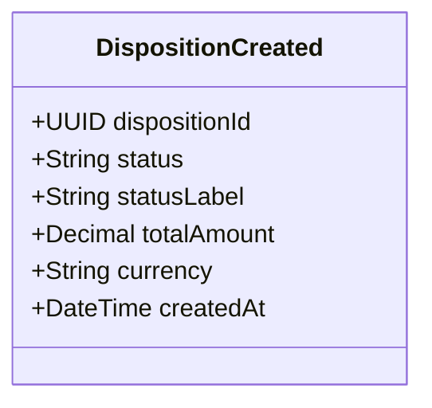

# POST /dispositions

| Pole | Wartość |
|---|---|
| Zdolność | CAP-001 |

## Cel

Przyjąć od klienta dyspozycję przelewu z 1–50 pozycjami, sprawdzić jej dane
i limit klienta, a potem zapisać ją w statusie ZAAKCEPTOWANA, żeby trafiła do
nocnego rozliczenia.

## Parametry wejściowe

| Parametr | Typ | Wymagany | Źródło |
|---|---|---|---|
| X-SCA-Token | String (JWS) | tak | header |
| Idempotency-Key | UUID | tak | header |
| accountNumber | String (IBAN) | tak | body |
| totalAmount | Decimal | tak | body |
| currency | String (ISO 4217) | tak | body |
| items | Lista pozycji | tak | body |
| items[].lineNo | Integer | tak | body |
| items[].beneficiaryAccount | String (IBAN) | tak | body |
| items[].amount | Decimal | tak | body |
| items[].title | String, do 140 znaków | tak | body |

## Walidacja pól wejściowych

| Reguła | Kod błędu HTTP | Komunikat zwracany przez system |
|---|---|---|
| Lista items jest pusta albo jej brak | 400 | „Dyspozycja musi zawierać co najmniej jedną pozycję.” |
| Lista items ma więcej niż 50 pozycji | 400 | „Dyspozycja może zawierać najwyżej 50 pozycji.” |
| Kwota pozycji jest mniejsza lub równa zero albo większa niż 1 000 000 PLN | 400 | „Kwota pozycji musi być większa od zera i nie większa niż 1 000 000 PLN.” |
| accountNumber albo beneficiaryAccount nie jest poprawnym numerem IBAN | 400 | „Numer rachunku jest nieprawidłowy.” |
| Suma kwot pozycji różni się od totalAmount | 422 | „Suma kwot pozycji nie jest równa kwocie dyspozycji.” |
| totalAmount przekracza dostępny limit klienta | 409 | „Kwota dyspozycji przekracza dostępny limit.” |
| System limitów nie zna klienta z tokenu | 422 | „Nie możemy sprawdzić limitu dla tej dyspozycji. Skontaktuj się z bankiem.” |

## Złożone parametry wejściowe

<!-- Opcjonalnie, np. zaszyfrowany token zawierający kilka informacji. -->

Nagłówek X-SCA-Token to podpisany token JWS, który serwer uwierzytelnienia
wydaje po potwierdzeniu operacji przez klienta. Ładunek tokenu zawiera:

- `clientId` – klient, który potwierdził operację; musi być równy identyfikatorowi z tokenu JWT,
- `txnHash` – skrót SHA-256 z accountNumber, totalAmount, currency i listy pozycji; punkt końcowy liczy skrót z treści żądania i porównuje oba,
- `scaMethod` – sposób potwierdzenia: aplikacja mobilna albo kod SMS,
- `exp` – koniec ważności tokenu, 5 minut od potwierdzenia.

## Autentykacja

Według CONV-002, token użytkownika. Wymagana rola: Klient. Operacja
finansowa wymaga też silnego uwierzytelnienia: brak nagłówka X-SCA-Token,
token wygasły albo skrót niezgodny z treścią żądania daje 403.

## Zachowanie

### Przebieg podstawowy

1. Sprawdza token JWT i token SCA.
2. Sprawdza treść żądania według reguł walidacji i zwraca komplet naruszeń, nie tylko pierwsze. Przy naruszeniach kończy się kodem BLAD_WALIDACJI i niczego nie zapisuje.
3. Woła system limitów z identyfikatorem klienta i kwotą łączną dyspozycji.
4. Zapisuje dyspozycję z pozycjami w jednej transakcji: dyspozycja dostaje status ZAAKCEPTOWANA, a pozycje nie mają jeszcze statusu księgowania, bo dostają go dopiero w przebiegu rozliczenia.
5. Publikuje zdarzenie o przyjęciu dyspozycji i zwraca 201 z identyfikatorem dyspozycji.

- FLOW-001: przebieg podstawowy przyjęcia dyspozycji.
- FLOW-002: odrzucenie dyspozycji po naruszeniach walidacji albo po sprawdzeniu limitu.

### Przypadek brzegowy

- Żądanie powtórzone z tym samym Idempotency-Key w ciągu 24 godzin zwraca 201 z już zapisaną dyspozycją; drugi zapis nie powstaje.
- Sprawdzenie limitu kończy się odrzuceniem: punkt końcowy zapisuje dyspozycję z pozycjami ze statusem ODRZUCONA, kodem przyczyny w rejectionReason i czasem odrzucenia w rejectedAt, nie publikuje zdarzenia przyjęcia i zwraca 409 dla LIMIT_PRZEKROCZONY, 422 dla KLIENT_NIEZNANY_W_SYSTEMIE_LIMITOW albo 503 dla LIMIT_NIEDOSTEPNY.
- System limitów odpowiada 404, bo nie zna klienta: punkt końcowy nie ponawia wywołania i odrzuca dyspozycję z kodem KLIENT_NIEZNANY_W_SYSTEMIE_LIMITOW.
- System limitów nie odpowiada także po ponowieniach: punkt końcowy odrzuca dyspozycję z kodem LIMIT_NIEDOSTEPNY. Klient może złożyć dyspozycję ponownie; powstaje wtedy nowa dyspozycja.

## Model odpowiedzi

<!-- Opcjonalnie: classDiagram i tabela pól, bez kopiowania OpenAPI. -->

| Pole | Typ | Opis |
|---|---|---|
| dispositionId | UUID | Identyfikator nadany dyspozycji |
| status | String | Status dyspozycji po zapisie: ZAAKCEPTOWANA |
| statusLabel | String | Etykieta statusu dyspozycji ze słownika statusów, np. „Zaakceptowana” |
| totalAmount | Decimal | Kwota łączna dyspozycji |
| currency | String | Waluta dyspozycji |
| createdAt | DateTime | Data i czas przyjęcia dyspozycji |

## Struktura odpowiedzi błędnej

Według CONV-001. Kody własne to kody przyczyny odrzucenia dyspozycji:

- BLAD_WALIDACJI: 400 albo 422; dyspozycja nie jest zapisywana. Każde naruszenie w `violations` ma pole własne `lineNo` z numerem pozycji, której dotyczy.
- LIMIT_PRZEKROCZONY: 409.
- KLIENT_NIEZNANY_W_SYSTEMIE_LIMITOW: 422.
- LIMIT_NIEDOSTEPNY: 503.

Przy trzech ostatnich kodach dyspozycja jest zapisana ze statusem ODRZUCONA,
a rejectionReason ma wartość równą kodowi.

## Encje

- ENT-Disposition: treść żądania i odpowiedzi to dyspozycja; pozycje są zagnieżdżone w liście `items` i należą do dyspozycji. Przy odrzuceniu po sprawdzeniu limitu punkt końcowy utrwala w dyspozycji rejectionReason i rejectedAt.
- ENT-StatusDict: odpowiedź zwraca status dyspozycji z etykietą `statusLabel` ze słownika statusów.

## Zależności

Brak integracji wołanych poza przepływami. System limitów wołają FLOW-001 i FLOW-002.

## Ograniczenia NFR

- NFR-001.NFRT-PERF-01: czas odpowiedzi punktu końcowego p95 ≤ 500 ms.
- NFR-001.NFRT-SEC-01: dyspozycja bez ważnego tokenu SCA zgodnego z treścią żądania nie trafia do przetwarzania.
