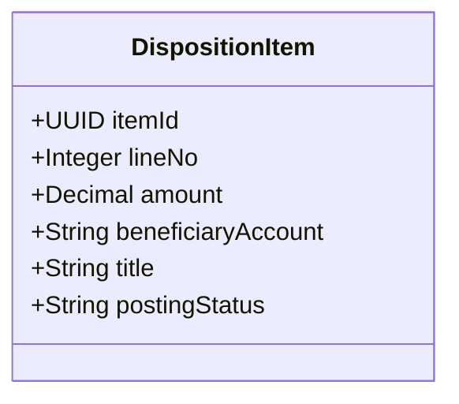

# PATCH /dispositions/{id}/items/{itemId}

| Pole | Wartość |
|---|---|
| Zdolność | CAP-001 |

## Cel

Pozwolić klientowi zmienić kwotę jednej pozycji dyspozycji, dopóki dyspozycja
czeka na nocne rozliczenie. Rachunek odbiorcy i tytuł pozycji klient podaje
tylko przy składaniu dyspozycji, więc punkt końcowy ich nie zmienia.

## Parametry wejściowe

| Parametr | Typ | Wymagany | Źródło |
|---|---|---|---|
| If-Match | String (ETag pozycji) | tak | header |
| id | UUID (dispositionId) | tak | path |
| itemId | UUID | tak | path |
| amount | Decimal | tak | body |

## Walidacja pól wejściowych

| Reguła | Kod błędu HTTP | Komunikat zwracany przez system |
|---|---|---|
| Treść żądania nie zawiera pola amount | 400 | „Podaj nową kwotę pozycji.” |
| Treść żądania zawiera pole inne niż amount, np. beneficiaryAccount albo title | 400 | „Korekta pozwala zmienić tylko kwotę pozycji.” |
| amount jest mniejsza lub równa zero albo większa niż 1 000 000 PLN | 400 | „Kwota pozycji musi być większa od zera i nie większa niż 1 000 000 PLN.” |
| Dyspozycja albo pozycja nie istnieje lub należy do innego klienta | 404 | „Nie znaleziono pozycji dyspozycji.” |
| Dyspozycja ma status inny niż ZAAKCEPTOWANA | 409 | „Dyspozycji nie można już korygować, bo jest rozliczana albo rozliczona.” |
| If-Match nie odpowiada bieżącej wersji pozycji | 412 | „Pozycja została zmieniona w innej sesji. Odśwież dane.” |

## Złożone parametry wejściowe

<!-- Opcjonalnie, np. zaszyfrowany token zawierający kilka informacji. -->

Punkt końcowy nie ma złożonych parametrów wejściowych.

## Autentykacja

Według CONV-002, token użytkownika. Wymagana rola: Klient; klient koryguje
tylko własne dyspozycje. Punkt końcowy nie wymaga tokenu silnego
uwierzytelnienia: korekta zmienia tylko kwoty pozycji, a kwota łączna, którą
klient zatwierdził przy złożeniu dyspozycji, się nie zmienia.

## Zachowanie

### Przebieg podstawowy

1. Sprawdza, czy dyspozycja należy do klienta z tokenu i ma status ZAAKCEPTOWANA.
2. Sprawdza nową kwotę pozycji i wersję z nagłówka If-Match.
3. Zapisuje nową kwotę pozycji. Rachunek odbiorcy, tytuł i kwota łączna dyspozycji się nie zmieniają, a pozycja nie ma jeszcze statusu księgowania.
4. Zwraca 200 z aktualnym stanem pozycji i nowym znacznikiem ETag.

### Przypadek brzegowy

- Przebieg rozliczenia ustawia dyspozycji status W_ROZLICZENIU między pobraniem jej przez klienta a zapisem korekty: punkt końcowy zwraca 409 i nie zapisuje zmiany.
- Punkt końcowy zmienia jedną pozycję, więc nie sprawdza zgodności sumy kwot pozycji z kwotą łączną dyspozycji: korekta kilku pozycji to kilka wywołań, a suma zgadza się dopiero po ostatnim. Zgodność sumy sprawdza sekcja pozycji na ekranie edycji przed przejściem do podsumowania, a zapis pozycji zaczyna się dopiero po potwierdzeniu korekty.

## Model odpowiedzi

<!-- Opcjonalnie: classDiagram i tabela pól, bez kopiowania OpenAPI. -->

| Pole | Typ | Opis |
|---|---|---|
| itemId | UUID | Identyfikator pozycji |
| lineNo | Integer | Numer pozycji w dyspozycji, bez zmian po korekcie |
| amount | Decimal | Kwota pozycji po korekcie |
| beneficiaryAccount | String | Rachunek odbiorcy, bez zmian po korekcie |
| title | String | Tytuł przelewu, bez zmian po korekcie |
| postingStatus | String | Status księgowania pozycji; pusty, bo dyspozycja nie weszła jeszcze do przebiegu rozliczenia |

## Struktura odpowiedzi błędnej

Według CONV-001. Kod własny: DISPOSITION_NOT_CORRECTABLE (409), gdy
dyspozycja jest rozliczana albo rozliczona.

## Encje

- ENT-DispositionItem: żądanie zmienia kwotę jednej pozycji, odpowiedź zwraca jej aktualny stan.

## Zależności

Brak zależności od integracji.

## Ograniczenia NFR

- NFR-001.NFRT-PERF-01
