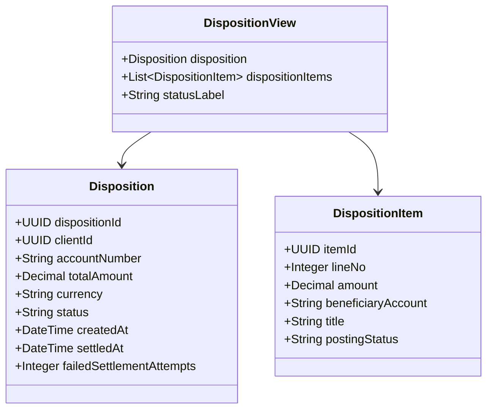

# GET /dispositions

| Pole | Wartość |
|---|---|
| Zdolność | CAP-001 |

## Cel

Zwrócić dyspozycje razem z ich pozycjami i etykietą statusu: klientowi do
podglądu i wyboru dyspozycji do korekty, doradcy do wyboru dyspozycji klienta,
a procesowi rozliczenia do pobrania dyspozycji w danym statusie.

## Parametry wejściowe

| Parametr | Typ | Wymagany | Źródło |
|---|---|---|---|
| status | String (kod ze słownika statusów dyspozycji) | nie | query |
| dispositionId | UUID | nie | query |
| clientId | UUID | nie | query |

## Walidacja pól wejściowych

| Reguła | Kod błędu HTTP | Komunikat zwracany przez system |
|---|---|---|
| status nie jest kodem ze słownika statusów dyspozycji | 400 | „Nieznany status dyspozycji.” |
| dispositionId albo clientId nie jest poprawnym UUID | 400 | „Nieprawidłowy identyfikator.” |
| Wywołujący z rolą inną niż Klient nie podał ani clientId, ani status | 400 | „Podaj klienta albo status dyspozycji.” |
| Doradca w oddziale nie ma clientId w tokenie albo podał w zapytaniu clientId inny niż w tokenie | 403 | „Brak dostępu do dyspozycji tego klienta.” |

## Złożone parametry wejściowe

<!-- Opcjonalnie, np. zaszyfrowany token zawierający kilka informacji. -->

Punkt końcowy nie ma złożonych parametrów wejściowych.

## Autentykacja

Według CONV-002: token użytkownika dla ról Klient i Doradca w oddziale,
token usługi dla roli System. Dozwolone role:
- Klient – tylko własne dyspozycje; clientId z zapytania jest pomijany, punkt końcowy bierze go z tokenu,
- Doradca w oddziale – tylko dyspozycje klienta wskazanego w tokenie przez clientId z identyfikacji klienta w oddziale; clientId z zapytania musi być równy clientId z tokenu,
- System – dyspozycje wszystkich klientów w statusie z parametru status, na potrzeby rozliczenia.

## Zachowanie

### Przebieg podstawowy

1. Ustala zakres danych z roli wywołującego.
2. Wybiera dyspozycje zgodne z parametrami status, dispositionId i clientId.
3. Do każdej dyspozycji dołącza jej pozycje oraz etykietę statusu ze słownika statusów dyspozycji.
4. Zwraca 200 z listą elementów posortowaną malejąco po dacie przyjęcia dyspozycji.

### Przypadek brzegowy

- Żadna dyspozycja nie spełnia filtra: 200 z pustą listą, nie 404.
- dispositionId wskazuje dyspozycję innego klienta: 200 z pustą listą, żeby odpowiedź nie zdradzała istnienia cudzej dyspozycji.

## Model odpowiedzi

<!-- Opcjonalnie: classDiagram i tabela pól, bez kopiowania OpenAPI. -->

Odpowiedź to lista elementów o polach:

| Pole | Typ | Opis |
|---|---|---|
| disposition.dispositionId | UUID | Identyfikator dyspozycji |
| disposition.clientId | UUID | Klient, który złożył dyspozycję |
| disposition.accountNumber | String | Rachunek obciążany |
| disposition.totalAmount | Decimal | Kwota łączna dyspozycji |
| disposition.currency | String | Waluta dyspozycji |
| disposition.status | String | Kod statusu dyspozycji, np. ZAAKCEPTOWANA |
| disposition.createdAt | DateTime | Data i czas przyjęcia dyspozycji |
| disposition.settledAt | DateTime | Data i czas rozliczenia; puste przed rozliczeniem |
| disposition.failedSettlementAttempts | Integer | Liczba nieudanych prób rozliczenia dyspozycji; pusta przed pierwszą nieudaną próbą |
| dispositionItems[].itemId | UUID | Identyfikator pozycji |
| dispositionItems[].lineNo | Integer | Numer pozycji w dyspozycji |
| dispositionItems[].amount | Decimal | Kwota pozycji |
| dispositionItems[].beneficiaryAccount | String | Rachunek odbiorcy |
| dispositionItems[].title | String | Tytuł przelewu |
| dispositionItems[].postingStatus | String | Status księgowania pozycji, np. OCZEKUJE; pusty, dopóki dyspozycja nie wejdzie do przebiegu rozliczenia |
| statusLabel | String | Etykieta statusu dyspozycji ze słownika statusów, np. „Zaakceptowana” |

## Struktura odpowiedzi błędnej

Według CONV-001. Kod własny: UNKNOWN_STATUS (400), gdy parametr status nie
jest kodem ze słownika statusów dyspozycji.

## Encje

- ENT-Disposition: obiekt `disposition` w każdym elemencie listy.
- ENT-DispositionItem: lista `dispositionItems` obok dyspozycji, osobny byt w odpowiedzi.
- ENT-StatusDict: `statusLabel` to etykieta ze słownika statusów dla kodu statusu dyspozycji.

## Zależności

Brak zależności od integracji.

## Ograniczenia NFR

- NFR-001.NFRT-PERF-01
