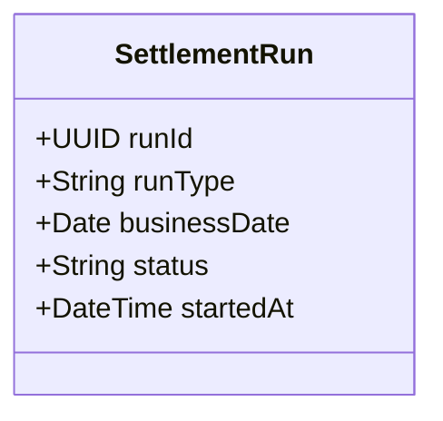

# POST /settlement-runs

| Pole | Wartość |
|---|---|
| Zdolność | CAP-003 |

## Cel

Uruchomić w silniku procesów przebieg rozliczenia dyspozycji: nocne
rozliczenie dyspozycji zaakceptowanych albo ponowienie rozliczenia dyspozycji
nierozliczonych.

## Parametry wejściowe

| Parametr | Typ | Wymagany | Źródło |
|---|---|---|---|
| runType | String: NIGHTLY albo RETRY | tak | body |

## Walidacja pól wejściowych

| Reguła | Kod błędu HTTP | Komunikat zwracany przez system |
|---|---|---|
| runType jest pusty albo ma wartość inną niż NIGHTLY i RETRY | 400 | „Nieznany typ przebiegu rozliczenia.” |
| Przebieg rozliczenia dowolnego typu ma status URUCHOMIONY albo W_TOKU | 409 | „Przebieg rozliczenia już trwa.” |

## Złożone parametry wejściowe

<!-- Opcjonalnie, np. zaszyfrowany token zawierający kilka informacji. -->

Punkt końcowy nie ma złożonych parametrów wejściowych.

## Autentykacja

Według CONV-002, token usługi. Wymagana rola: System. Punkt końcowy nie
jest dostępny dla klientów ani pracowników.

## Zachowanie

### Przebieg podstawowy

1. Sprawdza, czy nie trwa przebieg rozliczenia dowolnego typu.
2. Zapisuje przebieg w statusie URUCHOMIONY, nadaje mu runId i ustala dzień rozliczeniowy businessDate: przy NIGHTLY dzień poprzedzający uruchomienie, przy RETRY dzień uruchomienia.
3. Uruchamia w silniku procesów proces „Rozliczenie dyspozycji” ze zmiennymi runId, runType i businessDate. Punkt końcowy nie przekazuje listy dyspozycji: dyspozycje do rozliczenia wybiera pierwszy krok procesu.
4. Zwraca 202, nie czekając na koniec rozliczenia. Statusy dyspozycji zmieniają kroki procesu, nie punkt końcowy.

- BPMN-001: proces „Rozliczenie dyspozycji”, uruchamiany w kroku 3.

### Przypadek brzegowy

- Brak dyspozycji do rozliczenia nie jest błędem: punkt końcowy zwraca 202, a przebieg kończy się bez księgowania.
- Silnik procesów nie przyjmuje uruchomienia: przebieg przechodzi ze statusu URUCHOMIONY do PRZERWANY, punkt końcowy zwraca 503, a wywołujący może ponowić żądanie.

## Model odpowiedzi

<!-- Opcjonalnie: classDiagram i tabela pól, bez kopiowania OpenAPI. -->

| Pole | Typ | Opis |
|---|---|---|
| runId | UUID | Identyfikator przebiegu rozliczenia |
| runType | String | Typ przebiegu: NIGHTLY albo RETRY |
| businessDate | Date | Dzień rozliczeniowy przebiegu |
| status | String | Status przebiegu po uruchomieniu: URUCHOMIONY |
| startedAt | DateTime | Data i czas uruchomienia |

## Struktura odpowiedzi błędnej

Według CONV-001. Kod własny: RUN_IN_PROGRESS (409), gdy przebieg
rozliczenia już trwa. Odpowiedź ma wtedy pole własne `runId`
z identyfikatorem trwającego przebiegu, niezależnie od jego typu.

## Encje

Żądanie i odpowiedź nie przenoszą encji modelu logicznego: dyspozycje do rozliczenia wybiera pierwszy krok procesu.

## Zależności

Brak zależności od integracji. Księgowanie w księdze głównej wykonują kroki
procesu w silniku, nie punkt końcowy.

## Ograniczenia NFR

Brak własnych progów; obowiązują progi zdolności CAP-003.
