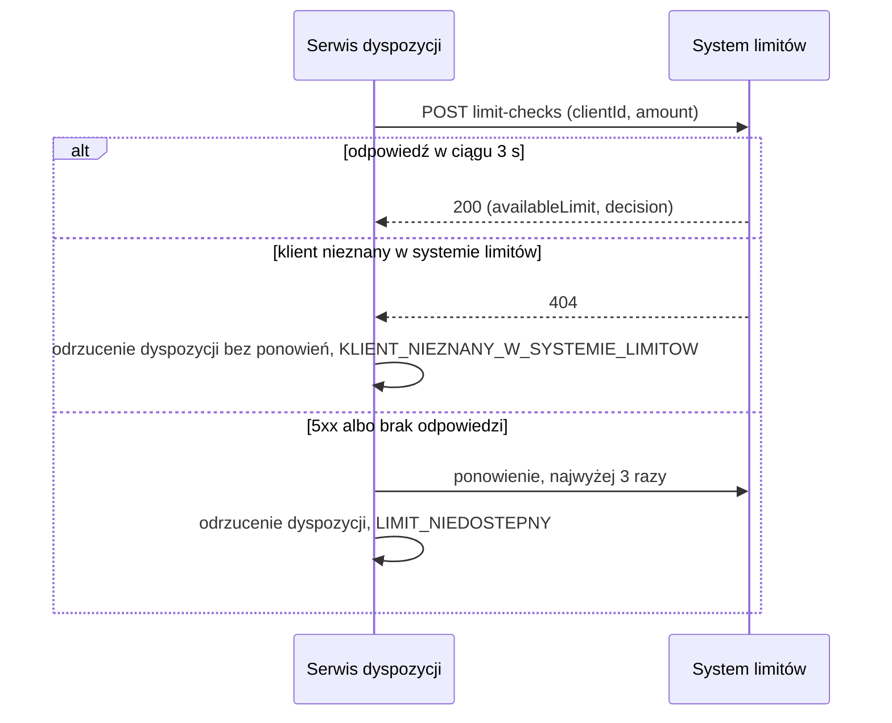

# System limitów: sprawdzenie limitu

| Pole | Wartość |
|---|---|
| Zdolność | CAP-001 |

## Cel

Przed zapisem dyspozycji sprawdzić, czy jej kwota łączna nie przekracza
dostępnego limitu klienta. Bank nie przyjmuje dyspozycji ponad limit, a stan
limitów prowadzi wyłącznie system limitów.

## Protokół

| Pole | Wartość |
|---|---|
| Typ | REST |
| Właściciel | Tribe Limity |
| Endpoint | POST https://limits.bank.internal/api/v1/limit-checks |
| API Catalog | https://api-catalog.bank.internal/limits/limit-checks |

## Operacja

Żądanie:

| Pole | Źródło | Opis |
|---|---|---|
| clientId | Identyfikator klienta z tokenu żądania złożenia dyspozycji | Klient, którego limit sprawdzamy |
| amount | Kwota łączna dyspozycji (totalAmount) | Kwota porównywana z dostępnym limitem |

Odpowiedź (tylko pola istotne dla nas):

| Pole | Opis |
|---|---|
| availableLimit | Dostępny limit klienta w chwili sprawdzenia |
| decision | ALLOWED, gdy amount nie przekracza availableLimit; EXCEEDED w przeciwnym razie |

## Warunek wywołania

Wołamy operację raz dla każdej składanej dyspozycji, po poprawnej walidacji
danych wejściowych i przed zapisem dyspozycji. Nie wołamy jej, gdy walidacja
zwróciła naruszenia. Odpowiedź EXCEEDED kończy przyjęcie dyspozycji
odrzuceniem z kodem przyczyny LIMIT_PRZEKROCZONY i komunikatem o przekroczonym
limicie.

## Obsługa błędów

| Sytuacja | Obsługa |
|---|---|
| 404 | Klient nieznany w systemie limitów: dyspozycja zostaje odrzucona z kodem przyczyny KLIENT_NIEZNANY_W_SYSTEMIE_LIMITOW. |
| 5xx | Ponowienia według CONV-003. Gdy zawiodą, dyspozycja zostaje odrzucona z kodem przyczyny LIMIT_NIEDOSTEPNY. |
| Przekroczenie czasu | Limit czasu według CONV-003, potem jak przy 5xx. |

## Diagram sekwencji

## Encje

- ENT-Client: `clientId` w żądaniu wskazuje klienta, którego limit sprawdzamy.

## Ograniczenia NFR

- NFR-001.NFRT-AVAIL-01: limit czasu 3 s i 3 ponowienia przy niedostępności systemu limitów.
