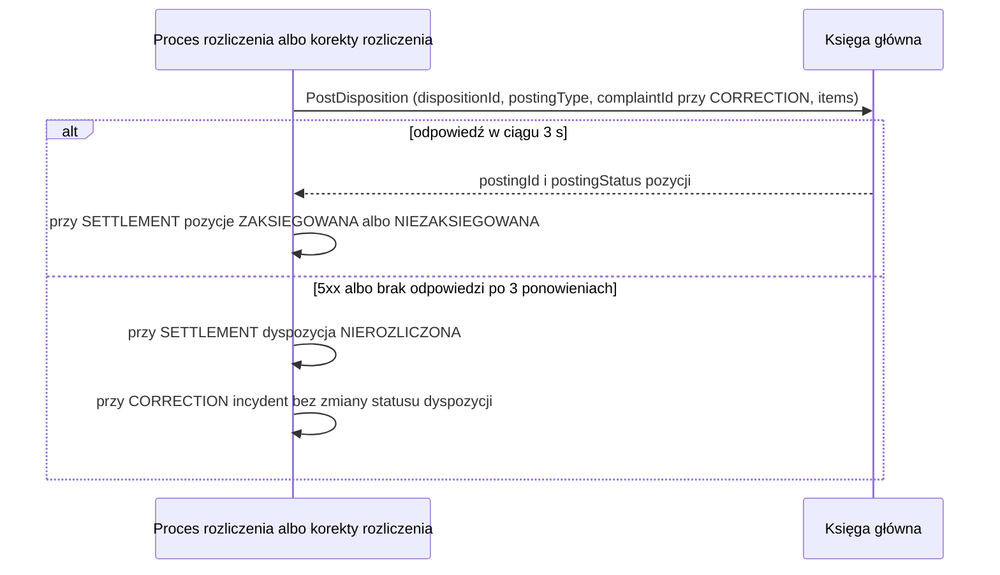

# Księga główna: księgowanie dyspozycji

| Pole | Wartość |
|---|---|
| Zdolność | CAP-003 |

## Cel

Zaksięgować w księdze głównej pozycje dyspozycji i odebrać wynik księgowania,
od którego zależy status pozycji i całej dyspozycji. Dyspozycja jest
rozliczona dopiero wtedy, gdy księga potwierdzi księgowanie wszystkich pozycji.
Ta sama operacja księguje korektę rozliczenia po uznanej reklamacji.

## Protokół

| Pole | Wartość |
|---|---|
| Typ | SOAP |
| Właściciel | Area Finanse |
| Endpoint | https://gl.finanse.bank.internal/ws/PostingService, operacja PostDisposition |
| API Catalog | https://api-catalog.bank.internal/finance/general-ledger/posting-service |

## Operacja

Żądanie:

| Pole | Źródło | Opis |
|---|---|---|
| dispositionId | Dyspozycja rozliczana w przebiegu albo reklamowana dyspozycja | Identyfikator dyspozycji; część klucza idempotencji |
| accountNumber | Dyspozycja; przy CORRECTION wewnętrzny rachunek kosztów reklamacji z konfiguracji serwisu | Rachunek obciążany |
| currency | Dyspozycja; przy CORRECTION waluta reklamowanej dyspozycji | Waluta księgowania |
| postingType | Krok procesu wołający operację | SETTLEMENT przy rozliczeniu i ponowieniu, CORRECTION przy księgowaniu korygującym; część klucza idempotencji |
| complaintId | Proces korekty rozliczenia po reklamacji | Reklamacja, której dotyczy księgowanie korygujące; tylko przy CORRECTION i wtedy część klucza idempotencji |
| items | SETTLEMENT: pozycje dyspozycji w statusie księgowania OCZEKUJE albo NIEZAKSIEGOWANA; CORRECTION: jedna pozycja korekty na kwotę rekompensaty | Lista pozycji do zaksięgowania |
| items.itemId | Pozycja dyspozycji; przy CORRECTION identyfikator reklamacji (complaintId) | Identyfikator pozycji |
| items.beneficiaryAccount | Pozycja dyspozycji; przy CORRECTION wewnętrzny rachunek rozliczeniowy wypłat rekompensat z konfiguracji serwisu, z którego system płatności wypłaca rekompensatę klientowi | Rachunek odbiorcy księgowania |
| items.amount | Pozycja dyspozycji; przy CORRECTION kwota rekompensaty | Kwota księgowania |
| items.title | Pozycja dyspozycji; przy CORRECTION tytuł z identyfikatorem reklamacji | Tytuł księgowania |

Odpowiedź (tylko pola istotne dla nas):

| Pole | Opis |
|---|---|
| postingId | Identyfikator księgowania dla każdej zaksięgowanej pozycji (itemId); przy SETTLEMENT zapisujemy go w pozycji dyspozycji |
| postingStatus | Wynik dla każdej pozycji (itemId): ZAKSIEGOWANA albo NIEZAKSIEGOWANA; przy SETTLEMENT przepisujemy go do statusu księgowania pozycji |

## Warunek wywołania

Przy postingType = SETTLEMENT wołamy operację dla każdej dyspozycji w przebiegu
rozliczenia, w nocnym rozliczeniu i przy ponowieniu nieudanych rozliczeń,
z pozycjami w statusie OCZEKUJE albo NIEZAKSIEGOWANA. Dyspozycję, której
wszystkie pozycje mają status ZAKSIEGOWANA, pomijamy. Przy postingType =
CORRECTION wołamy operację raz dla uznanej reklamacji w procesie korekty
rozliczenia, z jedną pozycją korekty. Pominięcie w pełni zaksięgowanej
dyspozycji wtedy nie obowiązuje, bo korekta dotyczy dyspozycji rozliczonej.

## Obsługa błędów

| Sytuacja | Obsługa |
|---|---|
| 404 | Adres usługi nie istnieje (błąd konfiguracji): zespół utrzymania dostaje alert. Przy SETTLEMENT wysłane pozycje dostają status NIEZAKSIEGOWANA, a dyspozycja status NIEROZLICZONA; przy CORRECTION krok korekty zgłasza incydent bez zmiany statusu dyspozycji. |
| 5xx | Błąd techniczny: ponowienia według CONV-003. Gdy zawiodą, przy SETTLEMENT dyspozycja dostaje status NIEROZLICZONA i czeka na ponowienie rozliczenia, a przy CORRECTION krok korekty zgłasza incydent bez zmiany statusu dyspozycji. SOAP Fault ACCOUNT_NOT_FOUND to błąd biznesowy bez ponowień: przy SETTLEMENT pozycje dostają status NIEZAKSIEGOWANA, a przy CORRECTION krok korekty zgłasza incydent. |
| Przekroczenie czasu | Limit czasu według CONV-003, potem jak przy 5xx. Kluczem idempotencji jest dispositionId z postingType, a przy CORRECTION także z complaintId. Księga rozpoznaje powtórzone żądanie po tym kluczu i pozycji zaksięgowanej wcześniej nie księguje drugi raz, tylko zwraca jej pierwotny postingId. |

## Diagram sekwencji

## Encje

- ENT-Disposition: żądanie niesie dyspozycję z pozycjami zagnieżdżonymi w liście `items`. Przy SETTLEMENT wynik zmienia status księgowania i postingId pozycji oraz status dyspozycji; przy CORRECTION lista `items` zawiera tylko pozycję korekty, a status dyspozycji się nie zmienia.

## Ograniczenia NFR

- NFR-001.NFRT-AVAIL-01: limit czasu 3 s i 3 ponowienia przy niedostępności księgi głównej.
