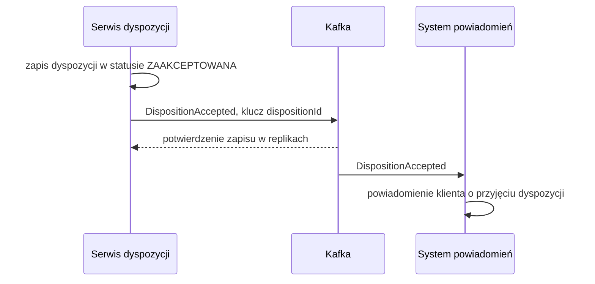

# DispositionAccepted

## Informacje podstawowe

| Pole | Wartość |
|---|---|
| Nazwa zdarzenia | DispositionAccepted |
| Wersja | 1.0.0 |
| System producenta | Serwis dyspozycji (disposition-service) |
| Adres kanału | retail.dispositions.disposition-accepted.v1 |
| Format | JSON |
| Zdolność publikująca | CAP-001 |

## Cel i zakres

Zdarzenie informuje inne systemy, że bank przyjął dyspozycję i zapisał ją
w statusie ZAAKCEPTOWANA. Obejmuje dane nagłówkowe dyspozycji: identyfikatory,
rachunek obciążany, kwotę łączną i walutę. Nie przenosi pozycji ani danych
odbiorców; system, który ich potrzebuje, pobiera je z serwisu dyspozycji.

## Kontekst biznesowy

Klient składa dyspozycję przelewu wielopozycyjnego w aplikacji mobilnej albo
w bankowości internetowej. Po zatwierdzeniu dyspozycji silnym uwierzytelnieniem
system zapisuje ją i publikuje zdarzenie. System powiadomień wysyła wtedy
klientowi potwierdzenie przyjęcia dyspozycji.

## Przepływ danych



## Nagłówek komunikatu

Według CONV-004. Wartości własne zdarzenia:

| Pole | Wartość |
|---|---|
| correlationId | Identyfikator żądania złożenia dyspozycji; system powiadomień przekazuje go dalej |
| ce_source | /retail/disposition-service |
| ce_time | Czas zapisu dyspozycji |

## Specyfikacja schematu

| Atrybut | Typ | Obligatoryjność | Wartości / format | Opis biznesowy |
|---|---|---|---|---|
| dispositionId | UUID | tak | UUID v4 | Identyfikator przyjętej dyspozycji |
| clientId | UUID | tak | UUID v4 | Klient, który złożył dyspozycję; adresat powiadomienia |
| accountNumber | String | tak | IBAN, 28 znaków dla rachunku polskiego | Rachunek obciążany dyspozycją |
| totalAmount | Decimal | tak | Większa od zera, 2 miejsca po przecinku | Kwota łączna dyspozycji |
| currency | String | tak | ISO 4217, np. PLN | Waluta dyspozycji |
| status | String | tak | ZAAKCEPTOWANA | Status dyspozycji w chwili publikacji |
| createdAt | DateTime | tak | ISO 8601, UTC | Data i czas przyjęcia dyspozycji |

## Przykład ładunku

```json
{
  "dispositionId": "3f6c2a9e-8d41-4b7a-9c55-1e2f0a7b6d13",
  "clientId": "a1d0c6e2-5b3f-4c8e-9f71-2b4d6e8f0a12",
  "accountNumber": "PL61109010140000071219812874",
  "totalAmount": 1250.00,
  "currency": "PLN",
  "status": "ZAAKCEPTOWANA",
  "createdAt": "2026-09-14T08:15:27Z"
}
```

## Charakterystyka dostarczenia

| Cecha | Wartość |
|---|---|
| Gwarancja dostarczenia | Co najmniej raz (at-least-once) |
| Idempotencja konsumenta | Wymagana: konsument pamięta messageId przez 7 dni i pomija duplikaty |
| Kolejność | Zachowana w obrębie partycji, czyli dla jednej dyspozycji |
| Klucz partycji | dispositionId |
| Retencja | 7 dni |
| Kolejka wiadomości niedostarczonych | retail.dispositions.disposition-accepted.v1.dlq, po 5 nieudanych próbach przetworzenia |

## Encje

- ENT-Disposition: ładunek zawiera atrybuty dyspozycji bez pozycji.

## Powiązanie z przepływem od początku do końca

Zdarzenie zamyka przyjęcie dyspozycji: przebieg podstawowy przyjęcia
dyspozycji publikuje je w kroku 5, po zapisie dyspozycji. Dyspozycja czeka
potem w statusie ZAAKCEPTOWANA na nocne rozliczenie, a do tego czasu klient
może skorygować kwoty jej pozycji. Odrzucona dyspozycja nie wywołuje zdarzenia.

## Powiązane dokumenty

- CAP-001: zdolność publikująca.
- ENT-Disposition: encja, z której pochodzą atrybuty ładunku.
