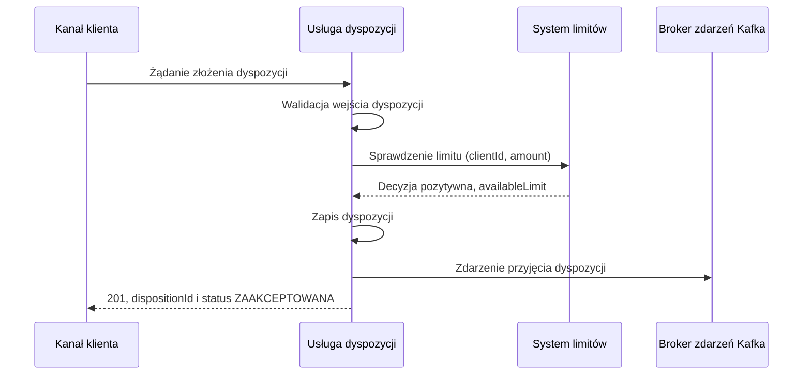

# Przyjęcie dyspozycji — przebieg podstawowy

| Pole | Wartość |
|---|---|
| Zdolność | CAP-001 |

## Warunki wstępne

Klient jest zalogowany w aplikacji mobilnej albo w bankowości internetowej
i zatwierdził dyspozycję silnym uwierzytelnieniem. Rachunek obciążany należy
do klienta. System limitów, baza danych dyspozycji i broker zdarzeń są
dostępne.

## Diagram

<!-- Mermaid, najwyżej 10–15 uczestników lub kroków. -->

## Opis przepływu

| Nr | Krok | Aktywność | Wywołanie |
|---|---|---|---|
| 1 | Usługa dyspozycji przyjmuje żądanie złożenia dyspozycji z rachunkiem obciążanym, walutą, kwotą łączną i pozycjami | — | — |
| 2 | Waliduje dane dyspozycji i pozycji; lista naruszeń jest pusta | ACT-001 | — |
| 3 | Sprawdza w systemie limitów, czy kwota łączna mieści się w dostępnym limicie klienta; decyzja jest pozytywna | — | INT-001 |
| 4 | Zapisuje dyspozycję z pozycjami w jednej transakcji i nadaje jej status ZAAKCEPTOWANA | ACT-002 | — |
| 5 | Publikuje zdarzenie przyjęcia dyspozycji i zwraca klientowi odpowiedź 201 z identyfikatorem dyspozycji | — | QUE-001 |

## Scenariusze błędów

Przebieg podstawowy kończy się przy pierwszym odchyleniu. Odrzucenie dyspozycji
opisuje przepływ „Przyjęcie dyspozycji — obsługa błędów”.

- Walidacja zwraca naruszenia (krok 2): przepływ nie sprawdza limitu i nie zapisuje dyspozycji.
- System limitów odmawia, bo kwota łączna przekracza dostępny limit, nie zna klienta albo nie odpowiada po ponowieniach (krok 3): dyspozycja zostaje odrzucona z kodem przyczyny.
- Zapis dyspozycji się nie udaje (krok 4): transakcja jest wycofana w całości, zdarzenie przyjęcia nie powstaje, a klient dostaje komunikat o chwilowej niedostępności.
- Broker nie potwierdza zdarzenia (krok 5): dyspozycja jest już zapisana, więc klient dostaje odpowiedź 201, a usługa ponawia publikację w tle, aż broker potwierdzi zapis.
