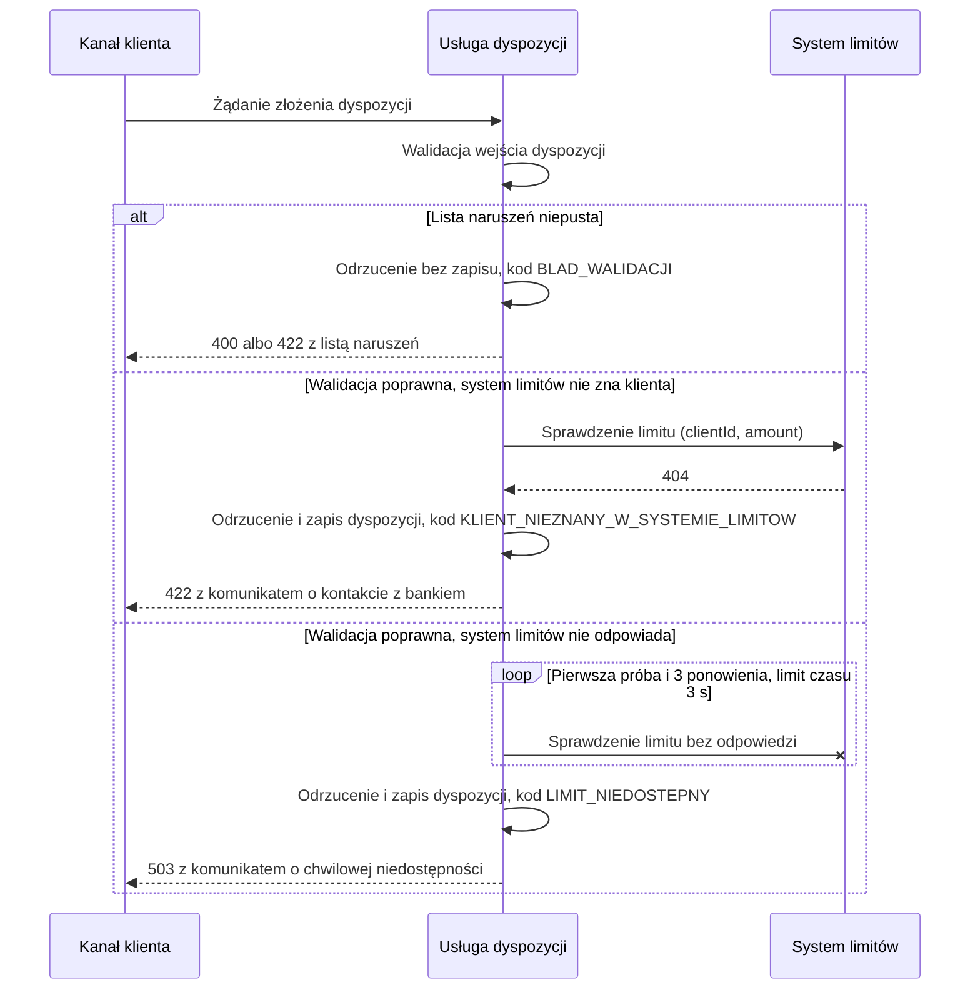

# Przyjęcie dyspozycji — obsługa błędów

| Pole | Wartość |
|---|---|
| Zdolność | CAP-001 |

## Warunki wstępne

Klient jest zalogowany i zatwierdził dyspozycję silnym uwierzytelnieniem.
Usługa dyspozycji ma połączenie z bazą danych dyspozycji. Przepływ zaczyna się
tak jak przebieg podstawowy i odchodzi od niego w kroku walidacji albo
sprawdzenia limitu.

## Diagram

<!-- Mermaid, najwyżej 10–15 uczestników lub kroków. -->

## Opis przepływu

| Nr | Krok | Aktywność | Wywołanie |
|---|---|---|---|
| 1 | Usługa dyspozycji przyjmuje żądanie złożenia dyspozycji | — | — |
| 2 | Walidacja zwraca niepustą listę naruszeń; przepływ pomija sprawdzenie limitu i przechodzi do kroku 5 z kodem przyczyny BLAD_WALIDACJI | ACT-001 | — |
| 3 | Po poprawnej walidacji system limitów odpowiada 404, bo nie zna klienta; przepływ nie ponawia wywołania i przechodzi do kroku 5 z kodem przyczyny KLIENT_NIEZNANY_W_SYSTEMIE_LIMITOW | — | INT-001 |
| 4 | Po poprawnej walidacji system limitów nie odpowiada w 3 s ani w pierwszej próbie, ani w 3 ponowieniach; przepływ przechodzi do kroku 5 z kodem przyczyny LIMIT_NIEDOSTEPNY | — | INT-001 |
| 5 | Odrzuca dyspozycję: przy kodach sprawdzenia limitu zapisuje ją ze statusem ODRZUCONA, kodem w rejectionReason i czasem w rejectedAt, przy BLAD_WALIDACJI niczego nie zapisuje; zwraca klientowi komunikat | ACT-003 | — |

## Scenariusze błędów

- Brak pozycji: odpowiedź 400 z pełną listą naruszeń i kodem BLAD_WALIDACJI. Suma kwot pozycji różna od kwoty łącznej: odpowiedź 422 z tym samym kodem. W obu przypadkach dyspozycja nie trafia do bazy, a klient poprawia dane w formularzu.
- System limitów zwraca decyzję odmowną, bo kwota łączna przekracza dostępny limit: przepływ przechodzi do kroku 5 z kodem LIMIT_PRZEKROCZONY, dyspozycja jest zapisana ze statusem ODRZUCONA, a punkt końcowy zwraca 409 z komunikatem o dostępnym limicie.
- System limitów nie zna klienta (krok 3): dyspozycja jest zapisana ze statusem ODRZUCONA i kodem KLIENT_NIEZNANY_W_SYSTEMIE_LIMITOW, punkt końcowy zwraca 422, a komunikat kieruje klienta do kontaktu z bankiem.
- System limitów nie odpowiada po 3 ponowieniach (krok 4): dyspozycja jest zapisana ze statusem ODRZUCONA i kodem LIMIT_NIEDOSTEPNY, punkt końcowy zwraca 503, a komunikat prosi o ponowne złożenie dyspozycji za kilka minut.
- Zapis odrzuconej dyspozycji się nie udaje: klient i tak dostaje komunikat odrzucenia, a błąd trafia do logu z identyfikatorem żądania.
