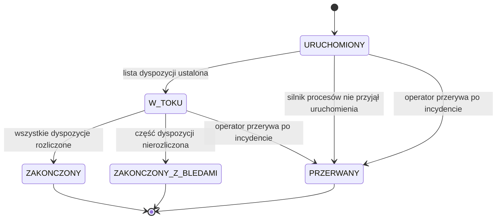

# Cykl życia przebiegu rozliczenia

| Pole | Wartość |
|---|---|
| Obiekt (pojęcie DDM) | — |
| Zdolność | CAP-003 |

## Warunki wstępne

Przebieg rozliczenia powstaje, gdy harmonogram nocny o 01:00 albo harmonogram
ponowień (co godzinę w godzinach 06:00–22:00) uruchomi rozliczenie. Żaden inny
przebieg, niezależnie od typu, nie jest w tej chwili w stanie URUCHOMIONY ani
W_TOKU.

## Diagram maszyny stanów

<!-- Generowany z tabel poniżej albo eksportowany z EA do katalogu assets/. -->

## Stany — opis

### Słownik statusów

| Kod | Status | Opis | Czy końcowy |
|---|---|---|---|
| URUCHOMIONY | Uruchomiony | Przebieg zarejestrowany i przekazany do uruchomienia w silniku procesów; lista dyspozycji nie jest jeszcze ustalona | nie |
| W_TOKU | W toku | Lista dyspozycji ustalona, trwa księgowanie w księdze głównej albo podsumowanie przebiegu | nie |
| ZAKONCZONY | Zakończony | Wszystkie dyspozycje przebiegu są rozliczone albo przebieg nie miał dyspozycji | tak |
| ZAKONCZONY_Z_BLEDAMI | Zakończony z błędami | Przebieg doszedł do końca, ale co najmniej jedna dyspozycja ma status NIEROZLICZONA | tak |
| PRZERWANY | Przerwany | Silnik procesów nie przyjął uruchomienia albo operator anulował instancję procesu po incydencie; przebieg nie ma podsumowania | tak |

### Stany procesowe

| Stan z | Stan do | Opis przejścia | Typ przepływu |
|---|---|---|---|
| [*] | URUCHOMIONY | Harmonogram uruchamia przebieg NIGHTLY albo RETRY, a przebieg zostaje zapisany przed startem instancji procesu rozliczenia | MAIN |
| URUCHOMIONY | W_TOKU | Zadanie pobrania dyspozycji kończy się poprawnie, także z pustą listą | MAIN |
| W_TOKU | ZAKONCZONY | Zamknięcie dnia rozliczeniowego nie znajduje wyniku NIEROZLICZONA | MAIN |
| W_TOKU | ZAKONCZONY_Z_BLEDAMI | Zamknięcie dnia rozliczeniowego znajduje co najmniej jeden wynik NIEROZLICZONA | ALTERNATIVE |
| URUCHOMIONY | PRZERWANY | Silnik procesów nie przyjął uruchomienia | ERROR |
| URUCHOMIONY | PRZERWANY | Operator anuluje instancję po incydencie w zadaniu pobrania dyspozycji | ERROR |
| W_TOKU | PRZERWANY | Operator anuluje instancję po incydencie w zadaniu księgowania albo zamknięcia dnia | ERROR |

## Kluczowe elementy

- Główna ścieżka sukcesu: URUCHOMIONY → W_TOKU → ZAKONCZONY; przebieg nocny kończy się przed 05:00.
- Przejścia alternatywne: W_TOKU → ZAKONCZONY_Z_BLEDAMI, gdy księga główna nie zaksięgowała części dyspozycji; nierozliczone dyspozycje z mniej niż trzema nieudanymi próbami rozliczenia podejmuje najbliższy przebieg RETRY.
- Przekroczenie czasu: stan nie zmienia się z upływem czasu. Przebieg nocny, który o 05:00 jest nadal w stanie W_TOKU, narusza termin nocnego przetwarzania i wymaga reakcji operatora.
- Odrzucenia i rezygnacje: przebieg kończy się stanem PRZERWANY, gdy silnik procesów nie przyjmie uruchomienia albo gdy operator przerwie przebieg po incydencie w silniku. Próba uruchomienia rozliczenia w trakcie trwającego przebiegu dowolnego typu nie tworzy nowego przebiegu.

## Scenariusze błędów

- Silnik procesów nie przyjmuje uruchomienia: przebieg przechodzi z URUCHOMIONY do PRZERWANY bez instancji procesu i bez zmiany statusów dyspozycji; harmonogram może ponowić uruchomienie.
- Incydent w zadaniu pobrania dyspozycji, bo lista dyspozycji jest niedostępna po ponowieniach: przebieg zostaje w stanie URUCHOMIONY, a operator ponawia zadanie albo przerywa przebieg (PRZERWANY).
- Incydent w zadaniu księgowania, np. błąd bazy danych: przebieg zostaje w stanie W_TOKU. Przy przejściu przebiegu do PRZERWANY settlement-service ustawia status NIEROZLICZONA dyspozycjom z listy przebiegu, które mają jeszcze status W_ROZLICZENIU, bez zwiększania failedSettlementAttempts, żeby rozliczył je przebieg ponowienia.
- Niedostępność księgi głównej nie jest błędem przebiegu: prowadzi do stanu ZAKONCZONY_Z_BLEDAMI.
