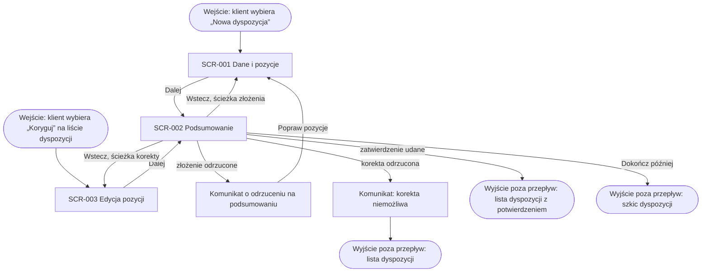

# Obsługa dyspozycji: mapa nawigacyjna

## Warunki wstępne

Mapa obejmuje ekrany klienta w procesie obsługi dyspozycji: ścieżkę złożenia
i ścieżkę korekty, w aplikacji mobilnej i w bankowości internetowej. Klient jest
zalogowany. Lista dyspozycji nie ma osobnego dokumentu ekranu, więc na mapie
jest tylko punktem wejścia i wyjścia. Nocne rozliczenie i ponowienia działają
bez ekranów i nie należą do mapy.

## Diagram nawigacji

<!-- Ekran startowy, pośredni, końcowy, ekran błędu, wyjście poza przepływ. -->

## Kluczowe elementy nawigacji

- Złożenie zaczyna się na SCR-001, korekta na SCR-003. Obie ścieżki prowadzą przyciskiem „Dalej” do wspólnego ekranu końcowego SCR-002.
- SCR-002 pamięta ścieżkę wejścia: „Wstecz” wraca do SCR-001 przy złożeniu i do SCR-003 przy korekcie.
- „Dalej” jest nieaktywny, dopóki sekcje ekranu startowego pokazują błędy walidacji.
- Zatwierdzenie złożenia na SCR-002 wymaga silnego uwierzytelnienia, a potwierdzenie korekty kwot pozycji go nie wymaga; po sukcesie klient wychodzi z przepływu na listę dyspozycji z potwierdzeniem.
- „Dokończ później” na SCR-002 w ścieżce złożenia zamyka przepływ i zostawia szkic; powrót do szkicu otwiera SCR-002.

## Odniesienia do ekranów

| Ekran | Rola w mapie | Dokument |
|---|---|---|
| Ekran Dyspozycja: Krok 1 z 2 — Dane i pozycje | startowy | SCR-001 |
| Ekran Korekta dyspozycji: Krok 1 z 2 — Edycja pozycji | startowy | SCR-003 |
| Ekran Dyspozycja: Krok 2 z 2 — Podsumowanie | końcowy | SCR-002 |

## Scenariusze błędów

Mapa nie ma osobnego ekranu błędu; błędy są komunikatami na ekranach mapy.

- Odrzucenie złożenia przy zatwierdzeniu, na przykład przekroczony limit: SCR-002 pokazuje komunikat, a „Popraw pozycje” wraca do SCR-001.
- Odrzucenie korekty, bo rozliczenie dyspozycji już się rozpoczęło: SCR-002 przy zapisie pokazuje komunikat, że korekta jest niemożliwa; klient wychodzi na listę dyspozycji.
- Suma kwot pozycji różna od kwoty łącznej: komunikat przy sekcji pozycji na SCR-001 albo SCR-003; przejście do SCR-002 jest zablokowane.
