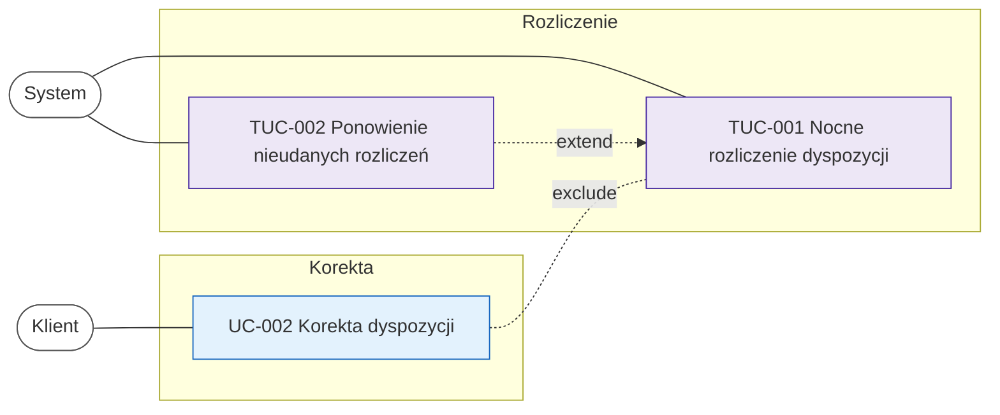

# Mapa scenariuszy rozliczenia dyspozycji

| Pole | Wartość |
|---|---|
| Aktorzy biznesowi | Klient |
| Aktorzy systemowi | System |
| Wersja diagramu | 1.0 |

## Cel

Mapa zestawia scenariusze, które działają na tej samej dyspozycji wokół
nocnego rozliczenia: korektę przez klienta, nocne rozliczenie i ponowienie
nieudanych rozliczeń. Pokazuje, kiedy korekta jest wykluczona i kiedy
ponowienie rozszerza nocne rozliczenie. Diagram ma dwa obszary: korektę
i rozliczenie.

## Legenda relacji

| Relacja | Znaczenie |
|---|---|
| include | krok obowiązkowy |
| extend | krok warunkowy |
| exclude | wzajemne wykluczenie wariantów |

## Diagram

<!-- Klasy dla aktorów, UC i TUC. -->

## Opis relacji

| Źródło | Relacja | Cel | Uzasadnienie |
|---|---|---|---|
| TUC-002 | extend | TUC-001 | Ponowienie uruchamia się tylko dla dyspozycji, których rozliczenie się nie powiodło: mają status NIEROZLICZONA i mniej niż trzy nieudane próby rozliczenia. |
| UC-002 | exclude | TUC-001 | Korekta jest niemożliwa w trakcie rozliczenia: przy starcie nocnego przebiegu wszystkie dyspozycje wybrane do rozliczenia dostają status W_ROZLICZENIU i system odrzuca zmianę ich pozycji. Dyspozycja przyjęta po końcu dnia rozliczeniowego nie wchodzi do przebiegu, więc klient może ją skorygować. |

## Powiązanie z artefaktami szczegółowymi

- UC-002
- TUC-001
- TUC-002

## Otwarte pytania

Czy przebieg ponowienia, który nie wystartował o 06:00, bo nocne rozliczenie jeszcze trwa, ma ruszyć zaraz po zakończeniu nocnego rozliczenia, czy dopiero o kolejnej pełnej godzinie?
