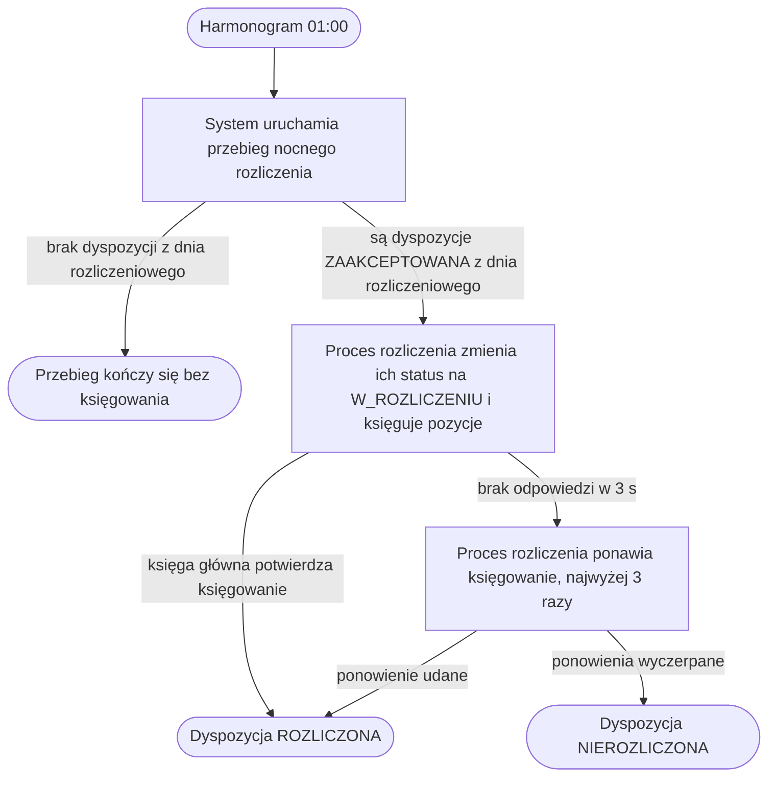

# Nocne rozliczenie dyspozycji

| Pole | Wartość |
|---|---|
| Aktor | ACTOR-001.ROLE-03 [System] |
| Trigger | cron 01:00 |
| BFS | BFS-001 |
| Powiązane REQ | BFS-001.REQ-04 |
| Powiązane RB | — |
| Zdolność | CAP-003 |

## Powiązanie z BFS

| Typ | ID z BFS | Jak TUC to realizuje |
|---|---|---|
| REQ | BFS-001.REQ-04 | Harmonogram o 01:00 uruchamia przebieg, który księguje w księdze głównej dyspozycje w statusie ZAAKCEPTOWANA przyjęte do końca dnia rozliczeniowego, czyli dnia poprzedzającego uruchomienie. |

## Cel

Każda dyspozycja zaakceptowana w ciągu dnia ma rano status ROZLICZONA albo
NIEROZLICZONA, a ślad audytowy zawiera decyzję o jej rozliczeniu.

## Aktorzy

- ACTOR-001.ROLE-03: System; harmonogram uruchamia przebieg, a proces rozliczenia w silniku procesów księguje dyspozycje bez udziału człowieka.

## Kiedy można to zrobić

- [ ] Nie trwa inny przebieg rozliczenia dyspozycji.

## Kroki

| Nr | Akcja systemu | Wywołanie |
|---|---|---|
| 1 | System uruchamia przebieg nocnego rozliczenia z typem NIGHTLY; dniem rozliczeniowym jest dzień poprzedzający uruchomienie. | API-006 |
| 2 | Proces rozliczenia dyspozycji w silniku procesów wybiera dyspozycje w statusie ZAAKCEPTOWANA przyjęte do końca dnia rozliczeniowego, od razu zmienia ich status na W_ROZLICZENIU, księguje ich pozycje w księdze głównej i po potwierdzeniu księgowania ustawia każdej dyspozycji status ROZLICZONA. | — |

## Co może pójść inaczej

### A1. Brak dyspozycji do rozliczenia

| Nr | Akcja systemu | Wywołanie |
|---|---|---|
| 1 | Proces rozliczenia nie znajduje dyspozycji w statusie ZAAKCEPTOWANA przyjętych do końca dnia rozliczeniowego. | |
| 2 | System kończy przebieg bez księgowania i zapisuje w śladzie audytowym przebieg bez dyspozycji. | |

## Co może pójść nie tak

### E1. Księga główna niedostępna

Polityka błędu: ponowienie

| Nr | Akcja systemu | Wywołanie |
|---|---|---|
| 1 | Księga główna nie odpowiada na księgowanie w ciągu 3 s. | |
| 2 | Proces rozliczenia ponawia księgowanie, najwyżej 3 razy. | |
| 3 | Po ostatnim nieudanym ponowieniu proces ustawia dyspozycji status NIEROZLICZONA, zwiększa liczbę jej nieudanych prób rozliczenia i przechodzi do kolejnej dyspozycji; dyspozycja czeka na ponowienie rozliczenia w ciągu dnia. | |

## Reguły biznesowe

Scenariusz nie realizuje reguł biznesowych procesu; rozlicza dyspozycje, które spełniły reguły przy złożeniu.

## Ograniczenia NFR

- NFR-001.NFRT-OBS-01

## Kryteria akceptacji

- Kiedy o 01:00 są dyspozycje w statusie ZAAKCEPTOWANA przyjęte do końca dnia rozliczeniowego, wtedy przebieg od razu zmienia status wszystkich tych dyspozycji na W_ROZLICZENIU, przed pierwszym księgowaniem.
- Kiedy dyspozycja została przyjęta po końcu dnia rozliczeniowego, np. o 00:20, wtedy przebieg jej nie obejmuje, a dyspozycja czeka w statusie ZAAKCEPTOWANA na następną noc.
- Kiedy księga główna potwierdzi księgowanie wszystkich pozycji dyspozycji, wtedy dyspozycja ma status ROZLICZONA i datę rozliczenia.
- Kiedy księga główna nie odpowie po 3 ponowieniach, wtedy dyspozycja ma status NIEROZLICZONA, a przebieg kończy się stanem ZAKONCZONY_Z_BLEDAMI.
- Kiedy nie ma dyspozycji do rozliczenia, wtedy przebieg kończy się bez wywołania księgi głównej.
- Kiedy przebieg się zakończy, wtedy ślad audytowy zawiera decyzję o statusie każdej rozliczanej dyspozycji.

## Diagram

<!-- Opcjonalny, najwyżej 15 kroków. -->

