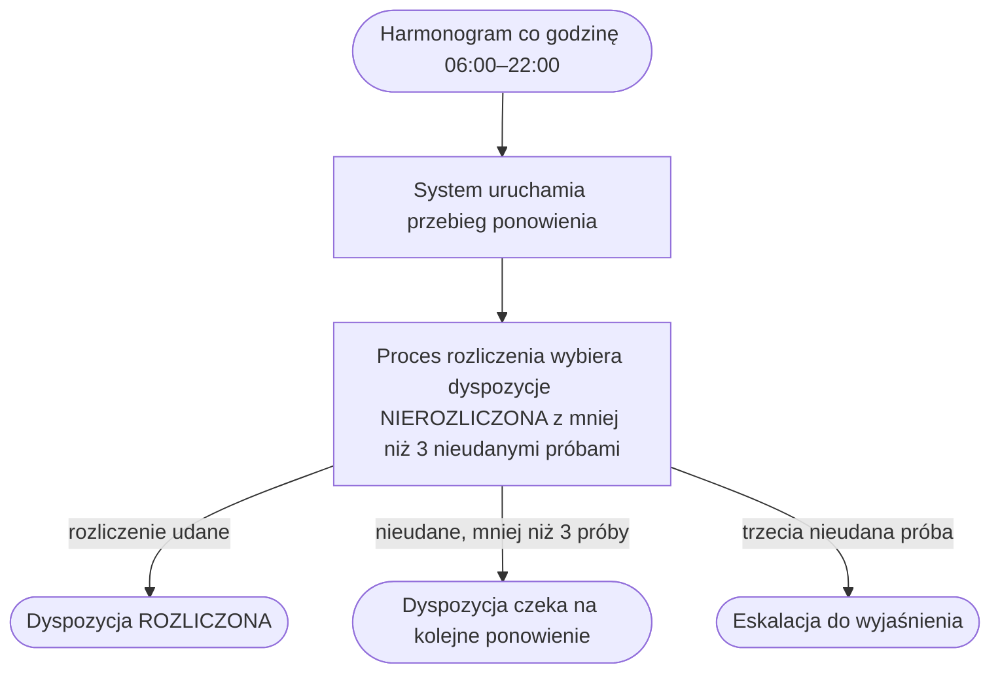

# Ponowienie nieudanych rozliczeń

| Pole | Wartość |
|---|---|
| Aktor | ACTOR-001.ROLE-03 [System] |
| Trigger | harmonogram co godzinę 06:00–22:00 |
| BFS | BFS-001 |
| Powiązane REQ | BFS-001.REQ-05 |
| Powiązane RB | — |
| Zdolność | CAP-003 |

## Powiązanie z BFS

| Typ | ID z BFS | Jak TUC to realizuje |
|---|---|---|
| REQ | BFS-001.REQ-05 | Co godzinę od 06:00 do 22:00 system ponownie rozlicza dyspozycje w statusie NIEROZLICZONA, dopóki dyspozycja nie ma trzech nieudanych prób rozliczenia. |

## Cel

Dyspozycja, której nocne rozliczenie się nie powiodło, zostaje zaksięgowana
jeszcze tego samego dnia, a dyspozycja nierozliczona po trzeciej nieudanej
próbie rozliczenia trafia do wyjaśnienia.

## Aktorzy

- ACTOR-001.ROLE-03: System; harmonogram uruchamia przebieg ponowienia, a proces rozliczenia w silniku procesów wybiera dyspozycje i ponownie je księguje bez udziału człowieka.

## Kiedy można to zrobić

- [ ] Nie trwa inny przebieg rozliczenia dyspozycji.

## Kroki

| Nr | Akcja systemu | Wywołanie |
|---|---|---|
| 1 | System uruchamia przebieg ponowienia z typem RETRY. | API-006 |
| 2 | Proces rozliczenia w silniku procesów wybiera dyspozycje w statusie NIEROZLICZONA, które mają mniej niż trzy nieudane próby rozliczenia, zmienia ich status na W_ROZLICZENIU i ponownie księguje ich niezaksięgowane pozycje. | — |

## Co może pójść inaczej

Scenariusz nie ma wariantów przebiegu: każde uruchomienie harmonogramu wykonuje kroki 1 i 2.

## Co może pójść nie tak

### E1. Trzecia nieudana próba rozliczenia

Polityka błędu: eskalacja

| Nr | Akcja systemu | Wywołanie |
|---|---|---|
| 1 | Rozliczenie dyspozycji nie udaje się w przebiegu ponowienia, a liczba jej nieudanych prób rozliczenia, liczona od nocnego przebiegu, osiąga trzy. | |
| 2 | Proces rozliczenia nie wybiera już dyspozycji do kolejnych ponowień; dyspozycja zostaje w statusie NIEROZLICZONA. | |
| 3 | System zgłasza dyspozycję do ręcznego wyjaśnienia przez zespół rozliczeń w zapleczu. | |

## Reguły biznesowe

Scenariusz nie realizuje reguł biznesowych procesu; ponawia rozliczenie dyspozycji przyjętych wcześniej do rozliczenia.

## Ograniczenia NFR

Brak własnych progów; obowiązują progi zdolności CAP-003.

## Kryteria akceptacji

- Kiedy wybije pełna godzina od 06:00 do 22:00 i nie trwa inny przebieg rozliczenia, wtedy system uruchamia przebieg ponowienia z typem RETRY.
- Kiedy przebieg ponowienia wystartuje, wtedy obejmuje dyspozycje w statusie NIEROZLICZONA z mniej niż trzema nieudanymi próbami rozliczenia.
- Kiedy ponowienie się powiedzie, wtedy dyspozycja ma status ROZLICZONA.
- Kiedy rozliczenie dyspozycji nie powiedzie się po raz trzeci, wtedy dyspozycja nie trafia do kolejnych przebiegów ponowienia i zostaje zgłoszona do wyjaśnienia.

## Diagram

<!-- Opcjonalny, najwyżej 15 kroków. -->

