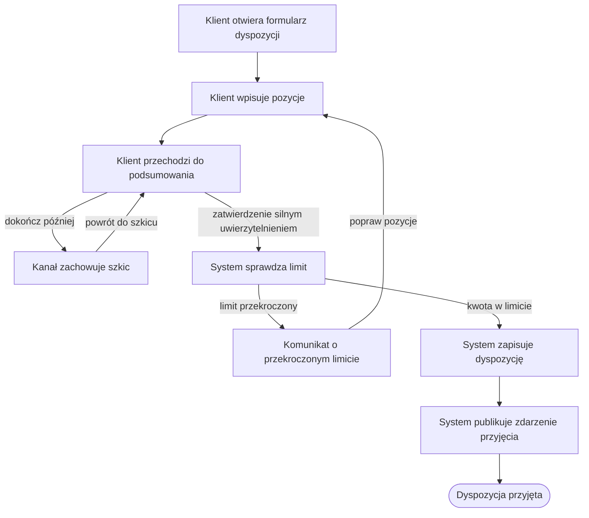

# Złożenie dyspozycji

| Pole | Wartość |
|---|---|
| Aktor główny | ACTOR-001.ROLE-01 |
| Kanały | Aplikacja mobilna, bankowość internetowa |
| BFS | BFS-001 |
| Powiązane REQ | BFS-001.REQ-01 |
| Powiązane RB | BFS-001.RB-01 |
| Zdolność | CAP-001 |
| Makiety | Figma, plik „Dyspozycja”, ramki „Krok 1 — Dane i pozycje” i „Krok 2 — Podsumowanie” |

## Powiązanie z BFS

| Typ | ID z BFS | Jak UC to realizuje |
|---|---|---|
| REQ | BFS-001.REQ-01 | Klient wpisuje od 1 do 50 pozycji, sprawdza podsumowanie i zatwierdza dyspozycję; system zapisuje ją ze statusem ZAAKCEPTOWANA. |
| RB | BFS-001.RB-01 | Przy zatwierdzeniu system porównuje kwotę łączną dyspozycji z dostępnym limitem klienta i odrzuca dyspozycję ponad limit (E1). |

## Cel

Klient chce jedną dyspozycją i jednym uwierzytelnieniem zlecić kilka przelewów
z jednego rachunku, zamiast wypełniać osobny formularz dla każdego przelewu.

## Aktorzy

- ACTOR-001.ROLE-01: Klient; wpisuje pozycje, sprawdza podsumowanie i zatwierdza dyspozycję silnym uwierzytelnieniem.

## Kiedy można to zrobić

- [ ] Klient jest zalogowany w aplikacji mobilnej albo w bankowości internetowej.
- [ ] Klient ma aktywny rachunek, z którego może zlecać przelewy.

## Kroki

| Nr | Krok | Ekran | Wywołanie |
|---|---|---|---|
| 1 | Klient otwiera formularz nowej dyspozycji dla wybranego rachunku; ekran pokazuje dane klienta. | SCR-001 | — |
| 2 | Klient wpisuje pozycje: rachunek odbiorcy, kwotę i tytuł każdego przelewu. | SCR-001 | — |
| 3 | Klient przechodzi do podsumowania; ekran pokazuje kwotę łączną, walutę i liczbę pozycji. | SCR-002 | — |
| 4 | Klient zatwierdza dyspozycję silnym uwierzytelnieniem; system sprawdza limit i zapisuje dyspozycję ze statusem ZAAKCEPTOWANA. | SCR-002 | API-001 |
| 5 | System publikuje zdarzenie o przyjęciu dyspozycji; ekran pokazuje potwierdzenie z numerem dyspozycji. | SCR-002 | QUE-001 |

## Co może pójść inaczej

### A1. Zapis szkicu

| Nr | Krok | Ekran | Wywołanie |
|---|---|---|---|
| 1 | Klient na podsumowaniu wybiera „Dokończ później” zamiast zatwierdzenia. | SCR-002 | |
| 2 | Kanał zachowuje wpisane pozycje jako szkic; dyspozycja nie trafia do banku, a limit nie jest sprawdzany. | SCR-002 | |
| 3 | Klient wraca do szkicu, kanał otwiera podsumowanie i scenariusz przechodzi do kroku 4. | SCR-002 | |

## Co może pójść nie tak

### E1. Przekroczony limit

| Nr | Krok | Ekran | Wywołanie |
|---|---|---|---|
| 1 | System odrzuca dyspozycję, bo kwota łączna przekracza dostępny limit klienta. | SCR-002 | API-001 |
| 2 | Ekran podsumowania pokazuje komunikat o przekroczonym limicie; system nie publikuje zdarzenia o przyjęciu. | SCR-002 | |
| 3 | Klient wybiera „Popraw pozycje” i scenariusz wraca do kroku 2. | SCR-002 | |

## Reguły biznesowe

- BFS-001.RB-01: przy zatwierdzeniu system porównuje kwotę łączną dyspozycji z dostępnym limitem klienta; dyspozycja ponad limit zostaje odrzucona (E1).

## Ograniczenia NFR

- NFR-001.NFRT-SEC-01

## Kryteria akceptacji

- Kiedy klient zatwierdzi silnym uwierzytelnieniem dyspozycję z 1–50 pozycjami w granicach limitu, wtedy system zapisuje ją ze statusem ZAAKCEPTOWANA i pokazuje numer dyspozycji.
- Kiedy system zapisze dyspozycję, wtedy publikuje jedno zdarzenie o jej przyjęciu.
- Kiedy kwota łączna dyspozycji przekracza dostępny limit klienta, wtedy ekran podsumowania pokazuje komunikat, a dyspozycja nie zostaje przyjęta.
- Kiedy klient wróci do szkicu, wtedy podsumowanie pokazuje te same pozycje, które wpisał przed przerwaniem.

## Diagram

<!-- Opcjonalny, najwyżej 15 kroków. -->

