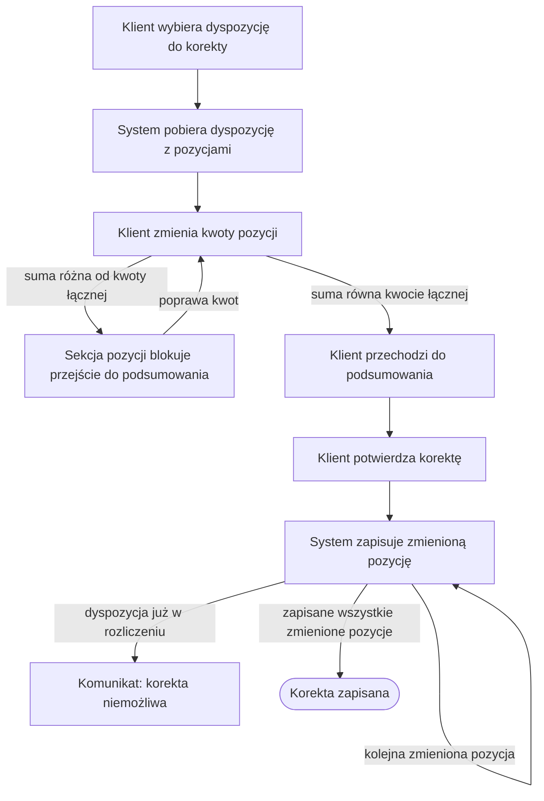

# Korekta dyspozycji

| Pole | Wartość |
|---|---|
| Aktor główny | ACTOR-001.ROLE-01 |
| Kanały | Aplikacja mobilna, bankowość internetowa |
| BFS | BFS-001 |
| Powiązane REQ | BFS-001.REQ-02 |
| Powiązane RB | BFS-001.RB-02 |
| Zdolność | CAP-001 |
| Makiety | Figma, plik „Korekta dyspozycji”, ramka „Krok 1 — Edycja pozycji”; podsumowanie z pliku „Dyspozycja” |

## Powiązanie z BFS

| Typ | ID z BFS | Jak UC to realizuje |
|---|---|---|
| REQ | BFS-001.REQ-02 | Klient zmienia kwoty pozycji zaakceptowanej dyspozycji na ekranie edycji, a po potwierdzeniu korekty na podsumowaniu system zapisuje zmienione pozycje. |
| RB | BFS-001.RB-02 | System zapisuje zmianę pozycji tylko w statusie ZAAKCEPTOWANA; po starcie przebiegu rozliczenia odrzuca korektę (E1). |

## Cel

Klient chce poprawić kwoty przelewów w dyspozycji, którą już zatwierdził, zanim
bank rozliczy ją w nocy.

## Aktorzy

- ACTOR-001.ROLE-01: Klient; wybiera dyspozycję, zmienia kwoty pozycji i potwierdza korektę.

## Kiedy można to zrobić

- [ ] Klient jest zalogowany w aplikacji mobilnej albo w bankowości internetowej.
- [ ] Dyspozycja klienta ma status ZAAKCEPTOWANA.

## Kroki

| Nr | Krok | Ekran | Wywołanie |
|---|---|---|---|
| 1 | Klient wybiera dyspozycję do korekty; system pobiera ją z pozycjami. | SCR-003 | API-005 |
| 2 | Klient zmienia kwoty pozycji tak, że ich suma pozostaje równa kwocie łącznej dyspozycji; rachunek odbiorcy i tytuł są tylko do odczytu. | SCR-003 | — |
| 3 | Klient przechodzi do podsumowania; ekran pokazuje pozycje po zmianie i niezmienioną kwotę łączną. | SCR-002 | — |
| 4 | Klient potwierdza korektę; system zapisuje każdą zmienioną pozycję. | SCR-002 | API-002 |

## Co może pójść inaczej

### A1. Kilka zmienionych pozycji

| Nr | Krok | Ekran | Wywołanie |
|---|---|---|---|
| 1 | Klient zmienił kwoty kilku pozycji, a jeden zapis obejmuje jedną pozycję. | SCR-002 | |
| 2 | Krok 4 powtarza zapis dla każdej zmienionej pozycji; system zapisuje pozycje po kolei. | SCR-002 | API-002 |
| 3 | Po zapisie ostatniej zmienionej pozycji ekran pokazuje potwierdzenie korekty i scenariusz się kończy. | SCR-002 | |

## Co może pójść nie tak

### E1. Dyspozycja już w rozliczeniu

| Nr | Krok | Ekran | Wywołanie |
|---|---|---|---|
| 1 | Przebieg rozliczenia wystartował po otwarciu ekranu edycji; przy zapisie system odrzuca zmianę pozycji, bo dyspozycja nie ma już statusu ZAAKCEPTOWANA. | SCR-002 | API-002 |
| 2 | Ekran podsumowania pokazuje komunikat, że korekta jest niemożliwa, bo dyspozycja jest już rozliczana. | SCR-002 | |
| 3 | Klient wraca do listy dyspozycji. | SCR-002 | |

### E2. Suma pozycji niezgodna z kwotą

| Nr | Krok | Ekran | Wywołanie |
|---|---|---|---|
| 1 | Klient chce przejść do podsumowania, a suma kwot pozycji różni się od kwoty łącznej dyspozycji. | SCR-003 | |
| 2 | Sekcja pozycji pokazuje komunikat z kwotą różnicy i blokuje przejście do podsumowania. | SCR-003 | |
| 3 | Klient poprawia kwoty pozycji i scenariusz wraca do kroku 2. | SCR-003 | |

## Reguły biznesowe

- BFS-001.RB-02: system zapisuje zmianę pozycji tylko dla dyspozycji w statusie ZAAKCEPTOWANA; po starcie przebiegu rozliczenia dyspozycja ma status W_ROZLICZENIU, a korekta zostaje odrzucona (E1).

## Ograniczenia NFR

Brak własnych progów; obowiązują progi zdolności CAP-001. Korekta nie wymaga
ponownego silnego uwierzytelnienia, bo zmienia tylko kwoty pozycji, a kwota
łączna zatwierdzona przy złożeniu dyspozycji się nie zmienia.

## Kryteria akceptacji

- Kiedy klient potwierdzi korektę dyspozycji w statusie ZAAKCEPTOWANA, a suma kwot pozycji jest równa kwocie łącznej, wtedy system zapisuje każdą zmienioną pozycję, a dyspozycja zachowuje status ZAAKCEPTOWANA.
- Kiedy przebieg rozliczenia wystartował przed zapisem korekty, wtedy system odrzuca zmianę pozycji, a ekran podsumowania pokazuje komunikat.
- Kiedy suma kwot pozycji różni się od kwoty łącznej dyspozycji, wtedy sekcja pozycji pokazuje różnicę i blokuje przejście do podsumowania.
- Kiedy klient koryguje dyspozycję, wtedy może zmienić tylko kwoty pozycji, a rachunek odbiorcy i tytuł są tylko do odczytu.
- Kiedy klient potwierdza korektę, wtedy system nie uruchamia silnego uwierzytelnienia.

## Diagram

<!-- Opcjonalny, najwyżej 15 kroków. -->

