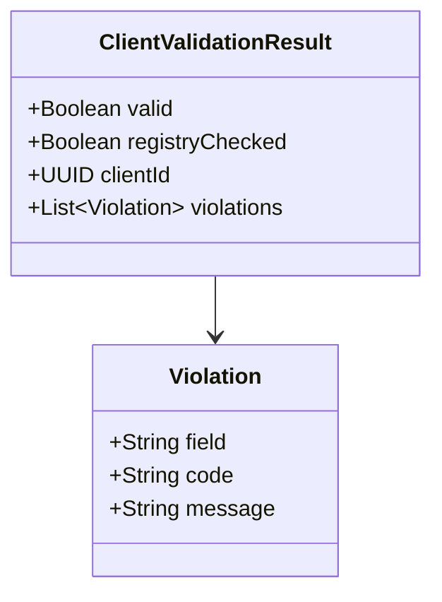

# POST /clients/validate

| Pole | Wartość |
|---|---|
| Zdolność | CAP-002 |

## Cel

Potwierdzić tożsamość klienta obecnego w oddziale, zanim doradca zacznie
działać w jego imieniu, np. zarejestruje reklamację. Doradca przepisuje
z dowodu osobistego numer PESEL, imię, nazwisko i datę urodzenia, a punkt
końcowy sprawdza je lokalnie, porównuje z rejestrem PESEL i wskazuje klienta
banku o tym numerze PESEL. Punkt końcowy niczego nie zapisuje. Tego samego
sprawdzenia używa pracownik zaplecza przy ręcznej weryfikacji tożsamości
wnioskodawcy.

## Parametry wejściowe

| Parametr | Typ | Wymagany | Źródło |
|---|---|---|---|
| pesel | String, 11 cyfr | tak | body |
| firstName | String | tak | body |
| lastName | String | tak | body |
| birthDate | Date (RRRR-MM-DD) | tak | body |

## Walidacja pól wejściowych

| Reguła | Kod błędu HTTP | Komunikat zwracany przez system |
|---|---|---|
| pesel jest pusty albo nie składa się z 11 cyfr | 400 | „PESEL musi mieć 11 cyfr.” |
| firstName albo lastName jest pusty | 400 | „Imię i nazwisko są wymagane.” |
| birthDate nie jest datą w formacie RRRR-MM-DD | 400 | „Data urodzenia ma nieprawidłowy format.” |

## Złożone parametry wejściowe

<!-- Opcjonalnie, np. zaszyfrowany token zawierający kilka informacji. -->

Punkt końcowy nie ma złożonych parametrów wejściowych.

## Autentykacja

Według CONV-002, token użytkownika. Wymagana rola: Doradca w oddziale
(aplikacja oddziałowa) albo Pracownik zaplecza (aplikacja zaplecza).

## Zachowanie

### Przebieg podstawowy

1. Sprawdza format pól według reguł walidacji.
2. Sprawdza sumę kontrolną numeru PESEL i zgodność birthDate z datą urodzenia zapisaną w numerze.
3. Gdy krok 2 nie daje naruszeń, woła rejestr PESEL, sprawdza, że numer ma status AKTYWNY, i porównuje imię, nazwisko oraz datę urodzenia z danymi rejestru.
4. Gdy dane zgadzają się z rejestrem, wyszukuje klienta banku po numerze PESEL; gdy osoba nie jest klientem banku, dodaje naruszenie CLIENT_NOT_FOUND.
5. Zwraca 200 z wynikiem `valid`, identyfikatorem `clientId` zidentyfikowanego klienta i listą naruszeń; wynik negatywny nie jest błędem HTTP.

### Przypadek brzegowy

Rejestr PESEL nie odpowiada także po ponowieniach: punkt końcowy zwraca 200
z wynikiem negatywnym (`valid = false`, `registryChecked = false`) i naruszeniem
pola pesel z kodem REGISTRY_UNAVAILABLE. Doradca nie potwierdza tożsamości na
podstawie samego dowodu osobistego i nie działa w imieniu klienta, dopóki
rejestr nie potwierdzi jego danych.

## Model odpowiedzi

<!-- Opcjonalnie: classDiagram i tabela pól, bez kopiowania OpenAPI. -->

| Pole | Typ | Opis |
|---|---|---|
| valid | Boolean | true, gdy dane nie mają naruszeń |
| registryChecked | Boolean | true, gdy dane porównano z rejestrem PESEL |
| clientId | UUID | Identyfikator klienta banku wyszukanego po numerze PESEL; pusty przy valid = false |
| violations | Lista | Naruszenia; pusta przy valid = true |
| violations[].field | String | Atrybut klienta z naruszeniem: pesel, firstName, lastName albo birthDate |
| violations[].code | String | Kod naruszenia: PESEL_CHECKSUM, BIRTH_DATE_MISMATCH, REGISTRY_MISMATCH (dane różne od rejestru albo numer o statusie innym niż AKTYWNY), REGISTRY_UNAVAILABLE (rejestr PESEL nie odpowiada), CLIENT_NOT_FOUND (osoba nie jest klientem banku) |
| violations[].message | String | Komunikat dla doradcy przy polu |

## Struktura odpowiedzi błędnej

Według CONV-001. Błędny format numeru PESEL to naruszenie z kodem
PESEL_FORMAT w `violations`.

## Encje

- ENT-Client: żądanie niesie atrybuty klienta pesel, firstName, lastName i birthDate; odpowiedź zwraca clientId zidentyfikowanego klienta i wskazuje atrybuty z naruszeniami.

## Zależności

- INT-010: potwierdzenie w rejestrze PESEL, że numer jest aktywny i należy do osoby o podanym imieniu, nazwisku i dacie urodzenia.

## Ograniczenia NFR

Brak własnych progów.
