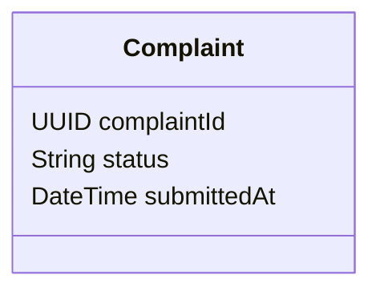

# POST /complaints

| Pole | Wartość |
|---|---|
| Zdolność | CAP-004 |

## Cel

Punkt końcowy rejestruje reklamację rozliczonej dyspozycji zgłoszoną przez
klienta w bankowości internetowej albo przez doradcę w oddziale i uruchamia
proces „Obsługa reklamacji” w silniku procesów.

## Parametry wejściowe

| Parametr | Typ | Wymagany | Źródło |
|---|---|---|---|
| dispositionId | UUID | tak | body |
| reason | String (kod ze słownika powodów reklamacji) | tak | body |
| description | String (do 2000 znaków) | tak | body |
| attachment | Plik (PDF, JPG, PNG) | nie | body |

## Walidacja pól wejściowych

| Reguła | Kod błędu HTTP | Komunikat zwracany przez system |
|---|---|---|
| Brak dispositionId, reason albo description | 400 | „Uzupełnij wymagane pola reklamacji.” |
| reason spoza słownika powodów reklamacji | 400 | „Wybierz powód reklamacji z listy.” |
| description dłuższy niż 2000 znaków | 400 | „Opis reklamacji może mieć najwyżej 2000 znaków.” |
| Dyspozycja nie istnieje albo nie należy do klienta z tokenu | 404 | „Nie znaleziono dyspozycji.” |
| Dyspozycja nie jest rozliczona | 422 | „Reklamować można tylko rozliczoną dyspozycję.” |
| Dyspozycja rozliczona ponad 30 dni przed zgłoszeniem | 422 | „Reklamację można złożyć do 30 dni od rozliczenia dyspozycji.” |

## Złożone parametry wejściowe

<!-- Opcjonalnie, np. zaszyfrowany token zawierający kilka informacji. -->

Token JWT w nagłówku Authorization niesie identyfikator zalogowanego
użytkownika, jego rolę i kanał: bankowość internetowa albo aplikacja oddziałowa.
Dla doradcy token zawiera też identyfikator klienta obsługiwanego w oddziale;
identyfikator pochodzi z identyfikacji klienta w oddziale.
Punkt końcowy dopuszcza tylko dyspozycje klienta wskazanego tokenem.

## Autentykacja

Według CONV-002, token użytkownika. Dostęp mają role Klient (bankowość
internetowa) i Doradca w oddziale (aplikacja oddziałowa).

## Zachowanie

### Przebieg podstawowy

Punkt końcowy sprawdza, że dyspozycja istnieje, należy do klienta z tokenu i jest
rozliczona, a od jej daty rozliczenia do chwili zgłoszenia minęło najwyżej 30 dni.
Zapisuje reklamację w statusie ZGLOSZONA z datą zgłoszenia submittedAt i
załącznikiem, uruchamia proces „Obsługa reklamacji” z identyfikatorem reklamacji
i zwraca 201 z complaintId, status i submittedAt.

- BPMN-002: proces „Obsługa reklamacji”, uruchamiany po zapisie reklamacji.

### Przypadek brzegowy

Termin liczony jest w dniach kalendarzowych: zgłoszenie 30. dnia po rozliczeniu
dyspozycji przechodzi, zgłoszenie 31. dnia dostaje 422. Gdy silnik procesów nie
przyjmie uruchomienia procesu, punkt końcowy wycofuje zapis reklamacji i zwraca
503, a użytkownik może ponowić zgłoszenie bez ryzyka duplikatu.

## Model odpowiedzi

<!-- Opcjonalnie: classDiagram i tabela pól, bez kopiowania OpenAPI. -->

| Pole | Typ | Opis |
|---|---|---|
| complaintId | UUID | Identyfikator zarejestrowanej reklamacji, pokazywany jako numer reklamacji |
| status | String | Status reklamacji po rejestracji: ZGLOSZONA |
| submittedAt | DateTime | Data i godzina zgłoszenia, od której liczy się 14 dni na rozpatrzenie |

## Struktura odpowiedzi błędnej

Według CONV-001. Komunikaty podaje tabela „Walidacja pól wejściowych”.
Kod własny: COMPLAINT_DEADLINE_EXCEEDED (422), gdy dyspozycję rozliczono
ponad 30 dni przed zgłoszeniem reklamacji.

## Encje

- ENT-Complaint: żądanie tworzy reklamację z dispositionId, reason i description, odpowiedź zwraca jej complaintId, status i submittedAt.

## Zależności

Brak zależności od integracji.

## Ograniczenia NFR

Brak własnych progów; obowiązują progi zdolności CAP-004.
