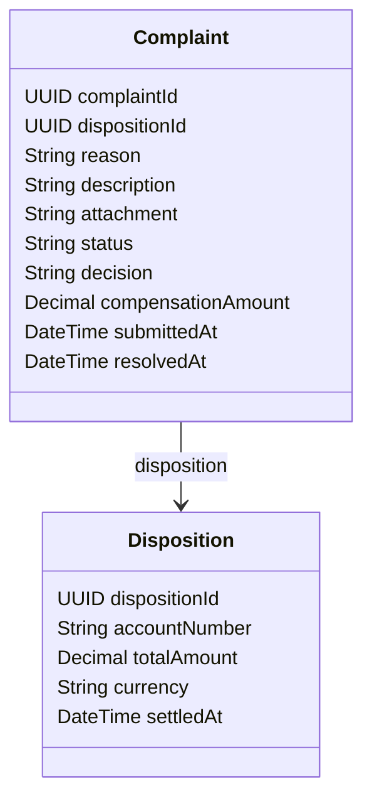

# GET /complaints/{id}

| Pole | Wartość |
|---|---|
| Zdolność | CAP-004 |

## Cel

Punkt końcowy zwraca szczegóły jednej reklamacji: powód, opis, załącznik, stan
decyzji oraz reklamowaną dyspozycję. Pracownik zaplecza ocenia na tej
podstawie zasadność reklamacji, proces obsługi reklamacji pobiera kwotę
dyspozycji do wyliczenia rekompensaty, krok korekty rozliczenia pobiera
rachunek obciążany i walutę dyspozycji przed wysłaniem księgowania
korygującego, a wypłata rekompensaty pobiera kwotę i rachunek obciążony
dyspozycji przed zleceniem przelewu.

## Parametry wejściowe

| Parametr | Typ | Wymagany | Źródło |
|---|---|---|---|
| id | UUID (complaintId) | tak | path |

## Walidacja pól wejściowych

| Reguła | Kod błędu HTTP | Komunikat zwracany przez system |
|---|---|---|
| id nie jest poprawnym UUID | 400 | „Niepoprawny identyfikator reklamacji.” |
| Token bez roli uprawnionej do reklamacji | 403 | „Brak uprawnień do podglądu reklamacji.” |
| Reklamacja o podanym id nie istnieje | 404 | „Nie znaleziono reklamacji.” |

## Złożone parametry wejściowe

<!-- Opcjonalnie, np. zaszyfrowany token zawierający kilka informacji. -->

Punkt końcowy nie ma złożonych parametrów: identyfikator reklamacji w ścieżce
jest zwykłym UUID, a token JWT służy tylko do sprawdzenia roli.

## Autentykacja

Według CONV-002. Wymagana rola: Pracownik zaplecza (token użytkownika).
Krok procesu obsługi reklamacji, krok korekty rozliczenia i wypłata
rekompensaty wywołują punkt końcowy tokenem usługi z rolą System.

## Zachowanie

### Przebieg podstawowy

Punkt końcowy odczytuje reklamację o podanym identyfikatorze i dołącza do
odpowiedzi reklamowaną dyspozycję jako osobny obiekt disposition. Zwraca 200 ze
wszystkimi polami modelu odpowiedzi. Wywołanie jest tylko do odczytu i nie
zmienia statusu reklamacji ani zadania w silniku procesów.

### Przypadek brzegowy

Reklamacja przed decyzją ma puste pola decision, compensationAmount i resolvedAt.
Reklamacja z zapisaną decyzją (status UZNANA, ODRZUCONA albo ZAMKNIETA) wraca
z wypełnionymi polami decyzji, a odrzucona ma pustą kwotę rekompensaty.

## Model odpowiedzi

<!-- Opcjonalnie: classDiagram i tabela pól, bez kopiowania OpenAPI. -->

| Pole | Typ | Opis |
|---|---|---|
| complaintId | UUID | Identyfikator reklamacji |
| dispositionId | UUID | Identyfikator reklamowanej dyspozycji |
| reason | String | Kod powodu reklamacji ze słownika powodów |
| description | String | Opis reklamacji podany przez klienta albo doradcę |
| attachment | String | Odnośnik do pobrania załącznika; puste, gdy zgłoszenie nie ma załącznika |
| status | String | ZGLOSZONA, W_ROZPATRZENIU, UZNANA, ODRZUCONA, ESKALOWANA albo ZAMKNIETA |
| decision | String | UZNANA albo ODRZUCONA; puste przed decyzją |
| compensationAmount | Decimal | Kwota rekompensaty w PLN; puste przed decyzją i przy odrzuceniu |
| submittedAt | DateTime | Data i godzina zgłoszenia |
| resolvedAt | DateTime | Data i godzina zapisu decyzji; puste przed decyzją |
| disposition | Disposition | Reklamowana dyspozycja: dispositionId, accountNumber (rachunek obciążony, na który trafia rekompensata), totalAmount (kwota łączna, górny limit rekompensaty), currency i settledAt |

## Struktura odpowiedzi błędnej

Według CONV-001. Komunikaty podaje tabela „Walidacja pól wejściowych”.
Kod własny: COMPLAINT_NOT_FOUND (404), gdy reklamacja o podanym id nie
istnieje.

## Encje

- ENT-Complaint: odpowiedź zwraca reklamację z jej atrybutami.
- ENT-Disposition: osobny obiekt disposition w odpowiedzi, z rachunkiem obciążanym, kwotą łączną, walutą i datą rozliczenia reklamowanej dyspozycji.

## Zależności

Brak zależności od integracji.

## Ograniczenia NFR

Brak własnych progów; obowiązują progi zdolności CAP-004.
