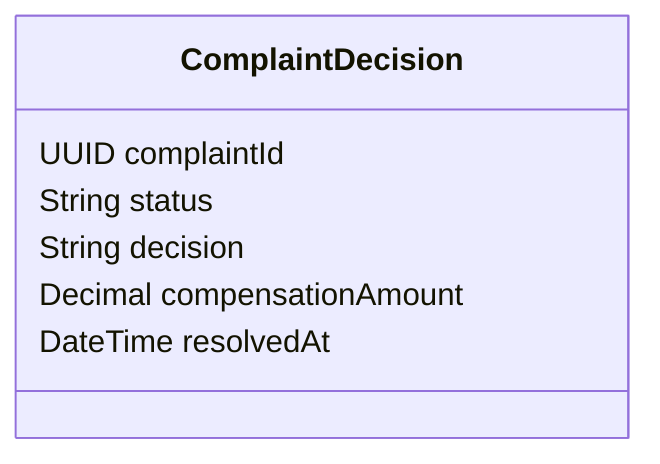

# POST /complaints/{id}/decision

| Pole | Wartość |
|---|---|
| Zdolność | CAP-004 |

## Cel

Punkt końcowy zapisuje decyzję pracownika zaplecza w sprawie reklamacji, UZNANA
albo ODRZUCONA, z kwotą rekompensaty i uzasadnieniem, a potem kończy zadanie
użytkownika „Rozpatrzenie reklamacji” w procesie „Obsługa reklamacji”.

## Parametry wejściowe

| Parametr | Typ | Wymagany | Źródło |
|---|---|---|---|
| id | UUID (complaintId) | tak | path |
| decision | String (UZNANA, ODRZUCONA) | tak | body |
| compensationAmount | Decimal (PLN, 2 miejsca po przecinku) | nie | body |
| justification | String (do 1000 znaków) | tak | body |

## Walidacja pól wejściowych

| Reguła | Kod błędu HTTP | Komunikat zwracany przez system |
|---|---|---|
| Brak decision albo wartość inna niż UZNANA i ODRZUCONA | 400 | „Wybierz decyzję: uznana albo odrzucona.” |
| Decyzja UZNANA bez compensationAmount albo z kwotą mniejszą lub równą zero | 400 | „Podaj dodatnią kwotę rekompensaty.” |
| Decyzja ODRZUCONA z wypełnionym compensationAmount | 400 | „Odrzucona reklamacja nie ma kwoty rekompensaty.” |
| Brak justification | 400 | „Uzupełnij uzasadnienie decyzji.” |
| Reklamacja o podanym id nie istnieje | 404 | „Nie znaleziono reklamacji.” |
| Reklamacja w statusie ZGLOSZONA: proces nie przekazał jej jeszcze do rozpatrzenia | 409 | „Reklamacja nie jest jeszcze w rozpatrzeniu.” |
| Reklamacja ma już zapisaną decyzję (status UZNANA, ODRZUCONA albo ZAMKNIETA) | 409 | „Reklamacja ma już zapisaną decyzję.” |
| compensationAmount większa niż kwota reklamowanej dyspozycji | 422 | „Kwota rekompensaty nie może przekroczyć kwoty dyspozycji.” |

## Złożone parametry wejściowe

<!-- Opcjonalnie, np. zaszyfrowany token zawierający kilka informacji. -->

Punkt końcowy nie ma złożonych parametrów: token JWT niesie identyfikator
pracownika, który trafia do śladu audytowego decyzji.

## Autentykacja

Według CONV-002, token użytkownika. Wymagana rola: Pracownik zaplecza.
Zadanie rozpatrzenia musi być przypisane do wywołującego pracownika albo do
jego grupy.

## Zachowanie

### Przebieg podstawowy

Punkt końcowy sprawdza, że reklamacja czeka na decyzję (status W_ROZPATRZENIU
albo ESKALOWANA), a przy decyzji UZNANA porównuje compensationAmount z kwotą
łączną reklamowanej dyspozycji. Zapisuje decision, compensationAmount,
uzasadnienie i resolvedAt, zmienia status reklamacji na UZNANA albo ODRZUCONA
i kończy zadanie „Rozpatrzenie reklamacji”, przekazując do procesu zmienne
decision, requestedCompensation i resolvedAt. Zapis decyzji z identyfikatorem
pracownika trafia do śladu audytowego. Zwraca 200 z modelem odpowiedzi.

ODRZUCONA jest statusem końcowym: odrzucona reklamacja nie zmienia już statusu,
a proces kończy się bez publikacji decyzji i bez powiadomienia klienta. Status
UZNANA zmienia się na ZAMKNIETA dopiero po przyjęciu przelewu rekompensaty.

- SPEC-WF-005: krok „Rozpatrzenie reklamacji” procesu „Obsługa reklamacji”, który punkt końcowy kończy po zapisie decyzji.

### Przypadek brzegowy

Kwota rekompensaty równa kwocie dyspozycji jest dozwolona i oznacza pełny zwrot.
Gdy silnik procesów nie zakończy zadania, punkt końcowy wycofuje zapis decyzji
i zwraca 503; pracownik ponawia zapis z tego samego ekranu.

## Model odpowiedzi

<!-- Opcjonalnie: classDiagram i tabela pól, bez kopiowania OpenAPI. -->

| Pole | Typ | Opis |
|---|---|---|
| complaintId | UUID | Identyfikator reklamacji |
| status | String | Status po decyzji: UZNANA albo końcowy ODRZUCONA |
| decision | String | Zapisana decyzja |
| compensationAmount | Decimal | Zapisana kwota rekompensaty w PLN; puste przy decyzji ODRZUCONA |
| resolvedAt | DateTime | Data i godzina zapisu decyzji |

## Struktura odpowiedzi błędnej

Według CONV-001. Komunikaty podaje tabela „Walidacja pól wejściowych”.
Kod własny: COMPENSATION_EXCEEDS_DISPOSITION_AMOUNT (422), gdy kwota
rekompensaty przekracza kwotę reklamowanej dyspozycji.

## Encje

- ENT-Complaint: żądanie ustawia decision i compensationAmount reklamacji, odpowiedź zwraca jej status i resolvedAt.

## Zależności

Brak zależności od integracji.

## Ograniczenia NFR

Brak własnych progów; obowiązują progi zdolności CAP-004.
