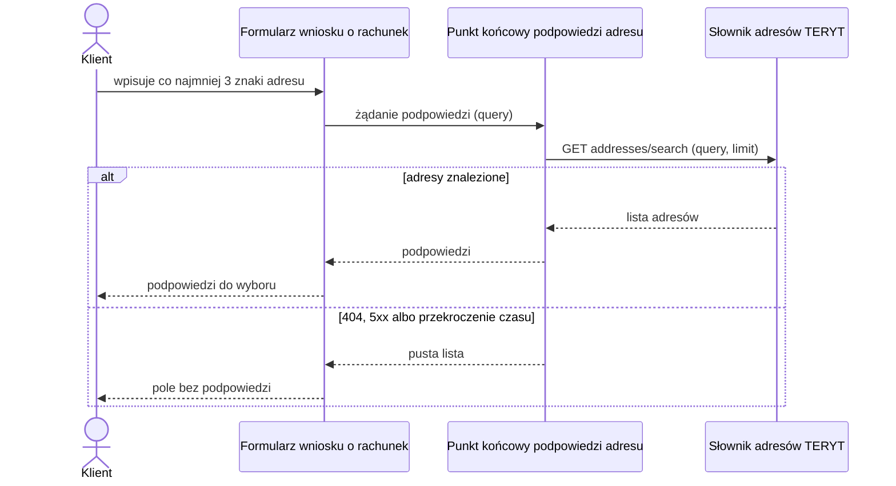

# Słownik adresów: wyszukiwanie adresu

| Pole | Wartość |
|---|---|
| Zdolność | CAP-002 |

## Cel

Podpowiadać klientowi we wniosku o rachunek adres korespondencyjny zgodny
z rejestrem TERYT, żeby ograniczyć błędy w nazwach ulic, miejscowości i kodach
pocztowych.

## Protokół

| Pole | Wartość |
|---|---|
| Typ | REST |
| Właściciel | Zewnętrzny dostawca danych TERYT |
| Endpoint | GET https://api.adresy-teryt.example/v2/addresses/search |
| API Catalog | https://api-catalog.bank.internal/external/teryt-address-search |

## Operacja

Żądanie:

| Pole | Źródło | Opis |
|---|---|---|
| query | Parametr query punktu końcowego podpowiedzi adresu | Fragment adresu, co najmniej 3 znaki |
| limit | Stała wartość 10 | Największa liczba zwracanych podpowiedzi |

Odpowiedź (tylko pola istotne dla nas):

| Pole | Opis |
|---|---|
| street | Nazwa ulicy z przedrostkiem, np. „ul. Marszałkowska” |
| buildingNumber | Numer budynku |
| postalCode | Kod pocztowy w formacie 00-000 |
| city | Miejscowość |
| terytCode | Identyfikator adresu w TERYT; nie zapisujemy go |

## Warunek wywołania

Operację woła punkt końcowy podpowiedzi adresu przy każdym swoim wywołaniu.
Formularz wniosku o rachunek wywołuje go, gdy klient wpisze w polu adresu
korespondencyjnego co najmniej 3 znaki i przerwie pisanie na 300 ms. Kolejny
znak anuluje poprzednie żądanie. Formularz nie wysyła żądania, gdy klient
wybrał podpowiedź i nie zmienia już adresu.

## Obsługa błędów

| Sytuacja | Obsługa |
|---|---|
| 404 | Brak adresów pasujących do tekstu: punkt końcowy zwraca pustą listę, a klient wpisuje adres ręcznie. |
| 5xx | Bez ponowień: punkt końcowy zwraca pustą listę, a pole działa jak zwykłe pole tekstowe. |
| Przekroczenie czasu | Punkt końcowy nie czeka na odpowiedź: przerywa żądanie i zwraca pustą listę. |

## Diagram sekwencji

## Encje

Operacja nie przenosi encji modelu logicznego.

## Ograniczenia NFR

Brak własnych progów.
