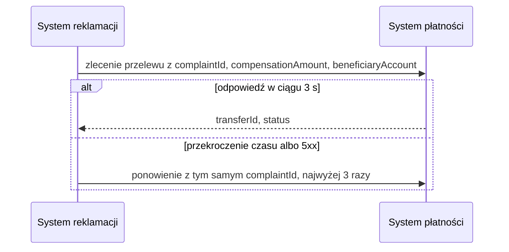

# System płatności: zlecenie przelewu

| Pole | Wartość |
|---|---|
| Zdolność | CAP-004 |

## Cel

Zlecić przelew rekompensaty uznanej reklamacji na rachunek, z którego klient
wykonał reklamowaną dyspozycję, bez ręcznego przelewu wykonywanego przez
zaplecze.

## Protokół

| Pole | Wartość |
|---|---|
| Typ | REST |
| Właściciel | Tribe Płatności |
| Endpoint | POST /payments/v1/transfer-orders (wewnętrzna brama API) |
| API Catalog | Katalog API banku, pozycja „Payments — transfer orders v1” |

## Operacja

Żądanie:

| Pole | Źródło | Opis |
|---|---|---|
| complaintId | ENT-Complaint, atrybut complaintId | Identyfikator reklamacji; system płatności używa go jako klucza idempotencji i w tytule przelewu |
| compensationAmount | ENT-Complaint, atrybut compensationAmount | Kwota rekompensaty w PLN |
| beneficiaryAccount | Pole disposition.accountNumber reklamacji pobranej przed zleceniem przelewu | Numer IBAN rachunku obciążonego reklamowanej dyspozycji, na który trafia rekompensata |

Odpowiedź (tylko pola istotne dla nas):

| Pole | Opis |
|---|---|
| transferId | Identyfikator zlecenia przelewu w systemie płatności; trafia do śladu audytowego reklamacji |
| status | ACCEPTED, gdy zlecenie przyjęto do realizacji, albo REJECTED z kodem przyczyny odrzucenia |

## Warunek wywołania

Po odebraniu decyzji o uznaniu reklamacji, pobraniu reklamacji z reklamowaną
dyspozycją i sprawdzeniu, że kwota rekompensaty nie przekracza kwoty
dyspozycji. Operację woła się raz na uznaną reklamację.

## Obsługa błędów

| Sytuacja | Obsługa |
|---|---|
| 404 | Rachunek beneficjenta nie istnieje w systemie płatności: wypłata zatrzymana, przyczyna w śladzie audytowym, sprawę przejmuje pracownik zaplecza |
| 5xx | Ponowienia według CONV-003, kluczem idempotencji jest complaintId; gdy zawiodą, wypłata zatrzymana |
| Przekroczenie czasu | Limit czasu według CONV-003, potem jak przy 5xx |
| Odpowiedź ze statusem REJECTED | Bez ponowień: wypłata zatrzymana, kod przyczyny w śladzie audytowym, sprawę przejmuje pracownik zaplecza |

## Diagram sekwencji

## Encje

- ENT-Complaint: identyfikator reklamacji i kwota rekompensaty w żądaniu.

## Ograniczenia NFR

- NFR-001.NFRT-AVAIL-01: limit czasu 3 s i 3 ponowienia przy niedostępności systemu płatności.
