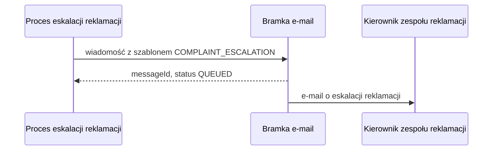

# Bramka e-mail: wysłanie wiadomości

| Pole | Wartość |
|---|---|
| Zdolność | CAP-004 |

## Cel

Powiadomić kierownika zespołu reklamacji wiadomością e-mail, że reklamacja nie
została rozpatrzona w 14 dni i przeszła do eskalacji, żeby przydzielił ją
innemu pracownikowi i doprowadził do decyzji bez dalszej zwłoki.

## Protokół

| Pole | Wartość |
|---|---|
| Typ | REST |
| Właściciel | Squad Powiadomienia |
| Endpoint | POST /notifications/v2/emails (wewnętrzna brama API) |
| API Catalog | Katalog API banku, pozycja „Email Gateway — send v2” |

## Operacja

Żądanie:

| Pole | Źródło | Opis |
|---|---|---|
| to | Konfiguracja serwisu complaint-service | Adres e-mail kierownika zespołu reklamacji |
| templateCode | Stała COMPLAINT_ESCALATION | Kod szablonu wiadomości o eskalacji reklamacji |
| templateParameters | Zmienne procesu eskalacji | Numer reklamacji, login przypisanego pracownika (pusty, gdy zadanie czeka w kolejce zespołu) i odnośnik do zadania rozpatrzenia wstawiane do treści wiadomości |

Odpowiedź (tylko pola istotne dla nas):

| Pole | Opis |
|---|---|
| messageId | Identyfikator wiadomości w bramce; trafia do śladu audytowego eskalacji |
| status | QUEUED, gdy bramka przyjęła wiadomość do wysyłki |

## Warunek wywołania

Gdy zadanie rozpatrzenia reklamacji przekroczy 14 dni, zdarzenie graniczne
timera uruchomi proces „Eskalacja przeterminowanej reklamacji”, a jego krok
oznaczy reklamację jako eskalowaną. Operację woła się raz na eskalację.

## Obsługa błędów

| Sytuacja | Obsługa |
|---|---|
| 404 | Szablon COMPLAINT_ESCALATION nie istnieje: krok procesu kończy się incydentem w silniku procesów, zespół utrzymania poprawia konfigurację i wznawia krok; reklamacja pozostaje eskalowana |
| 5xx | Silnik procesów ponawia krok najwyżej 3 razy co 5 minut; potem incydent w silniku procesów |
| Przekroczenie czasu | Obsługa jak przy 5xx; kierownik może dostać tę samą wiadomość dwa razy, co jest dopuszczalne dla powiadomienia |

## Diagram sekwencji

## Encje

Operacja nie przenosi encji modelu logicznego.

## Ograniczenia NFR

Brak własnych progów; obowiązują progi zdolności CAP-004.
