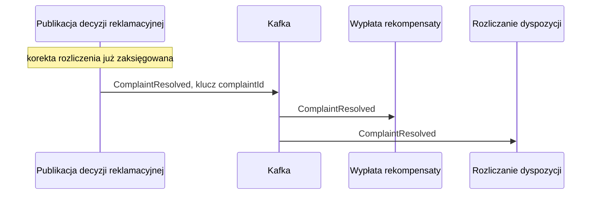

# ComplaintResolved

## Informacje podstawowe

| Pole | Wartość |
|---|---|
| Nazwa zdarzenia | ComplaintResolved |
| Wersja | 1.0.0 |
| System producenta | complaint-service, proces obsługi reklamacji w silniku procesów |
| Adres kanału | complaints.complaint-resolved.v1 |
| Format | JSON |
| Zdolność publikująca | CAP-004 |

## Cel i zakres

Zdarzenie ogłasza uznanie reklamacji z kwotą rekompensaty. Proces publikuje je
tylko dla decyzji UZNANA i dopiero po zaksięgowaniu korekty rozliczenia;
odrzucona reklamacja nie ma zdarzenia. Kontrakt kanału i schemat pochodzą
z pliku AsyncAPI wygenerowanego z Enterprise Architect; ten dokument jest
dokumentacją uzupełniającą: opisuje znaczenie biznesowe pól, zasady
dostarczenia i miejsce zdarzenia w procesie. Zdarzenie nie przenosi opisu
reklamacji, załączników ani uzasadnienia decyzji.

## Kontekst biznesowy

Pracownik zaplecza zapisuje decyzję w zadaniu rozpatrzenia reklamacji. Przy
uznaniu proces obsługi reklamacji wylicza rekompensatę, księguje korektę
rozliczenia w podprocesie korekty i publikuje zdarzenie w kroku publikacji
decyzji. Zdarzenie uruchamia wypłatę rekompensaty, a zdolność rozliczania
dyspozycji oznacza reklamowaną dyspozycję jako skorygowaną. Przy odrzuceniu
proces kończy się bez publikacji zdarzenia.

## Przepływ danych



## Nagłówek komunikatu

Według CONV-004. Wartości własne zdarzenia:

| Pole | Wartość |
|---|---|
| correlationId | Identyfikator korelacji procesu obsługi reklamacji, wspólny dla wszystkich komunikatów jednej reklamacji |
| ce_source | /complaint-service/complaint-handling |
| ce_time | Chwila publikacji zdarzenia |

## Specyfikacja schematu

| Atrybut | Typ | Obligatoryjność | Wartości / format | Opis biznesowy |
|---|---|---|---|---|
| complaintId | UUID | tak | UUID v4 | Identyfikator uznanej reklamacji |
| dispositionId | UUID | tak | UUID v4 | Reklamowana dyspozycja; zdolność rozliczania wskazuje nim dyspozycję, którą oznacza jako skorygowaną |
| decision | String | tak | UZNANA | Decyzja pracownika zaplecza; zdarzenie powstaje tylko dla uznanej reklamacji |
| compensationAmount | Decimal | tak | PLN, 2 miejsca po przecinku, większa od zera | Rekompensata po wyliczeniu, nie większa niż kwota reklamowanej dyspozycji |
| resolvedAt | DateTime | tak | ISO 8601 w UTC | Chwila zapisu decyzji przez pracownika zaplecza |

## Przykład ładunku

```json
{
  "complaintId": "7d9f3c2e-5b1a-4e8f-9c6d-2a4b8e1f0c37",
  "dispositionId": "3b2e8f14-9a6c-4d71-8e05-6f1c2d9a7b40",
  "decision": "UZNANA",
  "compensationAmount": 250.00,
  "resolvedAt": "2026-09-10T13:42:05Z"
}
```

## Charakterystyka dostarczenia

| Cecha | Wartość |
|---|---|
| Gwarancja dostarczenia | Co najmniej raz (at-least-once) |
| Idempotencja konsumenta | Wymagana po complaintId: powtórzone zdarzenie nie zleca drugiego przelewu i nie oznacza dyspozycji drugi raz |
| Kolejność | Zachowana w obrębie jednej reklamacji |
| Klucz partycji | complaintId |
| Retencja | 7 dni |
| Kolejka wiadomości niedostarczonych | complaints.complaint-resolved.v1.dlq, po 3 nieudanych próbach przetworzenia przez konsumenta |

## Encje

- ENT-Complaint: schemat przenosi identyfikator reklamacji, wskazanie dyspozycji, decyzję, kwotę rekompensaty i datę decyzji.

## Powiązanie z przepływem od początku do końca

Zgłoszenie reklamacji, rejestracja i start procesu obsługi reklamacji,
rozpatrzenie przez pracownika zaplecza, przy uznaniu wyliczenie rekompensaty
i zaksięgowanie korekty w podprocesie „Korekta rozliczenia po reklamacji”,
publikacja ComplaintResolved w kroku „Publikacja decyzji reklamacyjnej”, a dalej
równolegle wypłata rekompensaty zakończona zamknięciem reklamacji i oznaczenie
dyspozycji jako skorygowanej w zdolności „Rozliczanie dyspozycji”.

## Powiązane dokumenty

- CAP-004: zdolność publikująca.
- ENT-Complaint: encja, z której pochodzą atrybuty ładunku.
