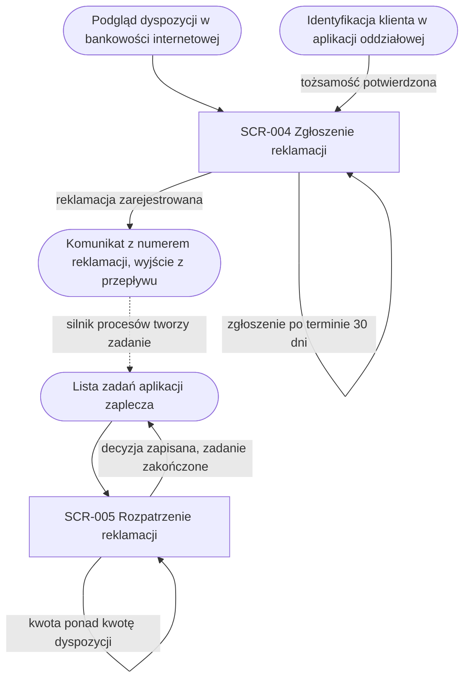

# Reklamacje dyspozycji: mapa nawigacyjna

## Warunki wstępne

Mapa obejmuje oba ekrany procesu reklamacji dyspozycji. Ścieżka zgłoszenia ma
jeden ekran, wspólny dla klienta w bankowości internetowej i doradcy w oddziale.
Ścieżka rozpatrzenia ma jeden ekran pracownika zaplecza. Ścieżek nie łączy
przejście między ekranami, tylko proces obsługi reklamacji w silniku procesów,
który po rejestracji tworzy zadanie rozpatrzenia. Mapa nie opisuje ekranów
spoza procesu: podglądu dyspozycji, identyfikacji klienta w aplikacji
oddziałowej i listy zadań zaplecza; pokazuje je tylko jako wejścia i wyjścia.

## Diagram nawigacji

<!-- Ekran startowy, pośredni, końcowy, ekran błędu, wyjście poza przepływ. -->

## Kluczowe elementy nawigacji

- SCR-004 jest ekranem startowym i końcowym ścieżki zgłoszenia: klient wchodzi na niego z podglądu dyspozycji, doradca po potwierdzeniu tożsamości klienta w aplikacji oddziałowej, a po rejestracji przepływ kończy komunikat z numerem reklamacji na tym samym ekranie.
- Przejście do ścieżki rozpatrzenia nie jest nawigacją użytkownika: zarejestrowana reklamacja uruchamia proces w silniku, a ten tworzy zadanie na liście zadań pracownika zaplecza.
- SCR-005 jest ekranem startowym i końcowym ścieżki rozpatrzenia: pracownik otwiera go z zadania, przegląda reklamowaną dyspozycję i opis reklamacji tylko do odczytu, a zapis decyzji kończy zadanie i wraca do listy zadań.

## Odniesienia do ekranów

| Ekran | Rola w mapie | Dokument |
|---|---|---|
| Zgłoszenie reklamacji | startowy i końcowy ścieżki klienta i doradcy | SCR-004 |
| Rozpatrzenie reklamacji | startowy i końcowy ścieżki pracownika zaplecza | SCR-005 |

## Scenariusze błędów

Proces nie ma osobnych ekranów błędów; każdy błąd pokazuje komunikat na ekranie,
na którym wystąpił. Zgłoszenie dyspozycji rozliczonej ponad 30 dni temu kończy
się komunikatem na SCR-004 bez rejestracji reklamacji. Klient bez dyspozycji
rozliczonych w ostatnich 30 dniach widzi na SCR-004 pustą listę i nie może
wysłać zgłoszenia. Kwota rekompensaty większa niż kwota dyspozycji kończy się
komunikatem na SCR-005, a pracownik poprawia kwotę bez opuszczania ekranu. Gdy
silnik procesów nie przyjmie zapisu decyzji, SCR-005 pokazuje komunikat
i pozwala ponowić zapis.
