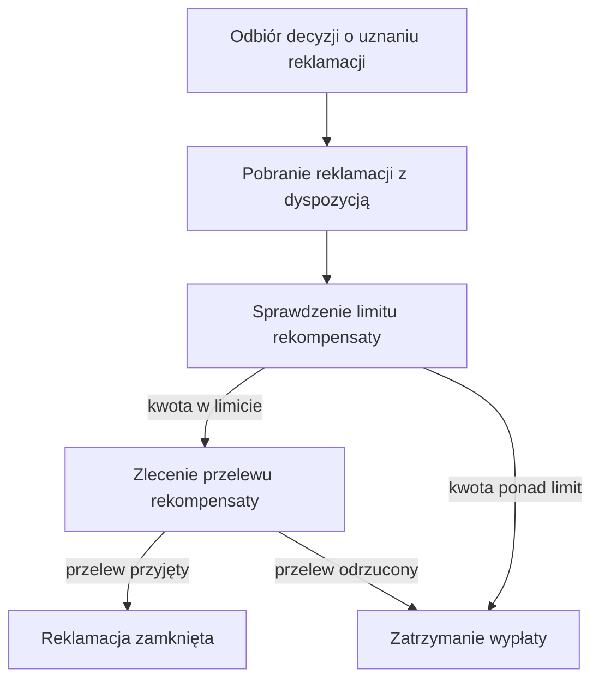

# Wypłata rekompensaty

| Pole | Wartość |
|---|---|
| Aktor | ACTOR-001.ROLE-03 [System] |
| Trigger | QUE-003 ComplaintResolved, odbiór zdarzenia o uznaniu reklamacji |
| BFS | BFS-002 |
| Powiązane REQ | BFS-002.REQ-03 |
| Powiązane RB | BFS-002.RB-02 |
| Zdolność | CAP-004 |

## Powiązanie z BFS

| Typ | ID z BFS | Jak TUC to realizuje |
|---|---|---|
| REQ | BFS-002.REQ-03 | Scenariusz realizuje wypłatę: zleca przelew rekompensaty na rachunek klienta i zamyka reklamację; korekta rozliczenia jest zaksięgowana w podprocesie „Korekta rozliczenia po reklamacji”, zanim proces opublikuje decyzję. |
| RB | BFS-002.RB-02 | Przed zleceniem przelewu system sprawdza, że kwota rekompensaty nie przekracza kwoty łącznej reklamowanej dyspozycji. |

## Cel

Klient dostaje rekompensatę za uznaną reklamację na rachunek, z którego wykonał
reklamowaną dyspozycję, bez ręcznego przelewu wykonywanego przez zaplecze,
a reklamacja zostaje zamknięta.

## Aktorzy

- ACTOR-001.ROLE-03: odbiera decyzję o uznaniu reklamacji, pobiera reklamowaną dyspozycję, sprawdza limit rekompensaty, zleca przelew w systemie płatności i zamyka reklamację bez udziału człowieka.

## Kiedy można to zrobić

- [ ] Zdarzenie niesie decyzję o uznaniu reklamacji i kwotę rekompensaty większą od zera.
- [ ] Reklamacja ma status UZNANA i dla tej reklamacji nie zlecono wcześniej przelewu rekompensaty.

## Kroki

| Nr | Akcja systemu | Wywołanie |
|---|---|---|
| 1 | System odbiera zdarzenie z decyzją o uznaniu reklamacji i kwotą rekompensaty. | QUE-003 |
| 2 | System pobiera reklamację z reklamowaną dyspozycją: kwotę łączną i rachunek obciążony dyspozycji (`disposition.accountNumber`). | API-007 |
| 3 | System sprawdza, że kwota rekompensaty nie przekracza kwoty łącznej dyspozycji. | — |
| 4 | System zleca w systemie płatności przelew rekompensaty na rachunek obciążony dyspozycji i zapisuje identyfikator przelewu w śladzie audytowym reklamacji. | INT-004 |
| 5 | Po przyjęciu przelewu przez system płatności system ustawia reklamacji status ZAMKNIETA. | — |

## Co może pójść inaczej

Scenariusz nie ma wariantów przebiegu: każda uznana reklamacja kończy się jednym przelewem rekompensaty i zamknięciem reklamacji.

## Co może pójść nie tak

### E1. System płatności odrzuca przelew

Polityka błędu: zatrzymanie

| Nr | Akcja systemu | Wywołanie |
|---|---|---|
| 1 | W kroku 4 system płatności odrzuca zlecenie przelewu, np. bo rachunek klienta jest zamknięty. | INT-004 |
| 2 | System nie ponawia zlecenia, zatrzymuje wypłatę i zapisuje przyczynę odrzucenia w śladzie audytowym; reklamacja zostaje w statusie UZNANA, a wypłatę wznawia pracownik zaplecza po wyjaśnieniu przyczyny. | |

### E2. Rekompensata większa niż kwota dyspozycji

Polityka błędu: zatrzymanie

| Nr | Akcja systemu | Wywołanie |
|---|---|---|
| 1 | W kroku 3 kwota rekompensaty ze zdarzenia jest większa niż kwota łączna dyspozycji pobrana w kroku 2. | |
| 2 | System nie zleca przelewu, zatrzymuje wypłatę i zapisuje przyczynę w śladzie audytowym; reklamacja zostaje w statusie UZNANA, a sprawę wyjaśnia pracownik zaplecza. | |

## Reguły biznesowe

- BFS-002.RB-02: w kroku 3 system porównuje kwotę rekompensaty z kwotą łączną reklamowanej dyspozycji pobraną w kroku 2; gdy rekompensata jest większa, scenariusz kończy się błędem E2.

## Ograniczenia NFR

Brak własnych progów; obowiązują progi zdolności CAP-004.

## Kryteria akceptacji

- Kiedy system odbiera decyzję o uznaniu reklamacji z kwotą rekompensaty 250,00 PLN dla dyspozycji na 1 200,00 PLN, wtedy zleca przelew 250,00 PLN na rachunek obciążony dyspozycją.
- Kiedy system płatności przyjmuje przelew rekompensaty, wtedy reklamacja ma status ZAMKNIETA.
- Kiedy kwota rekompensaty w zdarzeniu przekracza kwotę dyspozycji, wtedy system nie zleca przelewu, zatrzymuje wypłatę, a reklamacja zostaje w statusie UZNANA.
- Kiedy to samo zdarzenie przychodzi drugi raz, wtedy system nie zleca drugiego przelewu.
- Kiedy system płatności odrzuca przelew, wtedy wypłata zostaje zatrzymana, a przyczyna odrzucenia ma wpis w śladzie audytowym.

## Diagram

<!-- Opcjonalny, najwyżej 15 kroków. -->

