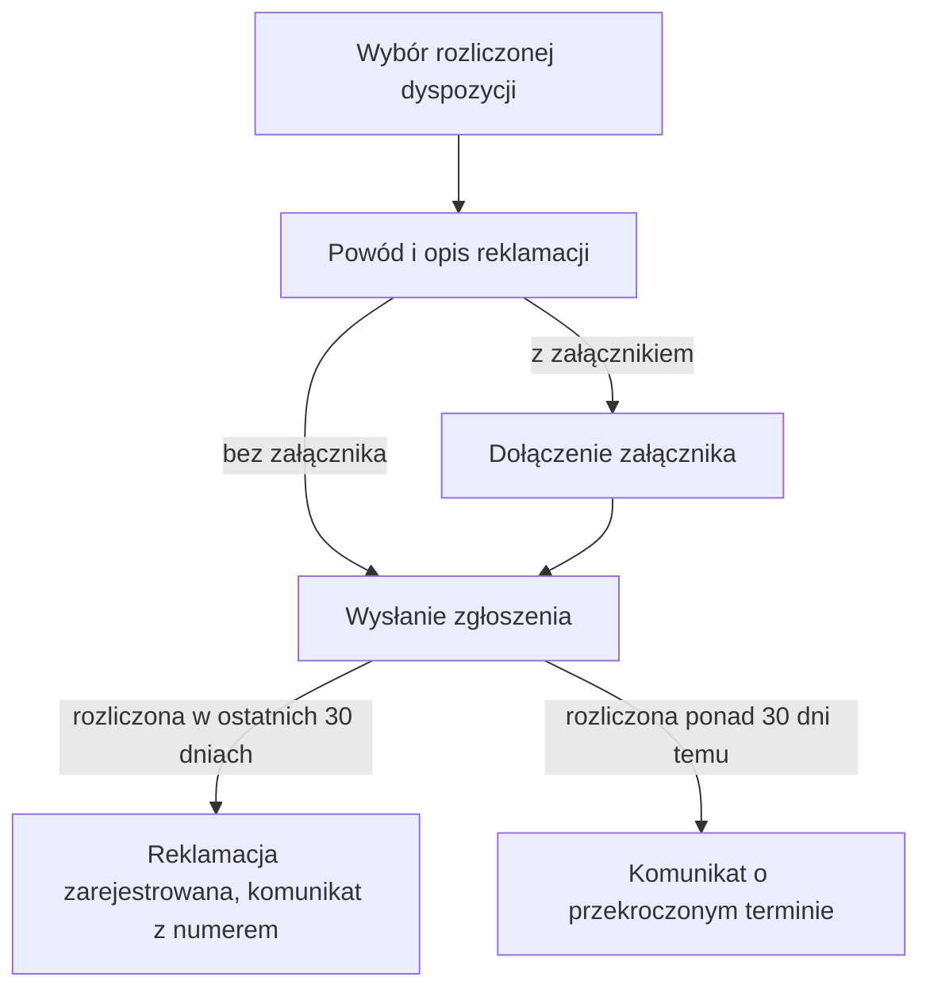

# Zgłoszenie reklamacji przez klienta

| Pole | Wartość |
|---|---|
| Aktor główny | ACTOR-001.ROLE-01 |
| Kanały | Bankowość internetowa |
| BFS | BFS-002 |
| Powiązane REQ | BFS-002.REQ-01 |
| Powiązane RB | BFS-002.RB-01 |
| Zdolność | CAP-004 |
| Makiety | Figma, plik „Reklamacje dyspozycji”, strona „Zgłoszenie — bankowość internetowa” |

## Powiązanie z BFS

| Typ | ID z BFS | Jak UC to realizuje |
|---|---|---|
| REQ | BFS-002.REQ-01 | Klient sam zgłasza reklamację w bankowości internetowej; zgłoszenie w oddziale opisuje osobny scenariusz kanału oddziałowego. |
| RB | BFS-002.RB-01 | Lista pokazuje tylko dyspozycje rozliczone w ostatnich 30 dniach, a przy wysłaniu system sprawdza termin ponownie. |

## Cel

Klient chce, żeby bank sprawdził rozliczoną dyspozycję, która jego zdaniem
została wykonana błędnie, i oddał mu nienależnie pobraną kwotę.

## Aktorzy

- ACTOR-001.ROLE-01: wybiera reklamowaną dyspozycję, podaje powód i opis, opcjonalnie dołącza załącznik i wysyła zgłoszenie.

## Kiedy można to zrobić

- [ ] Klient jest zalogowany w bankowości internetowej.
- [ ] Klient ma co najmniej jedną dyspozycję rozliczoną w ostatnich 30 dniach.

## Kroki

| Nr | Krok | Ekran | Wywołanie |
|---|---|---|---|
| 1 | Klient wybiera z listy rozliczonych dyspozycji tę, którą chce zareklamować. | SCR-004 | — |
| 2 | Klient wybiera powód reklamacji i opisuje, co było nie tak z dyspozycją. | SCR-004 | — |
| 3 | Klient wysyła zgłoszenie; system rejestruje reklamację w statusie ZGLOSZONA i pokazuje komunikat z numerem reklamacji. | SCR-004 | API-004 |

## Co może pójść inaczej

### A1. Dołączenie załącznika

| Nr | Krok | Ekran | Wywołanie |
|---|---|---|---|
| 1 | Po kroku 2 klient dołącza plik, np. potwierdzenie z banku odbiorcy albo zrzut wyciągu z podwójnym obciążeniem. | SCR-004 | |
| 2 | Klient przechodzi do kroku 3; załącznik trafia do reklamacji razem ze zgłoszeniem. | SCR-004 | |

## Co może pójść nie tak

### E1. Dyspozycja rozliczona ponad 30 dni temu

| Nr | Krok | Ekran | Wywołanie |
|---|---|---|---|
| 1 | W kroku 3 klient wysyła zgłoszenie dyspozycji, od której rozliczenia minęło już ponad 30 dni (formularz otwarto przed północą 30. dnia); system odrzuca zgłoszenie. | SCR-004 | API-004 |
| 2 | Klient widzi komunikat, że reklamację można złożyć tylko do 30 dni od rozliczenia dyspozycji; reklamacja nie powstaje. | SCR-004 | |

## Reguły biznesowe

- BFS-002.RB-01: lista w kroku 1 zawiera tylko dyspozycje rozliczone w ostatnich 30 dniach, a przy wysłaniu system sprawdza termin jeszcze raz; zgłoszenie po terminie kończy się błędem E1.

## Ograniczenia NFR

Brak własnych progów; obowiązują progi zdolności CAP-004.

## Kryteria akceptacji

- Kiedy klient wysyła zgłoszenie dyspozycji rozliczonej 10 dni temu z powodem i opisem, wtedy system rejestruje reklamację w statusie ZGLOSZONA i pokazuje jej numer.
- Kiedy klient dołącza plik przed wysłaniem zgłoszenia, wtedy pracownik zaplecza widzi ten plik w szczegółach reklamacji.
- Kiedy klient wysyła zgłoszenie dyspozycji rozliczonej 31 dni temu, wtedy system odrzuca zgłoszenie z komunikatem o terminie 30 dni i reklamacja nie powstaje.

## Diagram

<!-- Opcjonalny, najwyżej 15 kroków. -->

