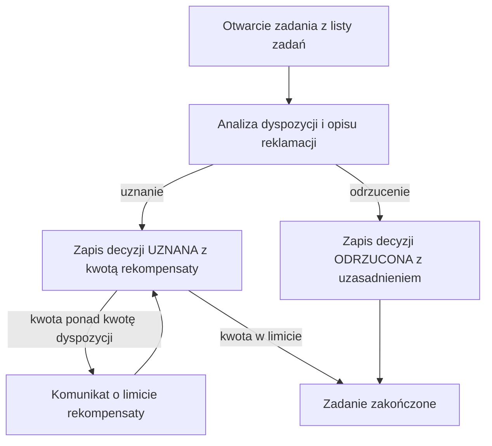

# Rozpatrzenie reklamacji

| Pole | Wartość |
|---|---|
| Aktor główny | ACTOR-001.ROLE-02 |
| Kanały | Aplikacja zaplecza, lista zadań silnika procesów |
| BFS | BFS-002 |
| Powiązane REQ | BFS-002.REQ-02 |
| Powiązane RB | BFS-002.RB-02 |
| Zdolność | CAP-004 |
| Makiety | Figma, plik „Reklamacje dyspozycji”, strona „Rozpatrzenie — zaplecze” |

## Powiązanie z BFS

| Typ | ID z BFS | Jak UC to realizuje |
|---|---|---|
| REQ | BFS-002.REQ-02 | Pracownik rozpatruje reklamację w zadaniu „Rozpatrzenie reklamacji” procesu „Obsługa reklamacji”, które pojawia się na jego liście zadań zaraz po rejestracji reklamacji. |
| RB | BFS-002.RB-02 | Przy zapisie decyzji UZNANA system odrzuca kwotę rekompensaty większą niż kwota reklamowanej dyspozycji. |

## Cel

Pracownik zaplecza chce ocenić, czy reklamacja jest zasadna, i zapisać decyzję
z kwotą rekompensaty, zanim minie 14 dni od zgłoszenia.

## Aktorzy

- ACTOR-001.ROLE-02: otwiera zadanie, analizuje reklamowaną dyspozycję, opis i załącznik klienta, zapisuje decyzję z uzasadnieniem.

## Kiedy można to zrobić

- [ ] Pracownik jest zalogowany w aplikacji zaplecza z rolą Pracownik zaplecza.
- [ ] Proces „Obsługa reklamacji” utworzył zadanie „Rozpatrzenie reklamacji”, widoczne na liście zadań pracownika, a reklamacja ma status W_ROZPATRZENIU albo ESKALOWANA.

## Kroki

| Nr | Krok | Ekran | Wywołanie |
|---|---|---|---|
| 1 | Pracownik otwiera zadanie z listy zadań; system przypisuje zadanie do pracownika i pobiera szczegóły reklamacji z reklamowaną dyspozycją. | SCR-005 | API-015, API-007 |
| 2 | Pracownik analizuje dane dyspozycji, powód, opis i załącznik klienta. | SCR-005 | — |
| 3 | Pracownik zapisuje decyzję UZNANA z kwotą rekompensaty i uzasadnieniem; system zapisuje decyzję i kończy zadanie w procesie. | SCR-005 | API-008 |

## Co może pójść inaczej

### A1. Odrzucenie reklamacji

| Nr | Krok | Ekran | Wywołanie |
|---|---|---|---|
| 1 | W kroku 3 pracownik wybiera decyzję ODRZUCONA i wpisuje uzasadnienie bez kwoty rekompensaty; system zapisuje decyzję, ustawia końcowy status ODRZUCONA i kończy zadanie. | SCR-005 | API-008 |

## Co może pójść nie tak

### E1. Kwota rekompensaty większa niż kwota dyspozycji

| Nr | Krok | Ekran | Wywołanie |
|---|---|---|---|
| 1 | W kroku 3 pracownik wpisuje kwotę rekompensaty większą niż kwota reklamowanej dyspozycji; system odrzuca zapis decyzji. | SCR-005 | API-008 |
| 2 | Pracownik widzi komunikat, że rekompensata nie może przekroczyć kwoty dyspozycji, poprawia kwotę i wraca do kroku 3. | SCR-005 | |

## Reguły biznesowe

- BFS-002.RB-02: przy decyzji UZNANA kwota rekompensaty może być najwyżej równa kwocie reklamowanej dyspozycji; system sprawdza to przy zapisie decyzji, a większa kwota kończy się błędem E1.

## Ograniczenia NFR

Brak własnych progów; obowiązują progi zdolności CAP-004.

## Kryteria akceptacji

- Kiedy pracownik zapisuje decyzję UZNANA z kwotą 250,00 PLN dla dyspozycji na 1 200,00 PLN, wtedy reklamacja ma status UZNANA, zadanie się kończy, a decyzja ma wpis w śladzie audytowym.
- Kiedy pracownik zapisuje decyzję ODRZUCONA z uzasadnieniem, wtedy reklamacja ma końcowy status ODRZUCONA, a obsługa reklamacji kończy się bez zlecenia rekompensaty.
- Kiedy pracownik wpisuje kwotę rekompensaty 1 500,00 PLN dla dyspozycji na 1 200,00 PLN, wtedy system odrzuca zapis, a zadanie pozostaje otwarte.

## Diagram

<!-- Opcjonalny, najwyżej 15 kroków. -->

