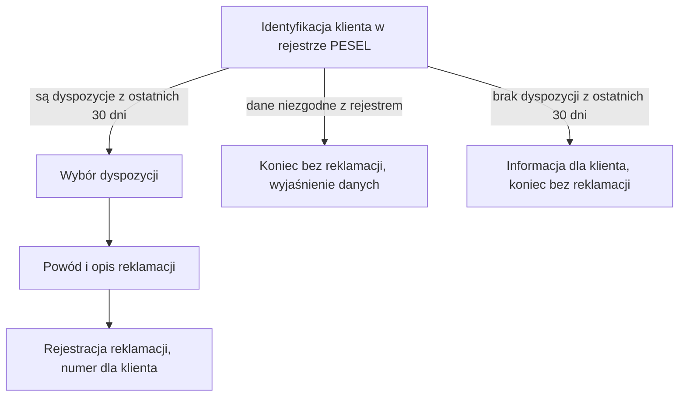

# Zgłoszenie reklamacji w oddziale

| Pole | Wartość |
|---|---|
| Aktor główny | ACTOR-001.ROLE-04 |
| Kanały | Oddział, aplikacja oddziałowa |
| BFS | BFS-002 |
| Powiązane REQ | BFS-002.REQ-01 |
| Powiązane RB | BFS-002.RB-01 |
| Zdolność | CAP-004, CAP-002 |
| Makiety | Figma, plik „Reklamacje dyspozycji”, strona „Zgłoszenie — aplikacja oddziałowa” |

## Powiązanie z BFS

| Typ | ID z BFS | Jak UC to realizuje |
|---|---|---|
| REQ | BFS-002.REQ-01 | Doradca identyfikuje klienta obecnego w oddziale i rejestruje reklamację w jego imieniu; zgłoszenie klienta w bankowości internetowej opisuje osobny scenariusz. |
| RB | BFS-002.RB-01 | Po identyfikacji klienta lista pokazuje tylko jego dyspozycje rozliczone w ostatnich 30 dniach. |

## Cel

Klient, który nie korzysta z bankowości internetowej albo woli załatwić sprawę
osobiście, chce zareklamować rozliczoną dyspozycję w oddziale i wyjść z numerem
zarejestrowanej reklamacji.

## Aktorzy

- ACTOR-001.ROLE-04: identyfikuje klienta na podstawie dowodu osobistego, wybiera reklamowaną dyspozycję, wpisuje powód podany przez klienta i rejestruje reklamację; w zakresie reklamacji działa z uprawnieniami klienta, wyłącznie dla klienta zidentyfikowanego w oddziale.

Klient jest obecny w oddziale i podaje powód reklamacji, ale nie obsługuje ekranu.

## Kiedy można to zrobić

- [ ] Doradca jest zalogowany w aplikacji oddziałowej.
- [ ] Klient jest obecny w oddziale i okazał dowód osobisty.

## Kroki

| Nr | Krok | Ekran | Wywołanie |
|---|---|---|---|
| 1 | Doradca wpisuje PESEL, imię, nazwisko i datę urodzenia z dowodu osobistego klienta; system sprawdza je w rejestrze PESEL, potwierdza tożsamość i wskazuje klienta w banku. | — | API-003 |
| 2 | Doradca wybiera z listy rozliczoną dyspozycję wskazaną przez klienta. | SCR-004 | — |
| 3 | Doradca wybiera powód reklamacji i wpisuje opis podany przez klienta. | SCR-004 | — |
| 4 | Doradca rejestruje reklamację; system zapisuje ją w statusie ZGLOSZONA, a doradca przekazuje klientowi numer reklamacji. | SCR-004 | API-004 |

## Co może pójść inaczej

Scenariusz nie ma wariantów przebiegu: każde zgłoszenie w oddziale przechodzi kroki 1–4.

## Co może pójść nie tak

### E1. Klient bez dyspozycji rozliczonych w 30 dniach

| Nr | Krok | Ekran | Wywołanie |
|---|---|---|---|
| 1 | W kroku 2 lista dyspozycji zidentyfikowanego klienta jest pusta, bo klient nie ma dyspozycji rozliczonych w ostatnich 30 dniach. | SCR-004 | |
| 2 | Doradca informuje klienta, że reklamacji nie można zarejestrować, i kończy obsługę bez zapisu reklamacji. | SCR-004 | |

### E2. Tożsamość klienta niepotwierdzona w rejestrze PESEL

| Nr | Krok | Ekran | Wywołanie |
|---|---|---|---|
| 1 | W kroku 1 system zwraca wynik negatywny: suma kontrolna PESEL jest błędna, dane różnią się od rejestru, numer ma status inny niż AKTYWNY albo rejestr PESEL nie odpowiada. | — | API-003 |
| 2 | Doradca porównuje dane z dowodem i poprawia błąd wpisania; gdy wynik nadal jest negatywny, kończy obsługę bez rejestracji reklamacji, a przy danych niezgodnych z rejestrem kieruje klienta do wyjaśnienia danych. | — | API-003 |

## Reguły biznesowe

- BFS-002.RB-01: lista w kroku 2 zawiera tylko dyspozycje klienta rozliczone w ostatnich 30 dniach; gdy żadnej nie ma, scenariusz kończy się błędem E1.

## Ograniczenia NFR

Brak własnych progów; obowiązują progi zdolności CAP-004.

## Kryteria akceptacji

- Kiedy dane z dowodu osobistego zgadzają się z rejestrem PESEL, wtedy system potwierdza tożsamość klienta, a doradca widzi listę jego dyspozycji rozliczonych w ostatnich 30 dniach.
- Kiedy doradca rejestruje zgłoszenie dyspozycji klienta rozliczonej 5 dni temu, wtedy system zapisuje reklamację w statusie ZGLOSZONA, a doradca widzi jej numer do przekazania klientowi.
- Kiedy klient nie ma dyspozycji rozliczonych w ostatnich 30 dniach, wtedy lista dyspozycji jest pusta i doradca nie może zarejestrować reklamacji.
- Kiedy dane z dowodu nie zgadzają się z rejestrem PESEL albo rejestr PESEL nie odpowiada, wtedy system nie potwierdza tożsamości i doradca nie przechodzi do wyboru dyspozycji.

## Diagram

<!-- Opcjonalny, najwyżej 15 kroków. -->

