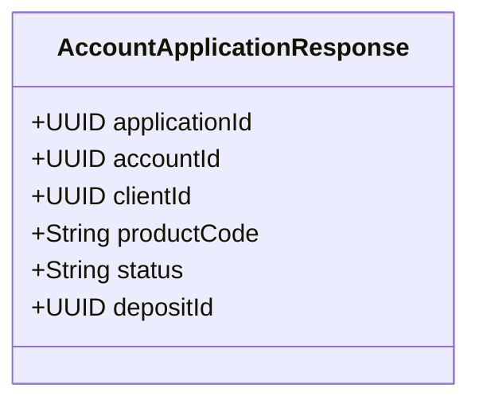

# POST /account-applications

| Pole | Wartość |
|---|---|
| Zdolność | CAP-010 |

## Cel

Punkt końcowy przyjmuje wysłany przez klienta wniosek o rachunek osobisty albo
lokatę terminową. Sprawdza dane wnioskodawcy, pełnoletność i zgodę na
regulamin, zapisuje rachunek w stanie WNIOSEK i uruchamia proces otwarcia
rachunku w silniku procesów.

## Parametry wejściowe

| Parametr | Typ | Wymagany | Źródło |
|---|---|---|---|
| client | object | tak | body |
| account | object | tak | body |
| deposit | object | nie | body |
| consents | array | tak | body |

## Walidacja pól wejściowych

| Reguła | Kod błędu HTTP | Komunikat zwracany przez system |
|---|---|---|
| Brak tokenu sesji wniosku albo token wygasł | 401 | Sesja wniosku wygasła. Rozpocznij wniosek ponownie. |
| Brak wymaganego pola w obiekcie client | 400 | Uzupełnij wymagane dane osobowe. |
| client.pesel nie ma 11 cyfr albo ma błędną sumę kontrolną | 400 | Numer PESEL jest niepoprawny. |
| client.birthDate nie zgadza się z datą urodzenia zapisaną w numerze PESEL | 400 | Data urodzenia nie zgadza się z numerem PESEL. |
| account.productCode spoza aktualnej oferty | 422 | Wybrany produkt nie jest dostępny w ofercie. |
| Produkt typu TERM_DEPOSIT bez obiektu deposit albo produkt typu PERSONAL_ACCOUNT z obiektem deposit | 400 | Dane lokaty nie pasują do wybranego produktu. |
| deposit.termMonths spoza zakresu 1–24 | 400 | Okres lokaty musi wynosić od 1 do 24 miesięcy. |
| deposit.amount mniejsza lub równa zero | 400 | Kwota lokaty musi być większa od zera. |
| Wnioskodawca ma mniej niż 18 lat, a produkt ma typ PERSONAL_ACCOUNT | 422 | Rachunek osobisty może otworzyć tylko osoba pełnoletnia. |
| Lista consents nie ma zgody typu REGULAMIN z granted = true | 422 | Zaakceptuj regulamin, aby wysłać wniosek. |

## Złożone parametry wejściowe

<!-- Opcjonalnie, np. zaszyfrowany token zawierający kilka informacji. -->

Nagłówek X-Application-Session to podpisany token JWT wydany przy otwarciu
formularza wniosku. Zawiera identyfikator sesji wniosku, kanał (WEB albo
MOBILE) i czas wygaśnięcia: 30 minut od wydania.

Obiekty treści żądania:

- client: pesel, firstName, lastName, birthDate i address (ulica z numerem, kod pocztowy, miejscowość).
- account: productCode, czyli kod produktu wybranego z oferty; typ produktu (PERSONAL_ACCOUNT albo TERM_DEPOSIT) mówi, czy wniosek dotyczy rachunku osobistego, czy lokaty.
- deposit (tylko dla produktu typu TERM_DEPOSIT): amount i termMonths.
- consents: lista zgód, każda z consentType (REGULAMIN albo MARKETING), granted i documentVersion, czyli wersją dokumentu, który klient zaakceptował.

## Autentykacja

Według CONV-002, token sesji wniosku. Punkt końcowy nie wymaga logowania
do bankowości.

## Zachowanie

### Przebieg podstawowy

1. Sprawdza token sesji wniosku i poprawność pól żądania.
2. Odczytuje typ i walutę wybranego produktu z oferty. Dla rachunku osobistego liczy wiek wnioskodawcy z client.birthDate na dzień złożenia wniosku. Sprawdza zgodę na regulamin.
3. W jednej transakcji zapisuje klienta, zgody z datą grantedAt i rachunek w stanie WNIOSEK z kodem produktu i walutą przepisaną z produktu, bez numeru IBAN. Dla lokaty zapisuje też lokatę z kwotą i okresem z wniosku, powiązaną z tym rachunkiem; oprocentowanie lokaty zostaje puste, bo ustala je otwarcie rachunku według oferty.
4. Nadaje wnioskowi identyfikator applicationId i uruchamia proces otwarcia rachunku w silniku procesów ze zmiennymi applicationId, pesel, firstName, lastName, birthDate i productCode.
5. Zwraca 201 z identyfikatorem wniosku, identyfikatorem rachunku i stanem WNIOSEK. Numer IBAN i potwierdzenie otwarcia klient dostaje później, po weryfikacji tożsamości.

- BPMN-010: proces otwarcia rachunku, uruchamiany w kroku 4.

### Przypadek brzegowy

Ponowne wysłanie wniosku w tej samej sesji, np. po podwójnym kliknięciu albo
ponowieniu po przekroczeniu czasu, nie tworzy drugiego rachunku ani drugiego
procesu: punkt końcowy rozpoznaje sesję z tokenu i zwraca 201 z danymi
pierwszego zapisu.

Jeśli klient o podanym numerze PESEL już istnieje w banku, wniosek wskazuje
istniejącego klienta, a dane osobowe z wniosku nie nadpisują jego danych.

## Model odpowiedzi

<!-- Opcjonalnie: classDiagram i tabela pól, bez kopiowania OpenAPI. -->

| Pole | Typ | Opis |
|---|---|---|
| applicationId | UUID | Identyfikator wniosku; ekran wniosku dopasowuje po nim potwierdzenie otwarcia rachunku |
| accountId | UUID | Identyfikator rachunku zapisanego w stanie WNIOSEK |
| clientId | UUID | Identyfikator nowego albo istniejącego klienta |
| productCode | String | Kod wybranego produktu |
| status | String | Stan rachunku po zapisie: WNIOSEK |
| depositId | UUID | Identyfikator lokaty; tylko w odpowiedzi na wniosek o lokatę |

## Struktura odpowiedzi błędnej

Według CONV-001. Kody własne (422): APPLICANT_UNDERAGE,
TERMS_CONSENT_MISSING i PRODUCT_NOT_AVAILABLE. Warunki i komunikaty podaje
tabela „Walidacja pól wejściowych”.

## Encje

- ENT-Client: obiekt client z danymi wnioskodawcy; w odpowiedzi clientId.
- ENT-Account: obiekt account z kodem produktu; zapisany rachunek w stanie WNIOSEK z walutą produktu, w odpowiedzi accountId, applicationId i status.
- ENT-Deposit: obiekt deposit z kwotą i okresem lokaty, bez oprocentowania; w odpowiedzi depositId.
- ENT-Consent: lista consents; zgoda typu REGULAMIN jest wymagana, zgoda MARKETING opcjonalna.

## Zależności

Brak zależności od integracji.

## Ograniczenia NFR

Brak własnych progów; obowiązują progi zdolności CAP-010.
