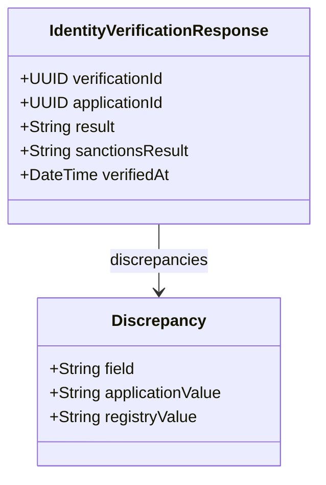

# POST /identity-verifications

| Pole | Wartość |
|---|---|
| Zdolność | CAP-011 |

## Cel

Punkt końcowy weryfikuje automatycznie tożsamość wnioskodawcy: sprawdza numer
PESEL i dane osobowe w rejestrze PESEL oraz osobę na liście sankcyjnej,
a następnie zwraca jeden wynik weryfikacji. Wynik decyduje, czy wniosek idzie
do otwarcia rachunku, trafia do ręcznej weryfikacji, czy zostaje odrzucony.

## Parametry wejściowe

| Parametr | Typ | Wymagany | Źródło |
|---|---|---|---|
| applicationId | UUID | tak | body |
| pesel | string | tak | body |
| firstName | string | tak | body |
| lastName | string | tak | body |
| birthDate | date | tak | body |

## Walidacja pól wejściowych

| Reguła | Kod błędu HTTP | Komunikat zwracany przez system |
|---|---|---|
| Brak tokenu albo token wygasł | 401 | Wymagane uwierzytelnienie serwisu. |
| Token bez zakresu identity-verifications:write | 403 | Brak uprawnień do weryfikacji tożsamości. |
| Brak któregokolwiek pola treści żądania | 400 | Żądanie weryfikacji nie zawiera kompletnych danych wnioskodawcy. |
| pesel nie ma 11 cyfr albo ma błędną sumę kontrolną | 400 | Numer PESEL jest niepoprawny. |
| birthDate jest datą z przyszłości | 400 | Data urodzenia jest niepoprawna. |

## Złożone parametry wejściowe

<!-- Opcjonalnie, np. zaszyfrowany token zawierający kilka informacji. -->

Punkt końcowy nie ma złożonych parametrów wejściowych.

## Autentykacja

Według CONV-002, token usługi z zakresem identity-verifications:write.
Punkt końcowy wywołuje krok procesu otwarcia rachunku; nie jest dostępny dla
klienta ani pracownika.

## Zachowanie

### Przebieg podstawowy

1. Sprawdza kompletność danych wnioskodawcy i zakłada rekord weryfikacji powiązany z applicationId.
2. Sprawdza numer PESEL i dane osobowe w rejestrze PESEL; zapisuje status numeru PESEL, dane z rejestru oraz numer i zdjęcie dokumentu tożsamości zwrócone przez rejestr.
3. Sprawdza osobę na liście sankcyjnej.
4. Sprawdza status numeru PESEL, porównuje dane z żądania z danymi z rejestru i łączy wynik z wynikiem listy sankcyjnej. Status numeru inny niż AKTYWNY jest rozbieżnością PESEL. Ustala wynik: NO_MATCH, gdy numer PESEL ma status AKTYWNY, a dane zgadzają się z rejestrem; POSSIBLE_MATCH, gdy są rozbieżności z rejestrem, w tym rozbieżność PESEL, albo lista sankcyjna wskazuje podobny wpis; MATCH, gdy osoba figuruje na liście sankcyjnej.
5. Zapisuje w rekordzie weryfikacji wynik, listę rozbieżności i czas zakończenia; numer PESEL w logach jest zamaskowany.
6. Zwraca 201 z identyfikatorem i wynikiem weryfikacji.

- FLOW-010: kolejność wywołań rejestru PESEL i listy sankcyjnej oraz ocena zgodności danych.

### Przypadek brzegowy

Gdy rejestr PESEL albo lista sankcyjna nie odpowiada także po ponowieniach,
punkt końcowy nie ustala wyniku. Rekord weryfikacji zostaje bez wyniku, a
odpowiedź 503 z kodem VERIFICATION_SOURCE_UNAVAILABLE zawiera jego
identyfikator verificationId, aby pracownik w ręcznej weryfikacji mógł otworzyć
dane wnioskodawcy. O dalszym przebiegu decyduje krok procesu otwarcia rachunku.

Ponowne żądanie z tym samym applicationId nie zakłada drugiego rekordu
weryfikacji: gdy rekord ma już wynik, punkt końcowy zwraca go bez ponownego
sprawdzania, a gdy wyniku nie ma, sprawdza rejestr PESEL i listę sankcyjną
ponownie w tym samym rekordzie. Wniosek ma więc jeden rekord weryfikacji.

Gdy rejestr nie zna numeru PESEL albo numer ma status UNIEWAZNIONY lub ZGON,
nie jest to błąd wywołania: lista rozbieżności zawiera PESEL, a wynik to
POSSIBLE_MATCH albo MATCH, zależnie od listy sankcyjnej. Status UNIEWAZNIONY
albo ZGON daje ten wynik także wtedy, gdy dane osobowe zgadzają się z rejestrem.

## Model odpowiedzi

<!-- Opcjonalnie: classDiagram i tabela pól, bez kopiowania OpenAPI. -->

| Pole | Typ | Opis |
|---|---|---|
| verificationId | UUID | Identyfikator weryfikacji; pod nim pracownik otwiera szczegóły w ręcznej weryfikacji |
| applicationId | UUID | Identyfikator wniosku z żądania |
| result | String | Wynik weryfikacji: NO_MATCH, POSSIBLE_MATCH albo MATCH |
| sanctionsResult | String | Wynik sprawdzenia listy sankcyjnej: NO_MATCH, POSSIBLE_MATCH albo MATCH |
| discrepancies | Lista | Rozbieżności z rejestrem PESEL: nazwa pola, wartość z wniosku i wartość z rejestru; dla numeru PESEL o statusie innym niż AKTYWNY wartość z rejestru to ten status; pusta, gdy numer jest aktywny, a dane są zgodne |
| verifiedAt | DateTime | Czas zakończenia weryfikacji |

## Struktura odpowiedzi błędnej

Według CONV-001. Kod własny: VERIFICATION_SOURCE_UNAVAILABLE (503), gdy
źródło weryfikacji nie odpowiada. Odpowiedź 503 ma pole własne
`verificationId`.

## Encje

- ENT-Client: dane wnioskodawcy w żądaniu: pesel, firstName, lastName i birthDate; punkt końcowy przekazuje je do rejestru PESEL i na listę sankcyjną.

## Zależności

Brak integracji wołanych poza przepływem. Rejestr PESEL i listę sankcyjną woła
FLOW-010.

## Ograniczenia NFR

- NFR-001.NFRT-PERF-01
