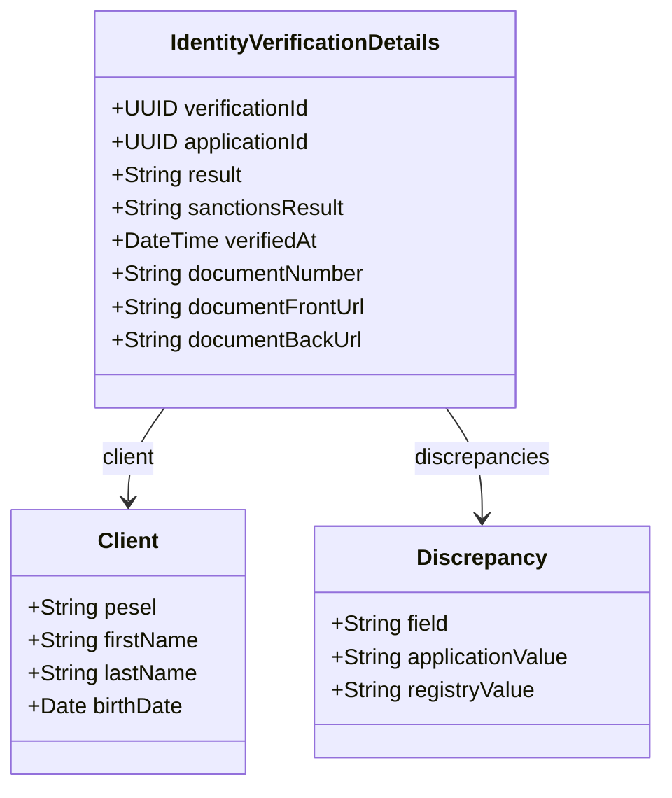

# GET /identity-verifications/{id}

| Pole | Wartość |
|---|---|
| Zdolność | CAP-011 |

## Cel

Punkt końcowy daje pracownikowi zaplecza komplet informacji do ręcznej
weryfikacji tożsamości: wynik weryfikacji automatycznej z rozbieżnościami,
dane wnioskodawcy oraz numer i zdjęcie dokumentu. Weryfikację wskazuje jej
identyfikator albo, gdy krok procesu go nie dostał, identyfikator wniosku.
Służy tylko do odczytu; decyzję pracownika zapisuje osobny punkt końcowy,
który kończy zadanie ręcznej weryfikacji.

## Parametry wejściowe

| Parametr | Typ | Wymagany | Źródło |
|---|---|---|---|
| id | UUID | tak | path |
| idType | string | nie | query |

## Walidacja pól wejściowych

| Reguła | Kod błędu HTTP | Komunikat zwracany przez system |
|---|---|---|
| Brak tokenu albo token wygasł | 401 | Sesja wygasła. Zaloguj się ponownie. |
| Użytkownik nie ma roli Pracownik zaplecza | 403 | Brak uprawnień do weryfikacji tożsamości. |
| Parametr id nie jest identyfikatorem UUID | 400 | Niepoprawny identyfikator weryfikacji. |
| Parametr idType ma wartość inną niż VERIFICATION albo APPLICATION | 400 | Niepoprawny rodzaj identyfikatora. |
| Weryfikacja o podanym id nie istnieje albo wniosek o podanym id nie ma rekordu weryfikacji | 404 | Nie znaleziono weryfikacji. |

## Złożone parametry wejściowe

<!-- Opcjonalnie, np. zaszyfrowany token zawierający kilka informacji. -->

Punkt końcowy nie ma złożonych parametrów wejściowych.

## Autentykacja

Według CONV-002, token użytkownika. Wymagana rola: Pracownik zaplecza
(aplikacja zaplecza).

## Zachowanie

### Przebieg podstawowy

1. Sprawdza token i rolę pracownika.
2. Wczytuje rekord weryfikacji z danymi wnioskodawcy, wynikiem, listą rozbieżności i danymi dokumentu: przy idType = VERIFICATION albo bez idType rekord o identyfikatorze weryfikacji równym id, przy idType = APPLICATION rekord weryfikacji wniosku o applicationId równym id.
3. Przygotowuje podpisane adresy obrazów awersu i rewersu dokumentu, ważne 5 minut.
4. Zapisuje odczyt w logu audytowym z identyfikatorem pracownika; numer PESEL i numer dokumentu są w logu zamaskowane.
5. Zwraca 200 ze szczegółami weryfikacji. Nie zmienia żadnych danych.

### Przypadek brzegowy

Gdy weryfikacja automatyczna była niedostępna, rekord weryfikacji nie ma
wyniku. Punkt końcowy zwraca wtedy dane wnioskodawcy, a pola result,
sanctionsResult, discrepancies, documentNumber i adresy zdjęć są puste;
pracownik porównuje dane ręcznie.

Gdy usługa weryfikacji nie odpowiedziała krokowi procesu, identyfikator
weryfikacji jest pusty. Formularz ręcznej weryfikacji woła wtedy punkt końcowy
z identyfikatorem wniosku i idType = APPLICATION; wniosek ma najwyżej jeden
rekord weryfikacji, więc wynik jest jednoznaczny. Gdy usługa weryfikacji nie
przyjęła żądania weryfikacji, rekord nie powstał i punkt końcowy zwraca 404.

## Model odpowiedzi

<!-- Opcjonalnie: classDiagram i tabela pól, bez kopiowania OpenAPI. -->

| Pole | Typ | Opis |
|---|---|---|
| verificationId | UUID | Identyfikator weryfikacji |
| applicationId | UUID | Identyfikator wniosku, którego dotyczy weryfikacja |
| result | String | Wynik weryfikacji automatycznej: NO_MATCH, POSSIBLE_MATCH albo MATCH; pusty, gdy weryfikacja była niedostępna |
| sanctionsResult | String | Wynik sprawdzenia listy sankcyjnej |
| verifiedAt | DateTime | Czas zakończenia weryfikacji automatycznej |
| client | Client | Dane wnioskodawcy z wniosku: pesel, firstName, lastName, birthDate |
| discrepancies | Lista | Rozbieżności z rejestrem PESEL: nazwa pola, wartość z wniosku i wartość z rejestru; dla numeru PESEL o statusie innym niż AKTYWNY wartość z rejestru to ten status |
| documentNumber | String | Seria i numer dowodu osobistego zwrócone przez rejestr PESEL |
| documentFrontUrl | String | Podpisany adres obrazu awersu dokumentu, ważny 5 minut |
| documentBackUrl | String | Podpisany adres obrazu rewersu dokumentu, ważny 5 minut |

## Struktura odpowiedzi błędnej

Według CONV-001. Kod własny: VERIFICATION_NOT_FOUND (404), gdy weryfikacja
o podanym id nie istnieje albo wniosek nie ma rekordu weryfikacji.

## Encje

- ENT-Client: obiekt client w odpowiedzi z danymi wnioskodawcy, które pracownik porównuje z danymi z rejestru i ze zdjęciem dokumentu.

## Zależności

Brak zależności od integracji.

## Ograniczenia NFR

Brak własnych progów; obowiązują progi zdolności CAP-011.
