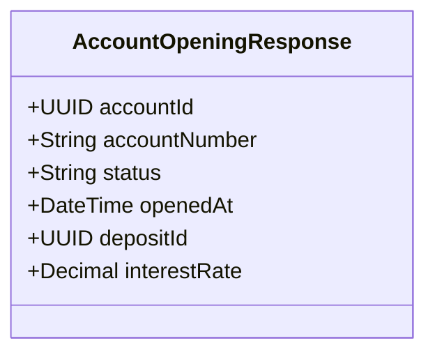

# POST /accounts

| Pole | Wartość |
|---|---|
| Zdolność | CAP-010 |

## Cel

Punkt końcowy otwiera rachunek z wniosku, którego wnioskodawca przeszedł
weryfikację tożsamości: nadaje numer IBAN i zmienia stan rachunku z WNIOSEK na
OTWARTY. Woła go krok procesu otwarcia rachunku w silniku procesów; proces
odpowiada za to, że wywołanie następuje tylko po pozytywnym wyniku weryfikacji
automatycznej albo ręcznej.

## Parametry wejściowe

| Parametr | Typ | Wymagany | Źródło |
|---|---|---|---|
| applicationId | UUID | tak | body |

## Walidacja pól wejściowych

| Reguła | Kod błędu HTTP | Komunikat zwracany przez system |
|---|---|---|
| Brak tokenu albo token wygasł | 401 | Wymagane uwierzytelnienie serwisu. |
| Token bez zakresu accounts:open | 403 | Brak uprawnień do otwarcia rachunku. |
| Brak applicationId albo wartość nie jest identyfikatorem UUID | 400 | Pole applicationId jest wymagane i musi być identyfikatorem UUID. |
| Wniosek o podanym applicationId nie istnieje | 404 | Nie znaleziono wniosku. |
| Rachunek z wniosku ma stan ZABLOKOWANY albo ZAMKNIETY | 409 | Rachunku z tego wniosku nie można otworzyć. |

## Złożone parametry wejściowe

<!-- Opcjonalnie, np. zaszyfrowany token zawierający kilka informacji. -->

Punkt końcowy nie ma złożonych parametrów wejściowych.

## Autentykacja

Według CONV-002, token usługi z zakresem accounts:open. Punkt końcowy
wywołuje krok procesu otwarcia rachunku.

## Zachowanie

### Przebieg podstawowy

1. Sprawdza token serwisu i wczytuje rachunek z wniosku o podanym applicationId; rachunek ma stan WNIOSEK.
2. Nadaje rachunkowi numer IBAN z puli numerów banku, z poprawną sumą kontrolną.
3. Zmienia stan rachunku na OTWARTY i zapisuje datę otwarcia openedAt.
4. Dla lokaty zapisuje w lokacie numer rachunku, stan ZALOZONA i oprocentowanie ustalone w dniu otwarcia z aktualnej oferty dla okresu lokaty; we wniosku oprocentowanie jest puste. Datę zapadalności ustala dopiero aktywacja w systemie centralnym.
5. Zwraca 201 z numerem rachunku i stanem OTWARTY. Punkt końcowy nie publikuje zdarzenia o otwarciu rachunku; robi to kolejny krok procesu.

### Przypadek brzegowy

Ponowne wywołanie dla wniosku, którego rachunek ma już stan OTWARTY albo
AKTYWNY, np. po przekroczeniu czasu w kroku procesu, nie nadaje drugiego numeru
IBAN. Punkt końcowy zwraca 200 z istniejącym numerem rachunku i bieżącym
stanem.

## Model odpowiedzi

<!-- Opcjonalnie: classDiagram i tabela pól, bez kopiowania OpenAPI. -->

| Pole | Typ | Opis |
|---|---|---|
| accountId | UUID | Identyfikator otwartego rachunku |
| accountNumber | String | Nadany numer IBAN |
| status | String | Stan rachunku: OTWARTY, a przy ponownym wywołaniu po aktywacji AKTYWNY |
| openedAt | DateTime | Data i czas otwarcia rachunku |
| depositId | UUID | Identyfikator lokaty; tylko dla lokaty |
| interestRate | Decimal | Oprocentowanie roczne lokaty w procentach, ustalone przy otwarciu z oferty; tylko dla lokaty |

## Struktura odpowiedzi błędnej

Według CONV-001. Kod własny: ACCOUNT_NOT_OPENABLE (409), gdy rachunek
z wniosku ma stan ZABLOKOWANY albo ZAMKNIETY.

## Encje

- ENT-Account: rachunek z wniosku; w odpowiedzi numer IBAN, stan i data otwarcia.
- ENT-Deposit: lokata powiązana z otwieranym rachunkiem, zapisywana ze stanem ZALOZONA i oprocentowaniem z oferty; w odpowiedzi depositId i oprocentowanie, tylko dla lokaty.

## Zależności

Brak zależności od integracji.

## Ograniczenia NFR

Brak własnych progów; obowiązują progi zdolności CAP-010.
