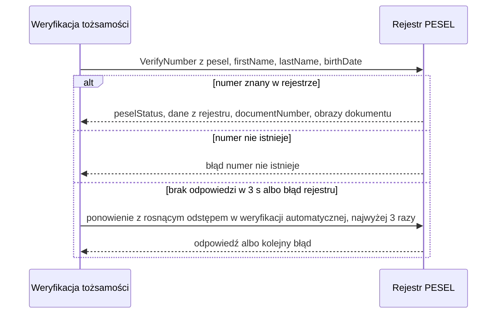

# Rejestr PESEL: weryfikacja numeru

| Pole | Wartość |
|---|---|
| Zdolność | CAP-011 |

## Cel

Bank potwierdza w źródle państwowym, że numer PESEL istnieje, jest aktywny
i należy do osoby o podanym imieniu, nazwisku i dacie urodzenia. Rejestr
zwraca też numer i obrazy ważnego dowodu osobistego, które pracownik zaplecza
porównuje z danymi wnioskodawcy przy ręcznej weryfikacji.

## Protokół

| Pole | Wartość |
|---|---|
| Typ | SOAP |
| Właściciel | Zewnętrzny: administrator państwowego rejestru PESEL |
| Endpoint | https://pesel-registry.example/ws/v2/VerifyNumber |
| API Catalog | Katalog API banku, pozycja „Rejestr PESEL: weryfikacja numeru” |

## Operacja

Żądanie:

| Pole | Źródło | Opis |
|---|---|---|
| pesel | ENT-Client, pesel | Numer PESEL wnioskodawcy |
| firstName | ENT-Client, firstName | Imię do porównania z rejestrem |
| lastName | ENT-Client, lastName | Nazwisko do porównania z rejestrem |
| birthDate | ENT-Client, birthDate | Data urodzenia do porównania z rejestrem |
| institutionCode | Konfiguracja integracji | Kod banku nadany przez administratora rejestru |
| queryPurpose | Stała WERYFIKACJA_KLIENTA | Podstawa zapytania wymagana przez rejestr |

Odpowiedź (tylko pola istotne dla nas):

| Pole | Opis |
|---|---|
| peselStatus | Status numeru: AKTYWNY, UNIEWAZNIONY albo ZGON; status inny niż AKTYWNY oznacza rozbieżność PESEL w wyniku weryfikacji |
| firstName | Imię zapisane w rejestrze |
| lastName | Nazwisko zapisane w rejestrze |
| birthDate | Data urodzenia zapisana w rejestrze |
| documentNumber | Seria i numer ważnego dowodu osobistego |
| documentFrontImage | Obraz awersu ważnego dowodu osobistego ze zdjęciem posiadacza, JPG w base64 |
| documentBackImage | Obraz rewersu ważnego dowodu osobistego, JPG w base64 |

## Warunek wywołania

Operację wołamy w trzech sytuacjach: przy automatycznej weryfikacji tożsamości
każdego wniosku o rachunek, wtedy, gdy pracownik zaplecza sprawdza numer PESEL
w zadaniu ręcznej weryfikacji, oraz przy identyfikacji klienta w oddziale, gdy
doradca wpisuje PESEL i dane z dowodu osobistego.

## Obsługa błędów

| Sytuacja | Obsługa |
|---|---|
| 404 | Rejestr zwraca błąd „numer nie istnieje”: wołający dostaje wynik z informacją, że numer PESEL nie figuruje w rejestrze. |
| 5xx | Błąd po stronie rejestru: w weryfikacji automatycznej ponowienia według CONV-003, potem błąd niedostępności rejestru; przy identyfikacji klienta w oddziale najwyżej 3 ponowienia według NFR-001.NFRT-AVAIL-01, potem wołający dostaje błąd niedostępności rejestru; w ręcznej weryfikacji bez ponowień, ekran pokazuje niedostępność rejestru. |
| Przekroczenie czasu | Limit czasu według CONV-003; obsługa jak przy 5xx. |
| Odrzucony certyfikat banku | Bez ponowień; błąd niedostępności rejestru dla wołającego i alert dla zespołu utrzymania integracji. |

## Diagram sekwencji

## Encje

- ENT-Client: dane klienta w żądaniu: pesel, firstName, lastName i birthDate; odpowiedź porównujemy z tymi samymi atrybutami.

## Ograniczenia NFR

- NFR-001.NFRT-AVAIL-01: limit czasu 3 s i najwyżej 3 ponowienia z rosnącym odstępem przy niedostępności rejestru PESEL.
