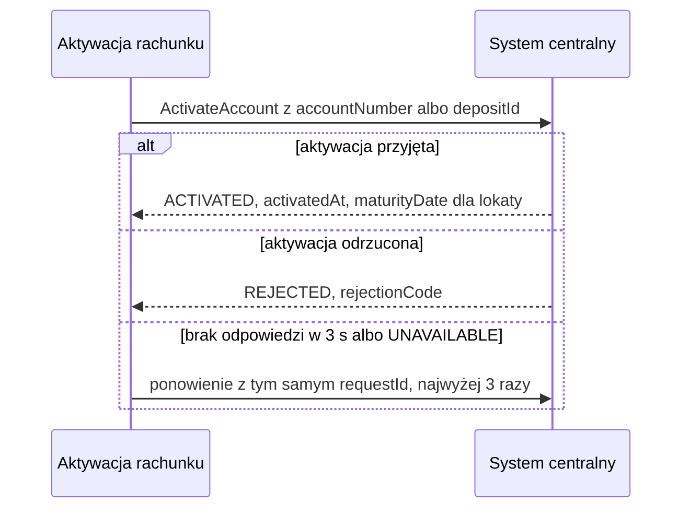

# System centralny: aktywacja rachunku

| Pole | Wartość |
|---|---|
| Zdolność | CAP-010 |

## Cel

Rachunek otwarty w systemie wniosków istnieje w systemie centralnym, ale nie
przyjmuje operacji, dopóki nie zostanie aktywowany. Wołamy system centralny,
aby aktywować rachunek osobisty albo lokatę i pozwolić klientowi na wpłaty,
przelewy i naliczanie odsetek.

## Protokół

| Pole | Wartość |
|---|---|
| Typ | gRPC |
| Właściciel | Area Core Banking |
| Endpoint | core-banking.bank.internal:443, usługa corebanking.accounts.v1.AccountService, metoda ActivateAccount |
| API Catalog | Katalog API banku, pozycja „System centralny: aktywacja rachunku” |

## Operacja

Żądanie:

| Pole | Źródło | Opis |
|---|---|---|
| requestId | Identyfikator odebranego zdarzenia o otwarciu rachunku | Klucz idempotencji: ponowienie z tym samym kluczem nie aktywuje rachunku drugi raz |
| accountNumber | ENT-Account, accountNumber | Numer IBAN rachunku osobistego; podawany zamiast depositId |
| productCode | ENT-Account, productCode | Kod produktu, według którego system centralny ustawia parametry rachunku |
| depositId | ENT-Deposit, depositId | Identyfikator lokaty; podawany zamiast accountNumber |
| amount | ENT-Deposit, amount | Kwota lokaty; tylko dla lokaty |
| termMonths | ENT-Deposit, termMonths | Okres lokaty w miesiącach; tylko dla lokaty |
| startDate | Data otwarcia rachunku | Data startu lokaty; tylko dla lokaty |

Odpowiedź (tylko pola istotne dla nas):

| Pole | Opis |
|---|---|
| activationStatus | Wynik: ACTIVATED albo REJECTED |
| rejectionCode | Kod odrzucenia, np. ACCOUNT_BLOCKED albo PRODUCT_INACTIVE; tylko przy REJECTED |
| activatedAt | Czas aktywacji w systemie centralnym |
| maturityDate | Data zapadalności lokaty wyliczona z daty startu i okresu; tylko dla lokaty |

## Warunek wywołania

Operację wołamy po odebraniu zdarzenia o otwarciu rachunku, gdy rachunek ma
stan OTWARTY. Dla rachunku osobistego podajemy accountNumber, dla lokaty
depositId z kwotą, okresem i datą startu.

## Obsługa błędów

| Sytuacja | Obsługa |
|---|---|
| 404 | Kod gRPC NOT_FOUND: system centralny nie zna rachunku albo lokaty. Eskalacja jak przy odrzuceniu aktywacji. |
| 5xx | Kod gRPC UNAVAILABLE albo INTERNAL: ponowienia według CONV-003, kluczem idempotencji jest requestId; gdy zawiodą, zdarzenie trafia do kolejki wiadomości niedostarczonych, a rachunek zostaje w stanie OTWARTY. |
| Przekroczenie czasu | Kod gRPC DEADLINE_EXCEEDED po limicie czasu według CONV-003: obsługa jak przy 5xx. |
| Odrzucenie aktywacji | activationStatus REJECTED: bez ponowień; eskalacja, czyli zgłoszenie dla zespołu obsługi rachunków z numerem rachunku i kodem odrzucenia. |

## Diagram sekwencji

## Encje

- ENT-Account: rachunek osobisty wskazany numerem accountNumber, z kodem produktu w żądaniu.
- ENT-Deposit: lokata wskazana identyfikatorem depositId, z kwotą i okresem w żądaniu oraz datą zapadalności w odpowiedzi.

## Ograniczenia NFR

- NFR-001.NFRT-AVAIL-01
