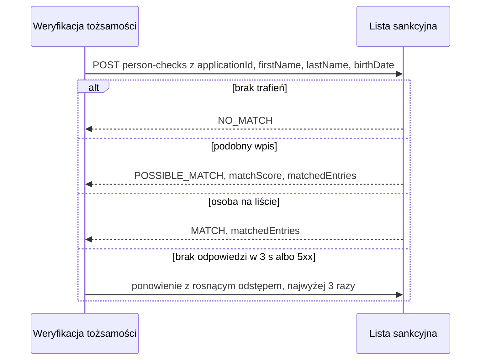

# Lista sankcyjna: sprawdzenie osoby

| Pole | Wartość |
|---|---|
| Zdolność | CAP-011 |

## Cel

Bank nie może otworzyć rachunku osobie objętej sankcjami. Wołamy zewnętrznego
dostawcę list sankcyjnych, aby sprawdzić wnioskodawcę na listach ONZ, Unii
Europejskiej i liście krajowej przed otwarciem rachunku.

## Protokół

| Pole | Wartość |
|---|---|
| Typ | REST |
| Właściciel | Zewnętrzny dostawca list sankcyjnych |
| Endpoint | POST https://sanctions-screening.example/api/v3/person-checks |
| API Catalog | Katalog API banku, pozycja „Lista sankcyjna: sprawdzenie osoby” |

## Operacja

Żądanie:

| Pole | Źródło | Opis |
|---|---|---|
| applicationId | Żądanie weryfikacji tożsamości, applicationId | Identyfikator wniosku z żądania weryfikacji, zapisywany u dostawcy do śladu audytowego |
| firstName | ENT-Client, firstName | Imię wnioskodawcy |
| lastName | ENT-Client, lastName | Nazwisko wnioskodawcy |
| birthDate | ENT-Client, birthDate | Data urodzenia zawężająca trafienia |
| lists | Konfiguracja integracji | Sprawdzane listy: ONZ, UE i lista krajowa |

Odpowiedź (tylko pola istotne dla nas):

| Pole | Opis |
|---|---|
| matchResult | MATCH: osoba figuruje na liście; POSSIBLE_MATCH: podobny wpis bez pełnej zgodności danych; NO_MATCH: brak trafień |
| matchScore | Podobieństwo najlepszego trafienia w skali 0–100; puste przy NO_MATCH |
| matchedEntries | Trafienia: nazwa listy, identyfikator wpisu, imię, nazwisko i data urodzenia z wpisu |
| screeningId | Identyfikator sprawdzenia u dostawcy, zapisywany w śladzie audytowym |

## Warunek wywołania

Operację wołamy przy każdej automatycznej weryfikacji tożsamości wnioskodawcy
o rachunek osobisty albo lokatę. Wynik trafia do oceny zgodności danych
tożsamości.

## Obsługa błędów

| Sytuacja | Obsługa |
|---|---|
| 404 | Dostawca nie zna skonfigurowanej listy albo ścieżki: weryfikacja kończy się błędem niedostępności listy, a zespół utrzymania integracji dostaje alert. |
| 5xx | Ponowienia według CONV-003; gdy zawiodą, wołający dostaje błąd niedostępności listy sankcyjnej i nie ustala wyniku weryfikacji. |
| Przekroczenie czasu | Limit czasu według CONV-003; obsługa jak przy 5xx. |
| 429 | Przekroczony limit zapytań: ponowienie po czasie z nagłówka Retry-After, w ramach tych samych 3 ponowień. |

## Diagram sekwencji

## Encje

- ENT-Client: imię, nazwisko i data urodzenia wnioskodawcy w żądaniu.

## Ograniczenia NFR

- NFR-001.NFRT-AVAIL-01
