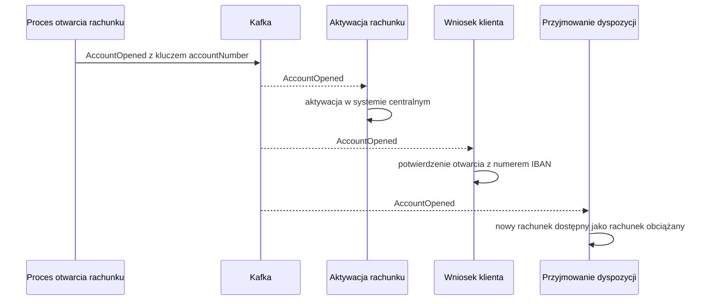

# AccountOpened

## Informacje podstawowe

| Pole | Wartość |
|---|---|
| Nazwa zdarzenia | AccountOpened |
| Wersja | 1.0.0 |
| System producenta | account-service, krok procesu otwarcia rachunku w silniku procesów |
| Adres kanału | accounts.account-opened.v1 |
| Format | JSON |
| Zdolność publikująca | CAP-010 |

## Cel i zakres

Zdarzenie informuje, że rachunek osobisty albo lokata zostały otwarte: rachunek
ma numer IBAN i stan OTWARTY. Obejmuje dane potrzebne do aktywacji rachunku
w systemie centralnym, do potwierdzenia otwarcia dla klienta i do przyjmowania
dyspozycji z nowego rachunku. Nie przenosi danych osobowych klienta poza jego
identyfikatorem.

## Kontekst biznesowy

Zdarzenie powstaje w procesie otwarcia rachunku, gdy wnioskodawca przeszedł
weryfikację tożsamości, a rachunek dostał numer IBAN. Klient składający
wniosek o rachunek czeka na nie na ekranie zgód i wysłania wniosku, aby
zobaczyć potwierdzenie otwarcia. Scenariusz aktywacji rachunku uruchamia po
nim aktywację rachunku w systemie centralnym.

## Przepływ danych



## Nagłówek komunikatu

Według CONV-004. Wartości własne zdarzenia:

| Pole | Wartość |
|---|---|
| correlationId | Identyfikator instancji procesu otwarcia rachunku; łączy zdarzenie z wnioskiem klienta |
| messageId | Wyliczany z identyfikatora wniosku, więc ponowiona publikacja ma ten sam messageId |
| ce_source | /account-opening/process |
| ce_time | Czas otwarcia rachunku |

## Specyfikacja schematu

| Atrybut | Typ | Obligatoryjność | Wartości / format | Opis biznesowy |
|---|---|---|---|---|
| applicationId | UUID | tak | UUID v4 | Identyfikator wniosku, z którego powstał rachunek; ekran wniosku dopasowuje po nim potwierdzenie |
| accountId | UUID | tak | UUID v4 | Identyfikator otwartego rachunku |
| accountNumber | String | tak | IBAN, 28 znaków, np. PL61109010140000071219812874 | Numer rachunku nadany przy otwarciu |
| clientId | UUID | tak | UUID v4 | Identyfikator właściciela rachunku |
| productCode | String | tak | Kod z katalogu produktów, np. ROR-STANDARD albo LOKATA-TERMINOWA | Otwarty produkt |
| currency | String | tak | ISO 4217, np. PLN | Waluta rachunku, przepisana z produktu przy zapisie wniosku |
| status | String | tak | OTWARTY | Stan rachunku w chwili publikacji |
| openedAt | DateTime | tak | ISO 8601 | Data i czas otwarcia rachunku |
| deposit | Object | nie | Obecny tylko dla lokaty | Dane lokaty otwartej na tym rachunku |
| deposit.depositId | UUID | tak | UUID v4 | Identyfikator lokaty |
| deposit.amount | Decimal | tak | Kwota większa od zera, dwa miejsca po przecinku | Kwota lokaty |
| deposit.termMonths | Integer | tak | 1–24 | Okres lokaty w miesiącach |
| deposit.interestRate | Decimal | tak | Procent roczny, np. 5.25 | Oprocentowanie lokaty ustalone przy otwarciu rachunku z oferty dla okresu lokaty; wniosek go nie zawiera |

## Przykład ładunku

```json
{
  "applicationId": "e4a91c6b-7d2f-4b38-a5e0-3c8d1f6b92a7",
  "accountId": "3f6c2a9e-8b41-4d7a-9c15-2e7b0d4a6f81",
  "accountNumber": "PL61109010140000071219812874",
  "clientId": "a2d5e7f1-4c93-4b8e-8f20-6d1c9b3e5a47",
  "productCode": "LOKATA-TERMINOWA",
  "currency": "PLN",
  "status": "OTWARTY",
  "openedAt": "2026-09-14T10:42:17+02:00",
  "deposit": {
    "depositId": "c81e4b27-5d9a-4f63-a0b8-7e2f1d6c9a35",
    "amount": 20000.00,
    "termMonths": 12,
    "interestRate": 5.25
  }
}
```

## Charakterystyka dostarczenia

| Cecha | Wartość |
|---|---|
| Gwarancja dostarczenia | Co najmniej raz (at-least-once) |
| Idempotencja konsumenta | Wymagana: konsument odrzuca duplikaty po messageId; aktywacja przekazuje go do systemu centralnego jako klucz idempotencji |
| Kolejność | Zachowana dla jednego rachunku dzięki kluczowi partycji |
| Klucz partycji | accountNumber |
| Retencja | 7 dni |
| Kolejka wiadomości niedostarczonych | accounts.account-opened.v1.dlq; trafia tam komunikat po wyczerpaniu ponowień u konsumenta |

## Encje

- ENT-Account: atrybuty rachunku w korzeniu ładunku: accountId, applicationId, accountNumber, clientId, productCode, currency, status i openedAt.
- ENT-Deposit: obiekt deposit z depositId, amount, termMonths i interestRate, obecny tylko dla lokaty.

## Powiązanie z przepływem od początku do końca

Wniosek klienta, weryfikacja tożsamości automatyczna albo ręczna, otwarcie
rachunku z nadaniem numeru IBAN, publikacja zdarzenia AccountOpened, a potem
równolegle aktywacja w systemie centralnym i potwierdzenie otwarcia dla
klienta. Zdarzenie zamyka część procesu wykonywaną w silniku procesów
i otwiera część asynchroniczną, która kończy się aktywnym rachunkiem.

## Powiązane dokumenty

- CAP-010: zdolność, która publikuje zdarzenie.
- ENT-Account: encja, z której pochodzą atrybuty rachunku w korzeniu ładunku.
- ENT-Deposit: encja, z której pochodzi obiekt deposit, obecny tylko dla lokaty.
