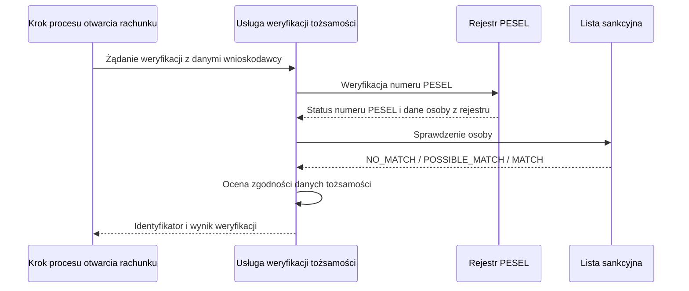

# Automatyczna weryfikacja tożsamości — przebieg podstawowy

| Pole | Wartość |
|---|---|
| Zdolność | CAP-011 |

## Warunki wstępne

- Wniosek o rachunek jest zapisany, a proces otwarcia rachunku w silniku doszedł do kroku automatycznej weryfikacji tożsamości.
- Żądanie zawiera identyfikator wniosku, PESEL, imię, nazwisko i datę urodzenia wnioskodawcy.
- Wołający krok procesu ma token techniczny uprawniający do weryfikacji tożsamości.

## Diagram

<!-- Mermaid, najwyżej 10–15 uczestników lub kroków. -->

## Opis przepływu

| Nr | Krok | Aktywność | Wywołanie |
|---|---|---|---|
| 1 | Przyjmuje żądanie weryfikacji, sprawdza kompletność danych wnioskodawcy i zakłada rekord weryfikacji | — | — |
| 2 | Sprawdza numer PESEL w rejestrze i pobiera status numeru oraz imię, nazwisko i datę urodzenia osoby | — | INT-010 |
| 3 | Sprawdza imię, nazwisko i datę urodzenia wnioskodawcy na liście sankcyjnej | — | INT-012 |
| 4 | Sprawdza status numeru PESEL (status inny niż AKTYWNY to rozbieżność PESEL), porównuje dane z wniosku z danymi z rejestru, łączy wynik z wynikiem listy sankcyjnej i zwraca wynik weryfikacji w odpowiedzi | ACT-010 | — |

## Scenariusze błędów

Osobny przepływ obsługi błędów nie powstaje. Gdy rejestr PESEL albo lista
sankcyjna nie odpowie po ponowieniach, przepływ przerywa weryfikację i zwraca
błąd niedostępności usługi z identyfikatorem rekordu weryfikacji, bez wyniku
weryfikacji. Błąd obsługuje krok procesu
„Automatyczna weryfikacja tożsamości” w procesie otwarcia rachunku: kieruje
wniosek do ręcznej weryfikacji przez pracownika zaplecza. Niekompletne dane
w żądaniu kończą przepływ w kroku 1 błędem walidacji, zanim przepływ zawoła
rejestr PESEL.
