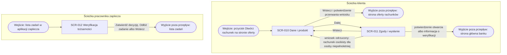

# Otwarcie rachunku: mapa nawigacyjna

## Warunki wstępne

Mapa obejmuje dwie niezależne ścieżki procesu otwarcia rachunku: ścieżkę
klienta, który w bankowości internetowej albo aplikacji mobilnej wypełnia
dwukrokowy wniosek, oraz ścieżkę pracownika zaplecza, który rozstrzyga
zadanie ręcznej weryfikacji tożsamości. Mapa jest kompletna dla tych ścieżek.
Nie obejmuje strony oferty, listy zadań w aplikacji zaplecza ani powiadomień
e-mail i SMS. Proces nie ma osobnych ekranów błędu: błędy są komunikatami na
ekranach mapy.

## Diagram nawigacji

<!-- Ekran startowy, pośredni, końcowy, ekran błędu, wyjście poza przepływ. -->

## Kluczowe elementy nawigacji

- Przejście z kroku 1 do kroku 2 wymaga poprawnych danych osobowych i wybranego produktu, a dla lokaty także kwoty i okresu.
- Przycisk wstecz na kroku 1 pyta o przerwanie wniosku; po potwierdzeniu klient wraca na stronę oferty rachunków bez zapisu danych.
- Powrót z kroku 2 do kroku 1 zachowuje wpisane dane i zaznaczone zgody.
- Wysłanie wniosku jest możliwe tylko po zaznaczeniu zgody na regulamin.
- Po wysłaniu wniosku klient zostaje na kroku 2, który pokazuje potwierdzenie otwarcia z numerem IBAN albo informację o ręcznej weryfikacji; wysłanego wniosku nie można już edytować.
- Ścieżka pracownika nie łączy się z ekranami klienta: ekran weryfikacji otwiera zadanie z listy zadań. Zatwierdzenie decyzji kończy zadanie, odłożenie zwraca je do puli, a przycisk wstecz zostawia je przypisane do pracownika; w każdym przypadku pracownik wraca do listy zadań.

## Odniesienia do ekranów

| Ekran | Rola w mapie | Dokument |
|---|---|---|
| Dane i produkt | startowy | SCR-010 |
| Zgody i wysłanie | końcowy | SCR-011 |
| Weryfikacja tożsamości | startowy i końcowy ścieżki pracownika | SCR-012 |

## Scenariusze błędów

- Rachunek osobisty dla osoby niepełnoletniej: po wysłaniu wniosku klient wraca z kroku 2 do kroku 1 z komunikatem przy dacie urodzenia.
- Brak zgody na regulamin: klient zostaje na kroku 2, a przycisk wysłania jest nieaktywny.
- Wygasła sesja wniosku: bieżący ekran pokazuje komunikat, a klient zaczyna wniosek od kroku 1.
- Rejestr PESEL niedostępny: pracownik zostaje na ekranie weryfikacji z komunikatem i może odłożyć zadanie, które wraca do puli, a pracownik do listy zadań.
