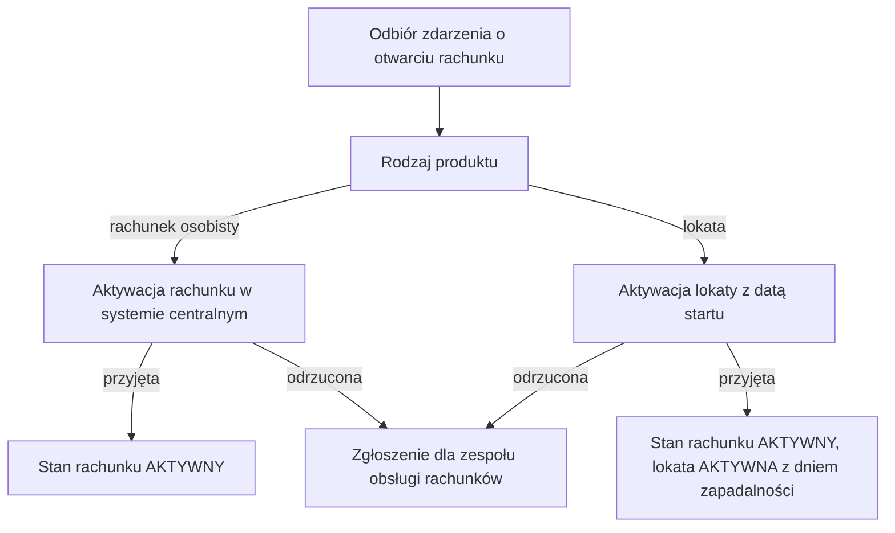

# Aktywacja rachunku

| Pole | Wartość |
|---|---|
| Aktor | ACTOR-001.ROLE-03 [System] |
| Trigger | Odbiór zdarzenia QUE-010 AccountOpened |
| BFS | BFS-003 |
| Powiązane REQ | BFS-003.REQ-04 |
| Powiązane RB | — |
| Zdolność | CAP-010 |

## Powiązanie z BFS

| Typ | ID z BFS | Jak TUC to realizuje |
|---|---|---|
| REQ | BFS-003.REQ-04 | Po odebraniu zdarzenia o otwarciu rachunku system aktywuje rachunek albo lokatę w systemie centralnym (kroki 1–2, A1). |

## Cel

Rachunek otwarty po weryfikacji tożsamości staje się aktywny w systemie
centralnym: klient może na niego wpłacać i wykonywać przelewy, a lokata nalicza
odsetki od daty startu.

## Aktorzy

- ACTOR-001.ROLE-03: odbiera zdarzenie o otwarciu rachunku i aktywuje rachunek albo lokatę w systemie centralnym.

## Kiedy można to zrobić

- [ ] Rachunek ma stan OTWARTY i nadany numer IBAN.
- [ ] Dla lokaty: lokata ma stan ZALOZONA.
- [ ] Proces otwarcia rachunku opublikował zdarzenie o otwarciu tego rachunku.

## Kroki

| Nr | Akcja systemu | Wywołanie |
|---|---|---|
| 1 | System odbiera zdarzenie o otwarciu rachunku z numerem rachunku i rodzajem produktu. | QUE-010 |
| 2 | System aktywuje rachunek osobisty w systemie centralnym i zapisuje stan rachunku AKTYWNY. | INT-011 |

## Co może pójść inaczej

### A1. Lokata

| Nr | Akcja systemu | Wywołanie |
|---|---|---|
| 1 | Zdarzenie dotyczy lokaty; system aktywuje lokatę w systemie centralnym z datą startu równą dacie otwarcia. | INT-011 |
| 2 | System zapisuje stan rachunku AKTYWNY, a w lokacie stan AKTYWNA i dzień zapadalności (maturityDate) zwrócony przez system centralny. | |

## Co może pójść nie tak

### E1. System centralny odrzuca aktywację

Polityka błędu: eskalacja

| Nr | Akcja systemu | Wywołanie |
|---|---|---|
| 1 | System centralny odrzuca aktywację z kodem błędu biznesowego, np. rachunek zablokowany albo nieznany numer. | INT-011 |
| 2 | System pozostawia rachunek w stanie OTWARTY, a lokatę w stanie ZALOZONA, i tworzy zgłoszenie dla zespołu obsługi rachunków z numerem rachunku i kodem odrzucenia. | |

## Reguły biznesowe

Scenariusz nie realizuje reguł biznesowych procesu.

## Ograniczenia NFR

Brak własnych progów; obowiązują progi zdolności CAP-010.

## Kryteria akceptacji

- Kiedy system odbierze zdarzenie o otwarciu rachunku osobistego, wtedy aktywuje rachunek w systemie centralnym, a rachunek ma stan AKTYWNY.
- Kiedy zdarzenie dotyczy lokaty, wtedy system aktywuje lokatę z datą startu równą dacie otwarcia, zapisuje stan rachunku AKTYWNY, a w lokacie stan AKTYWNA i dzień zapadalności z systemu centralnego.
- Kiedy system odbierze to samo zdarzenie drugi raz, wtedy nie wysyła ponownie aktywacji do systemu centralnego.
- Kiedy system centralny odrzuci aktywację, wtedy rachunek zostaje w stanie OTWARTY, a zespół obsługi rachunków dostaje zgłoszenie.

## Diagram

<!-- Opcjonalny, najwyżej 15 kroków. -->

