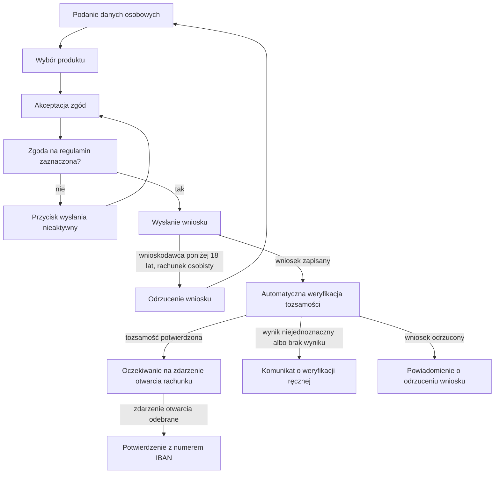

# Wniosek o rachunek

| Pole | Wartość |
|---|---|
| Aktor główny | ACTOR-001.ROLE-01 |
| Kanały | Bankowość internetowa, aplikacja mobilna |
| BFS | BFS-003 |
| Powiązane REQ | BFS-003.REQ-01, BFS-003.REQ-02 |
| Powiązane RB | BFS-003.RB-01, BFS-003.RB-02 |
| Zdolność | CAP-010, CAP-011 |
| Makiety | Figma: plik Konto-wniosek-online, ramki 101-2 (krok 1) i 101-3 (krok 2) |

## Powiązanie z BFS

| Typ | ID z BFS | Jak UC to realizuje |
|---|---|---|
| REQ | BFS-003.REQ-01 | Klient podaje dane osobowe, wybiera rachunek osobisty albo lokatę, akceptuje zgody i wysyła wniosek (kroki 1–4). |
| REQ | BFS-003.REQ-02 | Wysłany wniosek przechodzi w procesie otwarcia rachunku automatyczną weryfikację tożsamości w rejestrze PESEL i na liście sankcyjnej (krok 5); wynik niejednoznaczny albo brak wyniku prowadzi do weryfikacji ręcznej (A1). |
| RB | BFS-003.RB-01 | Wniosek osoby niepełnoletniej o rachunek osobisty zostaje odrzucony przy wysłaniu (E1). |
| RB | BFS-003.RB-02 | Bez zgody na regulamin przycisk wysłania wniosku jest nieaktywny (E2). |

## Cel

Klient chce otworzyć rachunek osobisty albo lokatę terminową bez wizyty
w oddziale i jeszcze w tej samej sesji dowiedzieć się, czy rachunek został
otwarty.

## Aktorzy

- ACTOR-001.ROLE-01: wypełnia i wysyła wniosek, akceptuje zgody, otrzymuje potwierdzenie otwarcia rachunku albo informację o weryfikacji.

## Kiedy można to zrobić

- [ ] Klient ma numer PESEL i ważny dowód osobisty.
- [ ] Klient otworzył wniosek na stronie banku albo w aplikacji mobilnej i ma aktywną sesję wniosku.
- [ ] Wybrany produkt jest w aktualnej ofercie banku.

## Kroki

| Nr | Krok | Ekran | Sekcja | Wywołanie |
|---|---|---|---|---|
| 1 | Klient podaje dane osobowe: PESEL, imię, nazwisko, datę urodzenia i adres. | SCR-010 | SCRSEC-010 | — |
| 2 | Klient wybiera produkt: rachunek osobisty albo lokatę; dla lokaty podaje kwotę i okres. | SCR-010 | SCRSEC-011 | — |
| 3 | Klient akceptuje zgodę na regulamin produktu i opcjonalnie zgodę marketingową. | SCR-011 | SCRSEC-012 | — |
| 4 | Klient wysyła wniosek; system zapisuje wniosek i uruchamia proces otwarcia rachunku. | SCR-011 | — | API-010 |
| 5 | System automatycznie weryfikuje tożsamość wnioskodawcy w procesie otwarcia rachunku; ekran pokazuje komunikat oczekiwania. | SCR-011 | — | — |
| 6 | Klient otrzymuje potwierdzenie otwarcia z numerem IBAN, gdy system odbierze zdarzenie o otwarciu rachunku. | SCR-011 | — | QUE-010 |

## Co może pójść inaczej

### A1. Weryfikacja ręczna

| Nr | Krok | Ekran | Wywołanie |
|---|---|---|---|
| 1 | Weryfikacja automatyczna w kroku 5 daje wynik niejednoznaczny albo nie daje wyniku, więc wniosek czeka na pracownika zaplecza, a potwierdzenie otwarcia nie przychodzi w trakcie sesji. | SCR-011 | |
| 2 | Klient widzi komunikat, że wniosek czeka na weryfikację tożsamości, a o otwarciu rachunku albo odrzuceniu wniosku dostanie powiadomienie e-mail i SMS. | SCR-011 | |

## Co może pójść nie tak

### E1. Klient niepełnoletni wybrał rachunek osobisty

| Nr | Krok | Ekran | Wywołanie |
|---|---|---|---|
| 1 | System odrzuca wniosek o rachunek osobisty, bo z daty urodzenia wynika wiek poniżej 18 lat. | SCR-010 | API-010 |
| 2 | Klient wraca do kroku danych i produktu, widzi komunikat przy dacie urodzenia i poprawia błędnie wpisaną datę albo rezygnuje z wniosku. | SCR-010 | |

### E2. Brak zgody na regulamin

| Nr | Krok | Ekran | Wywołanie |
|---|---|---|---|
| 1 | Klient nie zaznacza zgody na regulamin produktu. | SCR-011 | |
| 2 | Przycisk wysłania wniosku pozostaje nieaktywny, a przy zgodzie na regulamin pojawia się informacja, że jest wymagana. | SCR-011 | |

### E3. Wniosek odrzucony w weryfikacji tożsamości

| Nr | Krok | Ekran | Wywołanie |
|---|---|---|---|
| 1 | Weryfikacja w kroku 5 kończy się odrzuceniem wniosku: osoba jest na liście sankcyjnej albo pracownik zaplecza odrzucił wniosek w weryfikacji ręcznej. | SCR-011 | |
| 2 | System zamyka wniosek bez otwarcia rachunku; zdarzenie o otwarciu rachunku nie powstaje. | SCR-011 | |
| 3 | Ekran oczekiwania kończy się po 2 minutach komunikatem, że wynik wniosku przyjdzie e-mailem i SMS, a klient dostaje powiadomienie o odrzuceniu wniosku bez podania przyczyny. | SCR-011 | |

## Reguły biznesowe

- BFS-003.RB-01: przy wysłaniu wniosku o rachunek osobisty system liczy wiek wnioskodawcy z daty urodzenia i odrzuca wniosek osoby poniżej 18 lat; wniosek o lokatę tej reguły nie sprawdza.
- BFS-003.RB-02: zgoda na regulamin blokuje przycisk wysłania na ekranie zgód, a punkt końcowy wniosku dodatkowo odrzuca wniosek bez tej zgody.

## Ograniczenia NFR

Brak własnych progów; obowiązują progi zdolności CAP-010 i CAP-011.

## Kryteria akceptacji

- Kiedy pełnoletni klient wyśle kompletny wniosek o rachunek osobisty ze zgodą na regulamin, a weryfikacja automatyczna potwierdzi jego tożsamość, wtedy system otwiera rachunek bez udziału pracownika, a ekran pokazuje potwierdzenie z numerem IBAN.
- Kiedy klient wybierze lokatę i poda kwotę oraz okres, wtedy wysłany wniosek zawiera lokatę z tą kwotą i tym okresem.
- Kiedy weryfikacja automatyczna da wynik niejednoznaczny albo nie da wyniku, wtedy wniosek trafia do ręcznej weryfikacji tożsamości, a klient widzi komunikat o weryfikacji zamiast potwierdzenia otwarcia.
- Kiedy osoba poniżej 18 lat wyśle wniosek o rachunek osobisty, wtedy system odrzuca wniosek, a klient wraca do kroku danych i produktu z komunikatem o wymaganej pełnoletności.
- Kiedy zgoda na regulamin nie jest zaznaczona, wtedy przycisk wysłania wniosku jest nieaktywny.
- Kiedy weryfikacja tożsamości odrzuci wniosek, wtedy rachunek nie zostaje otwarty, ekran nie pokazuje potwierdzenia, a klient dostaje powiadomienie o odrzuceniu bez podania przyczyny.

## Diagram

<!-- Opcjonalny, najwyżej 15 kroków. -->

