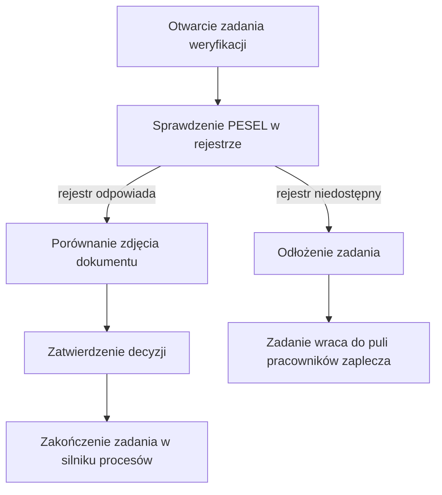

# Ręczna weryfikacja tożsamości

| Pole | Wartość |
|---|---|
| Aktor główny | ACTOR-001.ROLE-02 |
| Kanały | Aplikacja zaplecza banku, lista zadań silnika procesów |
| BFS | BFS-003 |
| Powiązane REQ | BFS-003.REQ-03 |
| Powiązane RB | — |
| Zdolność | CAP-011 |
| Makiety | Figma: plik Zaplecze-weryfikacja-tozsamosci, ramka 44-10 |

## Powiązanie z BFS

| Typ | ID z BFS | Jak UC to realizuje |
|---|---|---|
| REQ | BFS-003.REQ-03 | Pracownik zaplecza sprawdza PESEL w rejestrze, porównuje zdjęcie dokumentu i zatwierdza decyzję w zadaniu procesu otwarcia rachunku (kroki 1–3). |

## Cel

Pracownik zaplecza chce rozstrzygnąć wniosek, dla którego weryfikacja
automatyczna nie dała jednoznacznego wyniku albo nie dała go wcale, tak aby
rachunek otworzyć tylko osobie o potwierdzonej tożsamości.

## Aktorzy

- ACTOR-001.ROLE-02: podejmuje zadanie ręcznej weryfikacji z listy zadań procesu otwarcia rachunku, sprawdza dane w rejestrze PESEL, porównuje zdjęcie dokumentu i zatwierdza decyzję.

## Kiedy można to zrobić

- [ ] Weryfikacja automatyczna wniosku zakończyła się wynikiem POSSIBLE_MATCH albo była niedostępna, a proces otwarcia rachunku utworzył zadanie ręcznej weryfikacji.
- [ ] Pracownik jest zalogowany do aplikacji zaplecza i ma dostęp do zadań weryfikacji tożsamości.
- [ ] Zadania nie podjął wcześniej inny pracownik.

## Kroki

| Nr | Krok | Ekran | Wywołanie |
|---|---|---|---|
| 1 | Pracownik otwiera zadanie weryfikacji; system przypisuje zadanie do pracownika i pobiera szczegóły weryfikacji po jej identyfikatorze, a gdy go brak, po identyfikatorze wniosku, i pokazuje wynik weryfikacji automatycznej, dane z wniosku i zdjęcie dokumentu; gdy szczegółów weryfikacji nie ma, pokazuje same dane z wniosku z komunikatem o niedostępnej weryfikacji automatycznej. | SCR-012 | API-016, API-012 |
| 2 | Pracownik sprawdza numer PESEL i jego status w rejestrze i porównuje dane z rejestru z danymi z wniosku. | SCR-012 | API-003 |
| 3 | Pracownik porównuje zdjęcie dokumentu z danymi wnioskodawcy, wybiera decyzję ZATWIERDZONA albo ODRZUCONA z uzasadnieniem i zatwierdza ją; system zapisuje decyzję i kończy zadanie w silniku procesów. | SCR-012 | API-014 |

## Co może pójść inaczej

Scenariusz nie ma wariantów przebiegu. Decyzja ZATWIERDZONA i ODRZUCONA mają
ten sam przebieg kroków; o dalszym losie wniosku decyduje proces otwarcia
rachunku po zakończeniu zadania.

## Co może pójść nie tak

### E1. Rejestr PESEL niedostępny

| Nr | Krok | Ekran | Wywołanie |
|---|---|---|---|
| 1 | Rejestr PESEL nie odpowiada; ekran pokazuje komunikat o niedostępności rejestru. | SCR-012 | API-003 |
| 2 | Pracownik odkłada zadanie; zadanie wraca do puli pracowników zaplecza bez decyzji i można je podjąć ponownie. | SCR-012 | API-017 |

## Reguły biznesowe

Scenariusz nie realizuje reguł biznesowych procesu.

## Ograniczenia NFR

Brak własnych progów; obowiązują progi zdolności CAP-011.

## Kryteria akceptacji

- Kiedy pracownik otworzy zadanie weryfikacji, wtedy ekran pokazuje wynik weryfikacji automatycznej, dane z wniosku i zdjęcie dokumentu.
- Kiedy pracownik sprawdzi numer PESEL, wtedy ekran pokazuje dane z rejestru obok danych z wniosku.
- Kiedy pracownik zatwierdzi decyzję, wtedy zadanie w silniku procesów kończy się i znika z listy zadań.
- Kiedy rejestr PESEL jest niedostępny, wtedy ekran pokazuje komunikat o niedostępności, a odłożone zadanie wraca do puli pracowników zaplecza bez decyzji.
- Kiedy pracownik wybierze decyzję ODRZUCONA, wtedy zatwierdzenie wymaga uzasadnienia.

## Diagram

<!-- Opcjonalny, najwyżej 15 kroków. -->

