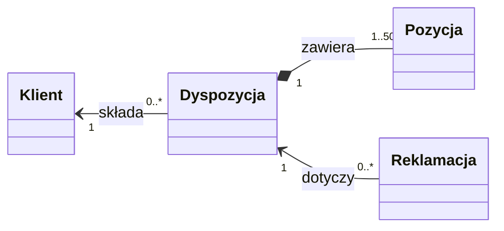

# Domena dyspozycji

| Pole | Wartość |
|---|---|
| Obszar | Dyspozycje przelewów wielopozycyjnych klientów detalicznych i reklamacje ich rozliczenia |
| Źródło domeny | Model EA DispositionRepository / Disposition v2.3, regulamin rachunków dla klientów indywidualnych, polityka reklamacji banku |

## Cel i zakres

Model mówi, co w banku znaczy dyspozycja, jej pozycja, klient i reklamacja oraz
jakie reguły obowiązują te pojęcia bez względu na kanał, system i sposób
zapisu danych. Obejmuje drogę dyspozycji od złożenia do rozliczenia w księdze
głównej oraz reklamację dyspozycji już rozliczonej.

## Źródła wymagań w górę

- Model EA DispositionRepository / Disposition v2.3: diagram klas domeny
  dyspozycji z definicjami pojęć.
- Regulamin rachunków dla klientów indywidualnych: maksymalna liczba pozycji
  w dyspozycji i maksymalna kwota pojedynczego przelewu.
- Polityka reklamacji banku: termin zgłoszenia reklamacji liczony od
  rozliczenia dyspozycji.
- Warsztaty z właścicielami pojęć z departamentów płatności, klienta
  detalicznego i reklamacji.

## Słownik pojęć domenowych

| ID | Definicja | Synonimy | Właściciel pojęcia |
|---|---|---|---|
| DOM-Dyspozycja | Polecenie klienta obciążenia jednego jego rachunku kwotą łączną rozdzieloną na pozycje przelewów, przyjmowane i rozliczane jako całość | przelew wielopozycyjny, zlecenie zbiorcze, paczka przelewów | Departament Płatności |
| DOM-Pozycja | Pojedynczy przelew w dyspozycji: rachunek odbiorcy, kwota i tytuł; nie istnieje poza dyspozycją | przelew składowy, linia dyspozycji | Departament Płatności |
| DOM-Klient | Osoba fizyczna, która w swoim imieniu składa dyspozycje i reklamacje, identyfikowana w banku numerem klienta i numerem PESEL | posiadacz rachunku, zleceniodawca | Departament Klienta Detalicznego |
| DOM-Reklamacja | Zgłoszenie klienta kwestionujące rozliczenie dyspozycji, zakończone decyzją banku: uznaniem z rekompensatą albo odrzuceniem | zgłoszenie reklamacyjne, reklamacja transakcji | Departament Reklamacji |

## Encje i Value Objects

| Pojęcie | Typ | Tożsamość | Odpowiedzialność |
|---|---|---|---|
| DOM-Dyspozycja | Encja | Identyfikator dyspozycji nadany przy przyjęciu | Korzeń agregatu: pilnuje liczby pozycji, zgodności kwoty łącznej z pozycjami i statusu całej dyspozycji |
| DOM-Pozycja | Encja | Identyfikator pozycji nadany przy przyjęciu dyspozycji | Część agregatu dyspozycji: niesie dane jednego przelewu i wynik jego księgowania |
| DOM-Klient | Encja | Identyfikator klienta nadany przez bank | Dane identyfikacyjne i adresowe osoby, która składa dyspozycje i reklamacje |
| DOM-Reklamacja | Encja | Identyfikator reklamacji nadany przy zgłoszeniu | Korzeń osobnego agregatu: wskazuje reklamowaną dyspozycję, niesie powód, decyzję i kwotę rekompensaty |

## Relacje i agregaty

<!-- Opcjonalnie diagram classDiagram. -->

- Agregat dyspozycji: korzeniem jest Dyspozycja, a w agregacie leży od 1 do 50
  pozycji. Pozycję tworzy się i zmienia tylko przez dyspozycję, bo tylko
  dyspozycja widzi wszystkie pozycje naraz i pilnuje RD-001 oraz RD-002.
  Pozycje są księgowane osobno, ale zawsze w rozliczeniu swojej dyspozycji.
- Klient to osobny agregat. Dyspozycja wskazuje jednego klienta, który ją
  złożył; klient ma wiele dyspozycji.
- Agregat reklamacji: Reklamacja ma własny cykl życia i własny termin
  rozpatrzenia, więc nie należy do agregatu dyspozycji. Wskazuje jedną
  dyspozycję; jedna dyspozycja może mieć wiele reklamacji zgłoszonych
  w różnych sprawach.
- RD-003 łączy dwa agregaty: reklamacja w chwili zgłoszenia sprawdza datę
  rozliczenia wskazanej dyspozycji, ale jej nie zmienia.

## Reguły i inwarianty domenowe

| ID | Reguła | Kryterium walidacji |
|---|---|---|
| RD-001 | Suma kwot pozycji jest równa kwocie dyspozycji | Suma kwot wszystkich pozycji = kwota łączna dyspozycji, co do grosza, po przyjęciu i po każdej korekcie |
| RD-002 | Dyspozycja ma od 1 do 50 pozycji | Liczba pozycji ≥ 1 i ≤ 50 po przyjęciu i po każdej korekcie |
| RD-003 | Reklamacja dotyczy dyspozycji rozliczonej nie dawniej niż 30 dni | Dyspozycja jest rozliczona, a od daty rozliczenia do daty zgłoszenia reklamacji minęło nie więcej niż 30 dni kalendarzowych |
| RD-004 | Kwota pojedynczej pozycji jest dodatnia i nie przekracza 1 000 000 PLN | 0 < kwota pozycji ≤ 1 000 000,00 PLN |

## Zakres poza dokumentem

- Limity klienta i zasady ich wyliczania: to reguła procesu obsługi
  dyspozycji, nie znaczenie pojęć.
- Rachunki i produkty bankowe: opisuje je osobna domena rachunków.
- Sposób księgowania w księdze głównej, kanały składania dyspozycji
  i przebiegi rozliczeń.
- Rekompensata i eskalacja jako osobne pojęcia: kwota rekompensaty jest cechą
  reklamacji, a eskalacja etapem jej rozpatrzenia.
- Struktura danych, typy i kontrakty.
