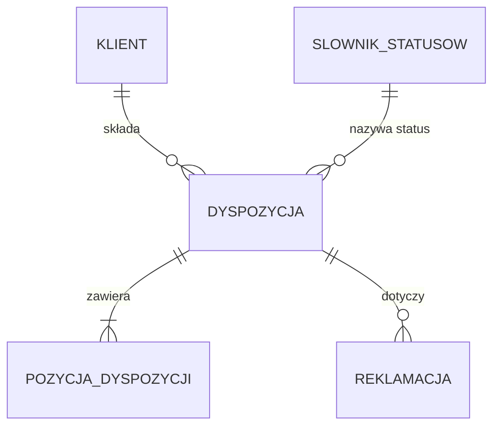

# Model logiczny dyspozycji

| Pole | Wartość |
|---|---|
| ID | LDM-001 |
| Źródło DDM | DDM-001 |
| Wersja | 1.4 |
| Źródło | Eksport XML z EA, pakiet DispositionLogical |

## Cel i zakres

Model opisuje dane dyspozycji przelewu wielopozycyjnego, jej pozycji, klienta
i reklamacji w systemie transakcyjnym: encje, atrybuty z typami logicznymi,
powiązania i słownik statusów. Jest niezależny od bazy danych; szczegóły
każdej encji leżą w osobnym pliku.

## Źródło (DDM)

Model wynika z DDM-001 „Domena dyspozycji”. Każde z czterech pojęć domeny ma
jedną encję, a reguły domenowe, które da się sprawdzić na danych jednej
encji, wracają w encjach jako reguły walidacyjne z kolumną RD.

## Mapowanie DDM → LDM

| Pojęcie | Encja | Uzasadnienie |
|---|---|---|
| DDM-001.DOM-Dyspozycja | ENT-Disposition | Korzeń agregatu: rachunek obciążany, kwota łączna, waluta, status i daty dyspozycji |
| DDM-001.DOM-Pozycja | ENT-DispositionItem | Pozycja ma własny status księgowania i jest zmieniana pojedynczo, więc jest osobną encją zawartą w dyspozycji |
| DDM-001.DOM-Klient | ENT-Client | Dane identyfikacyjne i adresowe klienta |
| DDM-001.DOM-Reklamacja | ENT-Complaint | Osobny agregat z własnym cyklem życia, który wskazuje reklamowaną dyspozycję |

## Diagram ER

<!-- Bez kluczy PK/FK, z notacją liczebności. -->

## Encje

- ENT-Disposition — Dyspozycja
- ENT-DispositionItem — Pozycja dyspozycji
- ENT-Client — Klient
- ENT-Complaint — Reklamacja
- ENT-StatusDict — Słownik statusów

## Kluczowe relacje

- ENT-Disposition zawiera ENT-DispositionItem: dyspozycja ma od 1 do 50
  pozycji, pozycja nie istnieje bez dyspozycji (1:N).
- Dyspozycja wskazuje klienta, który ją złożył; klient ma wiele dyspozycji
  (N:1).
- Reklamacja wskazuje jedną dyspozycję; dyspozycja może mieć wiele reklamacji
  (N:1). Reklamacja nie należy do agregatu dyspozycji.
- Status dyspozycji przyjmuje kody ze słownika statusów (ENT-StatusDict).

## Słowniki zewnętrzne

- ENT-StatusDict — słownik techniczny bez pojęcia w domenie. Przechowuje kody,
  etykiety i znacznik statusu końcowego dla słownika StatusDyspozycji. Leży
  w tym modelu jako encja, ale nie realizuje żadnego pojęcia DDM.
- Waluta — słownik walut obsługiwanych przez bank (kody ISO 4217), utrzymywany
  w systemie danych referencyjnych banku, poza tym modelem.

## Zakres poza dokumentem

- Rachunki, produkty i zgody: opisuje je model logiczny domeny rachunków.
- Historia zmian statusów.
- Limity klienta i ich wykorzystanie.
- Fizyczna struktura bazy: tabele, klucze, indeksy i typy kolumn.
