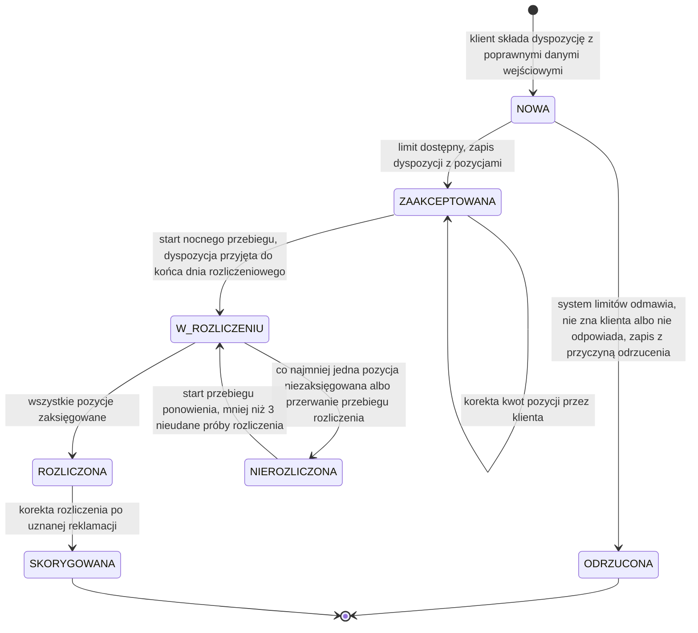

# Cykl życia dyspozycji

| Pole | Wartość |
|---|---|
| Obiekt (pojęcie DDM) | DDM-001.DOM-Dyspozycja |
| Zdolność | CAP-003 |

## Warunki wstępne

Dyspozycja wchodzi w cykl życia, gdy klient zatwierdzi ją silnym
uwierzytelnieniem, a system przyjmie żądanie z rachunkiem obciążanym, walutą
i pozycjami bez błędów walidacji wejścia. Żądanie z błędem walidacji jest
odrzucane bez zapisu i dyspozycja nie powstaje. Szkic zapisany przed
zatwierdzeniem nie jest jeszcze dyspozycją i nie ma statusu.

## Diagram maszyny stanów

<!-- Generowany z tabel poniżej albo eksportowany z EA do katalogu assets/. -->

## Stany — opis

### Słownik statusów

| Kod | Status | Opis | Czy końcowy |
|---|---|---|---|
| NOWA | Nowa | Dyspozycja z poprawnymi danymi wejściowymi czeka na decyzję systemu limitów | nie |
| ZAAKCEPTOWANA | Zaakceptowana | Dyspozycja zapisana z pozycjami, czeka na nocny przebieg rozliczenia; klient może korygować kwoty pozycji | nie |
| ODRZUCONA | Odrzucona | Dyspozycja nie przeszła sprawdzenia limitu; zapisana z przyczyną i czasem odrzucenia, klient dostaje komunikat | tak |
| W_ROZLICZENIU | W rozliczeniu | Przebieg rozliczenia wybrał dyspozycję i księguje jej pozycje w księdze głównej; korekta jest odrzucana | nie |
| ROZLICZONA | Rozliczona | Wszystkie pozycje zaksięgowane; od daty rozliczenia biegnie 30-dniowy termin reklamacji, a uznana reklamacja przenosi dyspozycję do SKORYGOWANA | nie |
| NIEROZLICZONA | Nierozliczona | Księgowanie co najmniej jednej pozycji nie powiodło się albo przebieg rozliczenia został przerwany; dyspozycja z mniej niż 3 nieudanymi próbami rozliczenia czeka na ponowienie | nie |
| SKORYGOWANA | Skorygowana | Rozliczenie skorygowane księgowaniem korygującym po uznanej reklamacji | tak |

### Stany procesowe

| Stan z | Stan do | Opis przejścia | Typ przepływu |
|---|---|---|---|
| [*] | NOWA | klient składa dyspozycję z poprawnymi danymi wejściowymi | MAIN |
| NOWA | ZAAKCEPTOWANA | limit dostępny, zapis dyspozycji z pozycjami | MAIN |
| NOWA | ODRZUCONA | system limitów odmawia, nie zna klienta albo nie odpowiada, zapis z przyczyną odrzucenia | ERROR |
| ZAAKCEPTOWANA | ZAAKCEPTOWANA | korekta kwot pozycji przez klienta | ALTERNATIVE |
| ZAAKCEPTOWANA | W_ROZLICZENIU | start nocnego przebiegu, dyspozycja przyjęta do końca dnia rozliczeniowego | MAIN |
| W_ROZLICZENIU | ROZLICZONA | wszystkie pozycje zaksięgowane | MAIN |
| W_ROZLICZENIU | NIEROZLICZONA | co najmniej jedna pozycja niezaksięgowana albo przerwanie przebiegu rozliczenia | ERROR |
| NIEROZLICZONA | W_ROZLICZENIU | start przebiegu ponowienia, mniej niż 3 nieudane próby rozliczenia | ALTERNATIVE |
| ROZLICZONA | SKORYGOWANA | korekta rozliczenia po uznanej reklamacji | ALTERNATIVE |

## Kluczowe elementy

- Główna ścieżka sukcesu: NOWA → ZAAKCEPTOWANA → W_ROZLICZENIU → ROZLICZONA.
  Nocny przebieg startuje o 01:00 i obejmuje dyspozycje ZAAKCEPTOWANA przyjęte
  do końca dnia rozliczeniowego; dyspozycja przyjęta po jego końcu czeka na
  następną noc. Na starcie przebieg ustawia W_ROZLICZENIU wszystkim wybranym
  dyspozycjom.
- Przejścia alternatywne: korekta kwot pozycji nie zmienia statusu i jest
  możliwa, dopóki dyspozycja ma status ZAAKCEPTOWANA; od startu przebiegu,
  który wybrał dyspozycję, korekta jest odrzucana. Ponowienie co godzinę od
  06:00 do 22:00 przenosi dyspozycje NIEROZLICZONA z mniej niż 3 nieudanymi
  próbami rozliczenia z powrotem do W_ROZLICZENIU i księguje tylko pozycje
  niezaksięgowane. Uznana reklamacja przenosi dyspozycję ROZLICZONA do
  SKORYGOWANA.
- Przekroczenie czasu: wywołanie księgi głównej ma limit 3 s i 3 ponowienia;
  po ich wyczerpaniu pozycja zostaje niezaksięgowana, a dyspozycja przechodzi
  do NIEROZLICZONA. Każda nieudana próba rozliczenia zwiększa liczbę
  nieudanych prób o 1. Po trzeciej nieudanej próbie dyspozycja zostaje
  w NIEROZLICZONA, nie wraca do ponowień i trafia do ręcznego wyjaśnienia
  w zespole rozliczeń.
- Odrzucenia i rezygnacje: dyspozycja przechodzi do ODRZUCONA, gdy system
  limitów odmawia, nie zna klienta albo nie odpowiada; zapis utrwala przyczynę
  i czas odrzucenia. Błąd walidacji wejścia kończy żądanie bez zapisu. Klient
  nie anuluje przyjętej dyspozycji; rezygnacja przed zatwierdzeniem to
  porzucony szkic bez statusu.

## Scenariusze błędów

- Suma kwot pozycji różni się od kwoty łącznej albo liczba pozycji wykracza
  poza 1–50: żądanie jest odrzucane z kodem BLAD_WALIDACJI, dyspozycja nie
  jest zapisywana i nie wchodzi w cykl życia.
- System limitów nie odpowiada po ponowieniach: dyspozycja przechodzi z NOWA do
  ODRZUCONA z przyczyną LIMIT_NIEDOSTEPNY, klient może złożyć ją ponownie.
- Klient próbuje skorygować pozycję dyspozycji w statusie innym niż
  ZAAKCEPTOWANA, np. po starcie przebiegu rozliczenia: zmiana jest odrzucana,
  status się nie zmienia.
- Księga główna jest niedostępna albo odrzuca księgowanie części pozycji:
  dyspozycja przechodzi z W_ROZLICZENIU do NIEROZLICZONA; zaksięgowane pozycje
  zostają zaksięgowane.
- Przebieg rozliczenia zostaje przerwany: dyspozycje, które zostały
  w W_ROZLICZENIU, przechodzą do NIEROZLICZONA bez zwiększania liczby
  nieudanych prób rozliczenia i trafiają do ponowienia.
