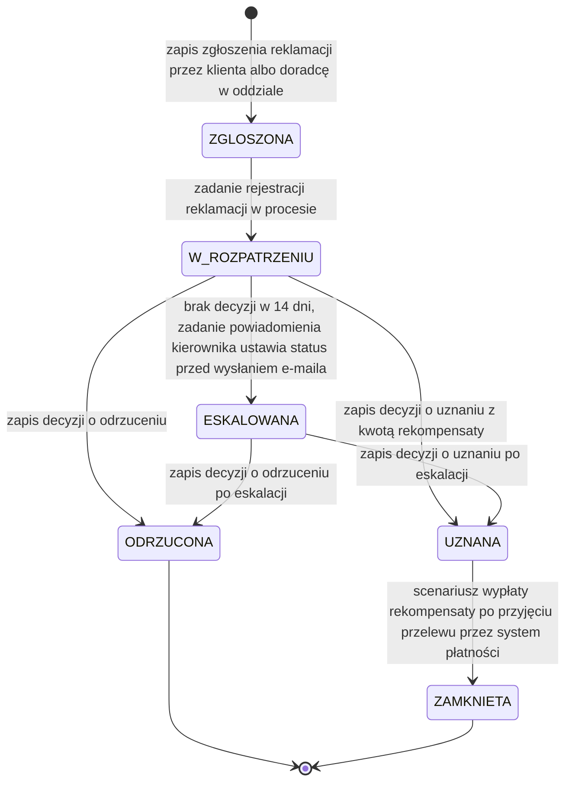

# Cykl życia reklamacji

| Pole | Wartość |
|---|---|
| Obiekt (pojęcie DDM) | DDM-001.DOM-Reklamacja |
| Zdolność | CAP-004 |

## Warunki wstępne

Reklamacja wchodzi w cykl życia, gdy klient w bankowości internetowej albo
doradca w oddziale w imieniu klienta zgłosi ją dla dyspozycji rozliczonej nie
dawniej niż 30 dni, z powodem wybranym z listy i opisem. Zgłoszenie dyspozycji
rozliczonej wcześniej jest odrzucane i reklamacja nie powstaje.

## Diagram maszyny stanów

<!-- Generowany z tabel poniżej albo eksportowany z EA do katalogu assets/. -->

## Stany — opis

### Słownik statusów

| Kod | Status | Opis | Czy końcowy |
|---|---|---|---|
| ZGLOSZONA | Zgłoszona | Reklamacja zapisana, proces obsługi reklamacji uruchomiony; czeka na rejestrację w procesie | nie |
| W_ROZPATRZENIU | W rozpatrzeniu | Zadanie rozpatrzenia czeka na decyzję pracownika zaplecza; biegnie termin 14 dni | nie |
| UZNANA | Uznana | Bank uznał reklamację; proces księguje korektę rozliczenia dyspozycji i publikuje decyzję, a potem trwa wypłata rekompensaty | nie |
| ODRZUCONA | Odrzucona | Bank odrzucił reklamację; obsługa reklamacji kończy się po zapisie decyzji | tak |
| ESKALOWANA | Eskalowana | Minęło 14 dni bez decyzji; kierownik zespołu dostał e-mail, zadanie nadal czeka na decyzję | nie |
| ZAMKNIETA | Zamknięta | Reklamacja uznana, rekompensata wypłacona: system płatności przyjął przelew | tak |

### Stany procesowe

| Stan z | Stan do | Opis przejścia | Typ przepływu |
|---|---|---|---|
| [*] | ZGLOSZONA | zapis zgłoszenia reklamacji przez klienta albo doradcę w oddziale | MAIN |
| ZGLOSZONA | W_ROZPATRZENIU | zadanie rejestracji reklamacji w procesie | MAIN |
| W_ROZPATRZENIU | UZNANA | zapis decyzji o uznaniu z kwotą rekompensaty | MAIN |
| W_ROZPATRZENIU | ODRZUCONA | zapis decyzji o odrzuceniu | ALTERNATIVE |
| W_ROZPATRZENIU | ESKALOWANA | brak decyzji w 14 dni, zadanie powiadomienia kierownika ustawia status przed wysłaniem e-maila | ERROR |
| ESKALOWANA | UZNANA | zapis decyzji o uznaniu po eskalacji | ALTERNATIVE |
| ESKALOWANA | ODRZUCONA | zapis decyzji o odrzuceniu po eskalacji | ALTERNATIVE |
| UZNANA | ZAMKNIETA | scenariusz wypłaty rekompensaty po przyjęciu przelewu przez system płatności | MAIN |

## Kluczowe elementy

- Główna ścieżka sukcesu: ZGLOSZONA → W_ROZPATRZENIU → UZNANA → ZAMKNIETA.
  Po uznaniu proces wylicza rekompensatę, księguje korektę rozliczenia
  dyspozycji i dopiero potem publikuje decyzję. Scenariusz wypłaty
  rekompensaty odbiera decyzję, zleca przelew i zamyka reklamację, gdy system
  płatności przyjmie przelew.
- Przejścia alternatywne: pracownik odrzuca reklamację (W_ROZPATRZENIU →
  ODRZUCONA); proces kończy się po zapisie decyzji, bez publikacji. Decyzja
  zapisana po eskalacji prowadzi do UZNANA albo ODRZUCONA tak samo jak przed
  eskalacją.
- Przekroczenie czasu: zdarzenie graniczne 14 dni na zadaniu rozpatrzenia
  uruchamia proces eskalacji. Zadanie powiadomienia kierownika ustawia
  ESKALOWANA, a potem wysyła e-mail do kierownika. Zadanie rozpatrzenia nie
  jest przerywane i zostaje u pracownika do decyzji.
- Odrzucenia i rezygnacje: ODRZUCONA po decyzji pracownika kończy cykl życia
  reklamacji. Maszyna nie ma stanu rezygnacji; wycofania zgłoszenia przez
  klienta system nie obsługuje.

## Scenariusze błędów

- Kwota rekompensaty w decyzji jest większa niż kwota reklamowanej dyspozycji:
  zapis decyzji jest odrzucany, reklamacja zostaje w W_ROZPATRZENIU albo
  ESKALOWANA.
- System płatności odrzuca przelew rekompensaty albo przy wypłacie kwota
  rekompensaty przekracza kwotę dyspozycji: reklamacja zostaje w UZNANA,
  wypłata jest zatrzymana do wyjaśnienia i reklamacja nie przechodzi do
  ZAMKNIETA.
- Zgłoszenie dotyczy dyspozycji rozliczonej ponad 30 dni temu: zgłoszenie jest
  odrzucane, reklamacja nie powstaje i maszyna nie startuje.
