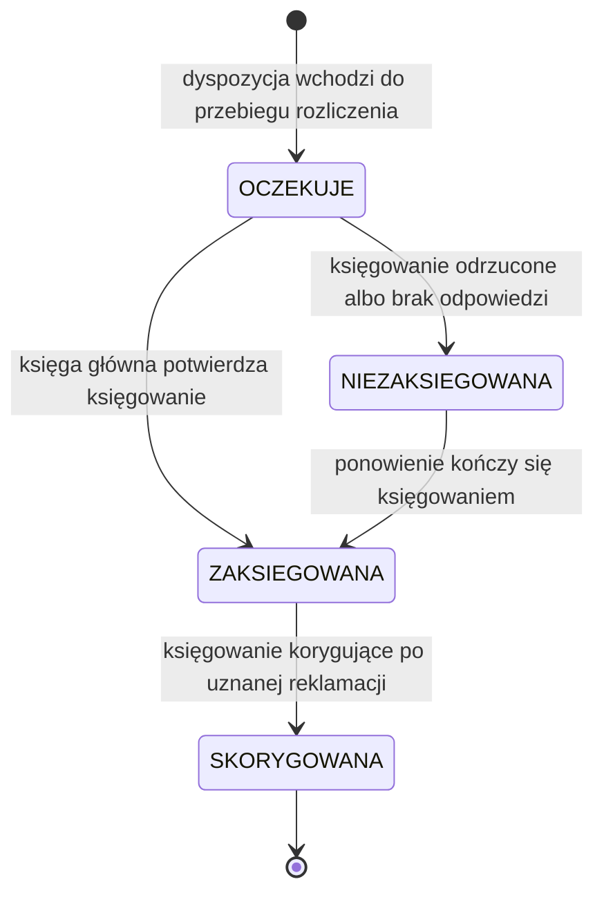

# Cykl życia pozycji dyspozycji

| Pole | Wartość |
|---|---|
| Obiekt (pojęcie DDM) | DDM-001.DOM-Pozycja |
| Zdolność | CAP-003 |

## Warunki wstępne

Pozycja wchodzi w cykl księgowania, gdy przebieg rozliczenia wybierze
dyspozycję ZAAKCEPTOWANA, do której należy. Do tej chwili pozycja nie ma
statusu księgowania, a klient może zmienić jej kwotę. Pozycja ma rachunek
odbiorcy w formacie IBAN, tytuł i kwotę większą od zera, nie większą niż
1 000 000 PLN. Pozycje dyspozycji odrzuconej nie wchodzą w cykl księgowania.

## Diagram maszyny stanów

<!-- Generowany z tabel poniżej albo eksportowany z EA do katalogu assets/. -->

## Stany — opis

### Słownik statusów

| Kod | Status | Opis | Czy końcowy |
|---|---|---|---|
| OCZEKUJE | Oczekuje | Dyspozycja weszła do przebiegu rozliczenia, pozycja czeka na księgowanie; zmiana kwoty jest odrzucana | nie |
| ZAKSIEGOWANA | Zaksięgowana | Księga główna potwierdziła księgowanie pozycji i zwróciła jego identyfikator; uznana reklamacja przenosi pozycję do SKORYGOWANA | nie |
| NIEZAKSIEGOWANA | Niezaksięgowana | Księgowanie odrzucone przez księgę główną albo niepotwierdzone w limicie czasu; pozycja czeka na ponowienie | nie |
| SKORYGOWANA | Skorygowana | Po uznanej reklamacji księga główna zaksięgowała korektę rozliczenia dyspozycji, do której należy pozycja | tak |

### Stany procesowe

| Stan z | Stan do | Opis przejścia | Typ przepływu |
|---|---|---|---|
| [*] | OCZEKUJE | dyspozycja wchodzi do przebiegu rozliczenia | MAIN |
| OCZEKUJE | ZAKSIEGOWANA | księga główna potwierdza księgowanie | MAIN |
| OCZEKUJE | NIEZAKSIEGOWANA | księgowanie odrzucone albo brak odpowiedzi | ERROR |
| NIEZAKSIEGOWANA | ZAKSIEGOWANA | ponowienie kończy się księgowaniem | ALTERNATIVE |
| ZAKSIEGOWANA | SKORYGOWANA | księgowanie korygujące po uznanej reklamacji | ALTERNATIVE |

## Kluczowe elementy

- Główna ścieżka sukcesu: OCZEKUJE → ZAKSIEGOWANA w nocnym przebiegu
  rozliczenia. Przebieg, który wybrał dyspozycję, na starcie ustawia OCZEKUJE
  jej pozycjom bez statusu księgowania. Każda pozycja jest księgowana osobno,
  więc pozycje jednej dyspozycji mogą mieć różne statusy.
- Przejścia alternatywne: przebieg ponowienia księguje pozycje OCZEKUJE
  i NIEZAKSIEGOWANA, a pozycje ZAKSIEGOWANA pomija. Uznana reklamacja przenosi
  pozycje z ZAKSIEGOWANA do SKORYGOWANA.
- Przekroczenie czasu: brak odpowiedzi księgi głównej w 3 s po 3 ponowieniach
  wywołania przenosi pozycję do NIEZAKSIEGOWANA.
- Odrzucenia i rezygnacje: księga główna odrzuca księgowanie, np. z powodu
  zablokowanego rachunku obciążanego, i pozycja przechodzi do
  NIEZAKSIEGOWANA. Pozycji nie usuwa się z przyjętej dyspozycji; korekta
  przed wejściem do przebiegu zmienia tylko kwotę.

## Scenariusze błędów

- Księga główna odrzuca księgowanie z błędem biznesowym: pozycja przechodzi do
  NIEZAKSIEGOWANA; jeśli trzecia próba rozliczenia dyspozycji też się nie
  powiedzie, pozycja zostaje w tym statusie i trafia do wyjaśnienia razem
  z dyspozycją.
- Księga główna zaksięgowała pozycję, ale potwierdzenie nie dotarło: pozycja
  przechodzi do NIEZAKSIEGOWANA, a ponowienie z tym samym kluczem
  idempotencji dostaje potwierdzenie istniejącego księgowania i przenosi ją do
  ZAKSIEGOWANA bez drugiego obciążenia.
- Zmiana kwoty pozycji po starcie przebiegu, który wybrał dyspozycję, jest
  odrzucana; status pozycji się nie zmienia.
