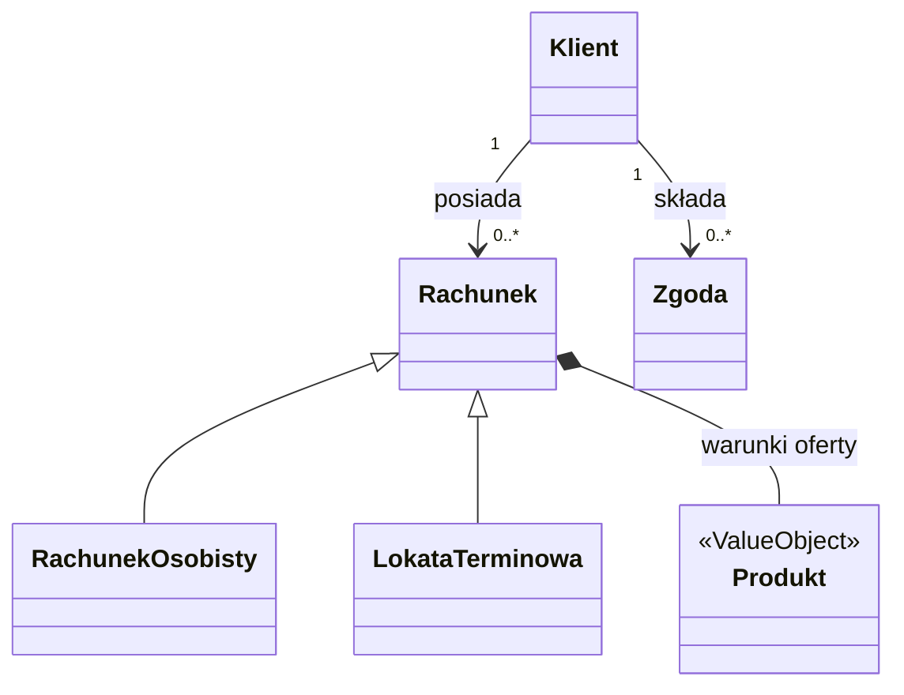

# Domena rachunków

| Pole | Wartość |
|---|---|
| Obszar | Rachunki detaliczne |
| Źródło domeny | Model EA CaseRepository, pakiet Accounts v1.2 |

## Cel i zakres

Model opisuje, co w bankowości detalicznej znaczą rachunek, produkt z oferty
i zgoda klienta oraz jakie reguły muszą być spełnione, zanim bank otworzy
rachunek. Obejmuje dwa rodzaje rachunku: rachunek osobisty i lokatę terminową.
Daje analitykom, architektom i zespołom rozwojowym jeden słownik tych pojęć,
niezależny od systemów, które je przetwarzają.

## Źródła wymagań w górę

- Model domenowy w Enterprise Architect: repozytorium CaseRepository, pakiet Accounts v1.2.
- Regulamin rachunków osobistych i regulamin lokat terminowych.
- Polityka produktowa rachunków osobistych: rachunek osobisty tylko dla osoby pełnoletniej.
- Kodeks cywilny: pełną zdolność do czynności prawnych nabywa się z chwilą uzyskania pełnoletności.
- RODO, art. 7: bank musi umieć wykazać, że klient wyraził zgodę marketingową.
- Warsztaty z Tribe Rachunki, Tribe Oferta i Area Compliance: definicje pojęć i ich właściciele.

## Słownik pojęć domenowych

| ID | Definicja | Synonimy | Właściciel pojęcia |
|---|---|---|---|
| DOM-Rachunek | Rachunek bankowy, który bank prowadzi dla klienta na podstawie umowy i na którym ewidencjonuje jego środki. Ma dwa rodzaje: rachunek osobisty (środki dostępne na bieżąco) i lokatę terminową (kwota złożona na określony okres za ustalonym oprocentowaniem). | konto, rachunek bankowy | Tribe Rachunki |
| DOM-Produkt | Pozycja oferty banku, według której bank otwiera rachunek: rodzaj rachunku, nazwa handlowa i opłata za prowadzenie. | produkt bankowy, pozycja oferty | Tribe Oferta |
| DOM-Zgoda | Oświadczenie klienta, że akceptuje regulamin produktu albo zgadza się na komunikację marketingową, złożone dla określonej wersji dokumentu. | oświadczenie, akceptacja regulaminu | Area Compliance |

## Encje i Value Objects

| Pojęcie | Typ | Tożsamość | Odpowiedzialność |
|---|---|---|---|
| DOM-Rachunek | Encja | Identyfikator nadany przy złożeniu wniosku; od otwarcia także numer rachunku (IBAN) | Ewidencjonuje umowę i środki klienta od wniosku do zamknięcia rachunku |
| DOM-Produkt | Value Object | Brak własnej tożsamości: dwa produkty są równe, gdy mają ten sam kod i te same warunki | Niesie warunki oferty, według których bank otwiera i prowadzi rachunek |
| DOM-Zgoda | Encja | Identyfikator oświadczenia | Utrwala decyzję klienta i wersję dokumentu, której dotyczy, tak aby bank mógł ją wykazać |

## Relacje i agregaty

<!-- Opcjonalnie diagram classDiagram. -->

- Agregat Rachunek: korzeniem jest Rachunek, a Produkt jest jego wartością, czyli warunkami oferty, według których otwarto rachunek.
- Rachunek osobisty i lokata terminowa to rodzaje jednego pojęcia, a nie osobne pojęcia: mają wspólną tożsamość, właściciela i produkt, a lokata dodaje kwotę, okres i oprocentowanie.
- Agregat Zgoda: zgoda jest osobnym agregatem, bo należy do klienta i obowiązuje niezależnie od rachunku; zgoda marketingowa dotyczy wszystkich produktów klienta.
- Klient to pojęcie domeny dyspozycji. Klient posiada rachunki i składa zgody; ta domena odwołuje się do niego, ale go nie definiuje.
- Reguły RD-001 i RD-002 wiążą rachunek z danymi spoza jego agregatu: RD-001 z datą urodzenia klienta, RD-002 ze zgodą na regulamin. Dlatego leżą w modelu domeny, a nie w jednym agregacie.

## Reguły i inwarianty domenowe

| ID | Reguła | Kryterium walidacji |
|---|---|---|
| RD-001 | Rachunek osobisty otwiera się tylko dla osoby pełnoletniej. | Wiek klienta w dniu otwarcia rachunku osobistego, liczony z daty urodzenia, wynosi co najmniej 18 lat. |
| RD-002 | Przed otwarciem rachunku klient akceptuje regulamin produktu. | Przed otwarciem istnieje udzielona zgoda klienta na regulamin wybranego produktu w obowiązującej wersji; bez niej wniosek nie przechodzi dalej. |

## Zakres poza dokumentem

Model nie opisuje:

- struktury logicznej danych i sposobu ich utrwalenia,
- stanów rachunku i lokaty oraz przejść między nimi,
- pojęcia klienta, które definiuje domena dyspozycji,
- sald, operacji na rachunku, rachunków wspólnych i pełnomocnictw.
