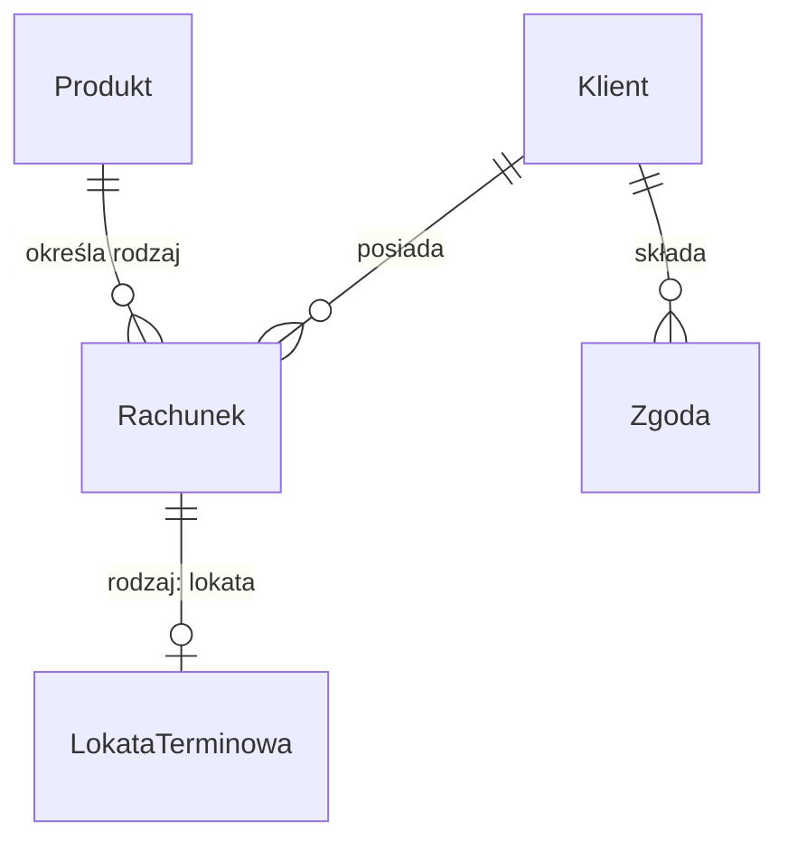

# Model logiczny rachunków

| Pole | Wartość |
|---|---|
| ID | LDM-002 |
| Źródło DDM | DDM-002 |
| Wersja | 0.4 |
| Źródło | Eksport XML z EA, pakiet Accounts LDM |

## Cel i zakres

Model opisuje dane rachunków w systemie transakcyjnym: jakie encje powstają
przy wniosku o rachunek, jego otwarciu i prowadzeniu, jakie mają atrybuty
i jak się ze sobą wiążą. Obejmuje rachunek osobisty, lokatę terminową, katalog
produktów i zgody klienta.

## Źródło (DDM)

DDM-002 „Domena rachunków”. Model realizuje wszystkie trzy pojęcia tej domeny:
DDM-002.DOM-Rachunek, DDM-002.DOM-Produkt i DDM-002.DOM-Zgoda. Reguły
domenowe DDM-002 wiążą rachunek z danymi spoza jego agregatu, więc nie wracają
w encjach jako reguły walidacyjne. Reguły walidacyjne encji sprawdzają dane
jednej encji albo warunki oferty.

## Mapowanie DDM → LDM

| Pojęcie | Encja | Uzasadnienie |
|---|---|---|
| DDM-002.DOM-Rachunek | ENT-Account | Dane wspólne obu rodzajów rachunku: właściciel, produkt, waluta, status i data otwarcia |
| DDM-002.DOM-Rachunek | ENT-Deposit | Lokata terminowa to rodzaj rachunku; jej parametry (kwota, okres, oprocentowanie, dzień zapadalności) i stan umowy leżą w osobnej encji |
| DDM-002.DOM-Produkt | ENT-Product | Value Object z oferty utrwalony jako pozycja katalogu produktów, którą wskazuje rachunek |
| DDM-002.DOM-Zgoda | ENT-Consent | Oświadczenie klienta z typem zgody, decyzją i wersją dokumentu |

## Diagram ER

<!-- Bez kluczy PK/FK, z notacją liczebności. -->

## Encje

- ENT-Account — Rachunek
- ENT-Deposit — Lokata terminowa
- ENT-Product — Produkt
- ENT-Consent — Zgoda

## Kluczowe relacje

- Rachunek wskazuje Produkt (N:1). Typ produktu rozstrzyga rodzaj rachunku: rachunek osobisty albo lokata terminowa. Waluta rachunku pochodzi z produktu.
- Lokata terminowa jest rodzajem rachunku (1:1). ENT-Deposit przechowuje parametry i stan umowy lokaty, a dane wspólne (właściciel, produkt, waluta, status rachunku) ma ENT-Account. Lokata nie jest częścią rachunku, więc żadna encja modelu nie zawiera innej.
- Rachunek i Zgoda wskazują Klienta (N:1). Encja klienta należy do modelu logicznego domeny dyspozycji; na diagramie Klient pokazuje tylko, do kogo należą rachunki i zgody.

## Słowniki zewnętrzne

- Waluta: słownik walut ISO 4217 prowadzony w systemie centralnym, używany przez atrybuty currency produktu i rachunku.

Statusy rachunku, stany lokaty, typy produktu i typy zgód są typami
wyliczeniowymi encji, nie słownikami zewnętrznymi.

## Zakres poza dokumentem

Model nie opisuje:

- klienta, którego encja należy do modelu logicznego domeny dyspozycji,
- stanu dziennego rachunków w hurtowni danych, który opisuje osobny model logiczny tej domeny,
- sald, operacji na rachunkach, rachunków wspólnych i pełnomocnictw,
- przejść między statusami rachunku i stanami lokaty.
