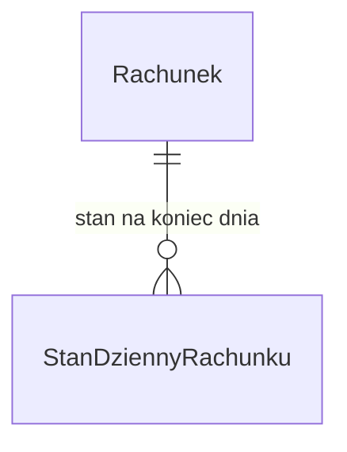

# Model hurtowni rachunków

| Pole | Wartość |
|---|---|
| ID | LDM-003 |
| Źródło DDM | DDM-002 |
| Wersja | 0.2 |
| Źródło | Eksport XML z EA, pakiet DWH Accounts |

## Cel i zakres

Model opisuje dane rachunków w hurtowni danych: stan każdego rachunku na koniec
dnia. Hurtownia zasila raporty sald i struktury portfela rachunków oraz
sprawozdawczość regulacyjną. To drugi model logiczny domeny rachunków, obok
modelu systemu transakcyjnego. Różni się ziarnem danych: jeden rachunek ma tu
osobny wiersz na każdy dzień.

## Źródło (DDM)

DDM-002 „Domena rachunków”, pojęcie DDM-002.DOM-Rachunek. Pojęć produktu
i zgody hurtownia nie realizuje: kod produktu przechowuje jako atrybut stanu
rachunku.

## Mapowanie DDM → LDM

| Pojęcie | Encja | Uzasadnienie |
|---|---|---|
| DDM-002.DOM-Rachunek | ENT-AccountSnapshot | Hurtownia utrwala stan rachunku na koniec dnia, a nie bieżący rachunek; nazwa encji odróżnia ją od rachunku systemu transakcyjnego |

## Diagram ER

<!-- Bez kluczy PK/FK, z notacją liczebności. -->

## Encje

- ENT-AccountSnapshot — Stan dzienny rachunku

## Kluczowe relacje

- Jeden rachunek ma wiele stanów dziennych, po jednym na każdy dzień od dnia otwarcia do dnia zamknięcia włącznie. Tożsamość stanu tworzą data stanu i numer rachunku.
- Rachunek na diagramie to encja modelu logicznego rachunków w systemie transakcyjnym, z której nocne ładowanie pobiera dane. Nie należy do tego modelu.

## Słowniki zewnętrzne

Brak. Kod produktu i status hurtownia przepisuje z systemu transakcyjnego bez
dekodowania; nazwy produktów dołącza warstwa raportowa.

## Zakres poza dokumentem

Model nie opisuje:

- zmian stanu rachunku w ciągu dnia i operacji na rachunku,
- parametrów lokat terminowych i zgód klienta,
- procesu ładowania danych i jego harmonogramu.
